
Caliptra Hardware Specification

Version 1.0-rc2

# Scope

This document defines technical specifications for a Caliptra RoT for Measurement (RTM)[1] cryptographic subsystem used in the Open Compute Project (OCP). This document, along with [Caliptra: A Datacenter System on a Chip (SoC) Root of Trust (RoT)](https://chipsalliance.github.io/Caliptra/doc/Caliptra.html), shall comprise the Caliptra technical specification.

# Overview

This document provides definitions and requirements for a Caliptra cryptographic subsystem. The document then relates these definitions to existing technologies, enabling device and platform vendors to better understand those technologies in trusted computing terms.

# Caliptra Core

The following figure shows the Caliptra Core.

*Figure 1: Caliptra Block Diagram*

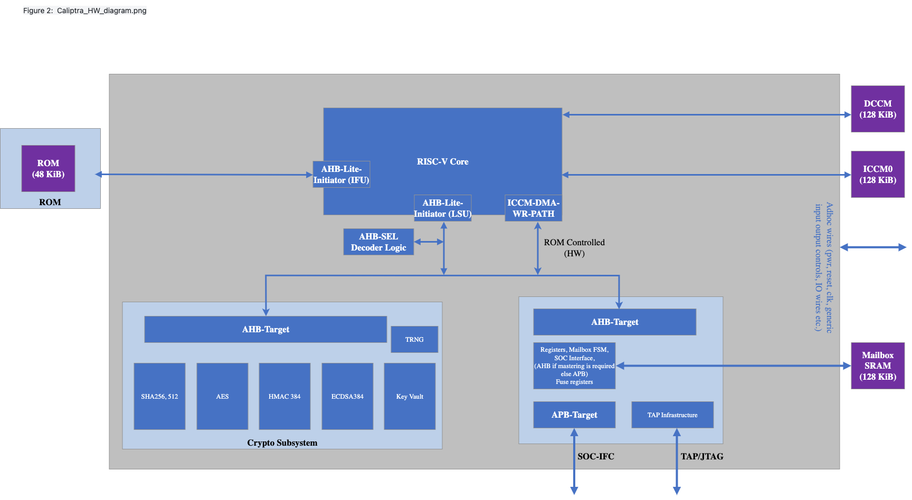

## Boot FSM

The Boot FSM detects that the SoC is bringing Caliptra out of reset. Part of this flow involves signaling to the SoC that Caliptra is awake and ready for fuses. After fuses are populated and the SoC indicates that it is done downloading fuses, Caliptra can wake up the rest of the IP by de-asserting the internal reset.

The following figure shows the initial power-on arc of the Mailbox Boot FSM.

*Figure 2: Mailbox Boot FSM state diagram*

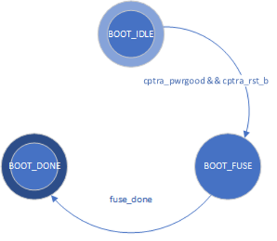

The Boot FSM first waits for the SoC to assert cptra\_pwrgood and de-assert cptra\_rst\_b. In the BOOT\_FUSE state, Caliptra signals to the SoC that it is ready for fuses. After the SoC is done writing fuses, it sets the fuse done register and the FSM advances to BOOT\_DONE.

BOOT\_DONE enables Caliptra reset de-assertion through a two flip-flop synchronizer.

## FW update reset (Impactless FW update)

Runtime FW updates write to fw\_update\_reset register to trigger the FW update reset. When this register is written, only the RISC-V core is reset using cptra\_uc\_fw\_rst\_b pin and all AHB slaves are still active. All registers within the slaves and ICCM/DCCM memories are intact after the reset. Since ICCM is locked during runtime, it must be unlocked after the RISC-V reset is asserted. Reset is deasserted synchronously after a programmable number of cycles (currently set to 5 clocks) and normal boot flow updates the ICCM with the new FW from the mailbox SRAM. Reset de-assertion is done through a two flip-flop synchronizer. The boot flow is modified as shown in the following figure.

*Figure 3: Mailbox Boot FSM state diagram for FW update reset*

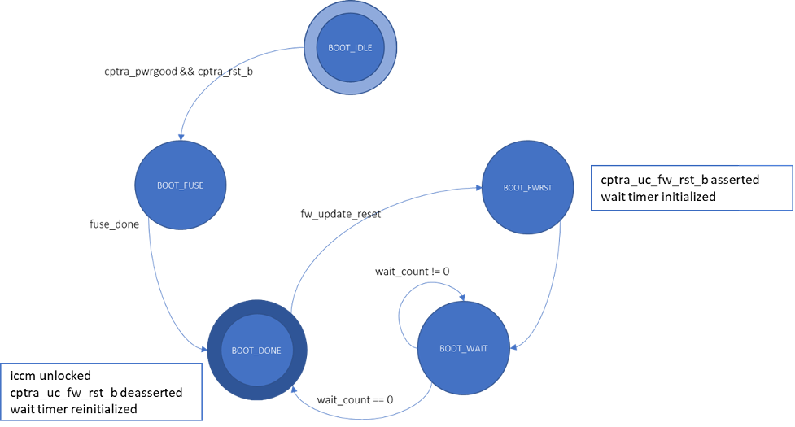

After Caliptra comes out of global reset and enters the BOOT\_DONE state, a write to the fw\_update\_reset register triggers the FW update reset flow. In the BOOT\_FWRST state, only the reset to the VeeR core is asserted, ICCM is unlocked and the timer is initialized. After the timer expires, the FSM advances from the BOOT\_WAIT to BOOT\_DONE state where the reset is deasserted.

| Control register | Start address | Description |
| :------- | :---------- | :--------- |
| FW_UPDATE_RESET | 0x30030418 | Register to trigger the FW update reset flow. Setting it to 1 starts the Boot FSM. The field auto-clears to 0. |
| FW_UPDATE_RESET_WAIT_CYCLES | 0x3003041C | Programmable wait time to keep the microcontroller reset asserted. |

## RISC-V core

The RISC-V core is VeeR EL2 from CHIPS Alliance. It is a 32-bit CPU core that contains a 4-stage, scalar, in-order pipeline. The core supports RISC-V’s integer(I), compressed instruction(C), multiplication and division (M), instruction-fetch fence, CSR, and subset of bit manipulation instructions (Z) extensions. A link to the RISC-V VeeR EL2 Programmer’s Reference Manual is provided in the [References](#references) section.

### Configuration

The RISC-V core is highly configurable and has the following settings.

| Parameter               | Configuration |
| :---------------------- | :------------ |
| Interface               | AHB-Lite      |
| DCCM                    | 128 KiB       |
| ICCM                    | 128 KiB       |
| I-Cache                 | Disabled      |
| Reset Vector            | 0x00000000    |
| Fast Interrupt Redirect | Enabled       |
| External Interrupts     | 31            |

### Embedded memory export

Internal RISC-V SRAM memory components are exported from the Caliptra subsystem to support adaptation to various fabrication processes. For more information, see the [Caliptra Integration Specification](https://github.com/chipsalliance/caliptra-rtl/blob/main/docs/CaliptraIntegrationSpecification.md).

### Memory map address regions

The 32-bit address region is subdivided into 16 fixed-sized, contiguous 256 MB regions. The following table describes the address mapping for each of the AHB devices that the RISC-V core interfaces with.

| Subsystem           | Address size | Start address | End address |
| :------------------ | :----------- | :------------ | :---------- |
| ROM                 | 48 KiB       | 0x0000_0000   | 0x0000_BFFF |
| Cryptographic       | 512 KiB      | 0x1000_0000   | 0x1007_FFFF |
| Peripherals         | 32 KiB       | 0x2000_0000   | 0x2000_7FFF |
| SoC IFC             | 256 KiB      | 0x3000_0000   | 0x3003_FFFF |
| RISC-V Core ICCM    | 128 KiB      | 0x4000_0000   | 0x4001_FFFF |
| RISC-V Core DCCM    | 128 KiB      | 0x5000_0000   | 0x5001_FFFF |
| RISC-V MM CSR (PIC) | 256 MiB      | 0x6000_0000   | 0x6FFF_FFFF |

#### Cryptographic subsystem

The following table shows the memory map address ranges for each of the IP blocks in the cryptographic subsystem.

| IP/Peripheral                       | Slave \# | Address size | Start address | End address |
| :---------------------------------- | :------- | :----------- | :------------ | :---------- |
| Cryptographic Initialization Engine | 0        | 32 KiB       | 0x1000_0000   | 0x1000_7FFF |
| ECC Secp384                         | 1        | 32 KiB       | 0x1000_8000   | 0x1000_FFFF |
| HMAC384                             | 2        | 4 KiB        | 0x1001_0000   | 0x1001_0FFF |
| Key Vault                           | 3        | 8 KiB        | 0x1001_8000   | 0x1001_9FFF |
| PCR Vault                           | 4        | 8 KiB        | 0x1001_A000   | 0x1001_BFFF |
| Data Vault                          | 5        | 8 KiB        | 0x1001_C000   | 0x1001_DFFF |
| SHA512                              | 6        | 32 KiB       | 0x1002_0000   | 0x1002_7FFF |
| SHA256                              | 13       | 32 KiB       | 0x1002_8000   | 0x1002_FFFF |

#### Peripherals subsystem

The following table shows the memory map address ranges for each of the IP blocks in the peripherals’ subsystem.

| IP/Peripheral | Slave \# | Address size | Start address | End address |
| :------------ | :------- | :----------- | :------------ | :---------- |
| QSPI          | 7        | 4 KiB        | 0x2000_0000   | 0x2000_0FFF |
| UART          | 8        | 4 KiB        | 0x2000_1000   | 0x2000_1FFF |
| CSRNG         | 15       | 4 KiB        | 0x2000_2000   | 0x2000_2FFF |
| ENTROPY SRC   | 16       | 4 KiB        | 0x2000_3000   | 0x2000_3FFF |

#### SoC interface subsystem

The following table shows the memory map address ranges for each of the IP blocks in the SoC interface subsystem.

| IP/Peripheral              | Slave \# | Address size | Start address | End address |
| :------------------------- | :------- | :----------- | :------------ | :---------- |
| Mailbox SRAM Direct Access | 10       | 128 KiB      | 0x3000_0000   | 0x3001_FFFF |
| Mailbox CSR                | 10       | 4 KiB        | 0x3002_0000   | 0x3002_0FFF |
| SHA512 Accelerator CSR     | 10       | 4 KiB        | 0x3002_1000   | 0x3002_1FFF |
| Mailbox                    | 10       | 64 KiB       | 0x3003_0000   | 0x3003_FFFF |

#### RISC-V core local memory blocks

The following table shows the memory map address ranges for each of the local memory blocks that interface with RISC-V core.

| IP/Peripheral   | Slave \# | Address size | Start address | End address |
| :-------------- | :------- | :----------- | :------------ | :---------- |
| ICCM0 (via DMA) | 12       | 128 KiB      | 0x4000_0000   | 0x4001_FFFF |
| DCCM            | 11       | 128 KiB      | 0x5000_0000   | 0x5001_FFFF |

### Interrupts

The VeeR-EL2 processor supports multiple types of interrupts, including non-maskable interrupts (NMI), software interrupts, timer interrupts, external interrupts, and local interrupts. Local interrupts are events not specified by the RISC-V standard, such as auxiliary timers and correctable errors.

Caliptra uses NMI in conjunction with a watchdog timer to support fatal error recovery and system restart. For more information, see the [Watchdog timer](#watchdog-timer) section.

Software and local interrupts are not implemented in the first generation of Caliptra. Standard RISC-V timer interrupts are implemented using the mtime and mtimecmp registers defined in the RISC-V Privileged Architecture Specification. Both mtime and mtimecmp are included in the soc\_ifc register bank, and are accessible by the internal microprocessor to facilitate precise timing tasks. Frequency for the timers is configured by the SoC using the dedicated timer configuration register, which satisfies the requirement prescribed in the RISC-V specification for such a mechanism. These timer registers drive the timer\_int pin into the internal microprocessor.

#### Non-maskable interrupts

<TODO> 0p8 describe a register bank that may be used to dynamically configure the NMI reset vector. (i.e., where the PC resets to).

#### External interrupts

Caliptra uses the external interrupt feature to support event notification from all attached peripheral components in the subsystem. The RISC-V processor supports multiple priority levels (ranging from 1-15), which allows firmware to configure interrupt priority per component.

Errors and notifications are allocated as interrupt events for each component, with error interrupts assigned a higher priority and expected to be infrequent.

Notification interrupts are used to alert the processor of normal operation activity, such as completion of requested operations or arrival of SoC requests through the shared interface.

Vector 0 is reserved by the RISC-V processor and may not be used, so vector assignment begins with Vector 1. Bit 0 of the interrupt port to the processor corresponds with Vector 1.

| IP/Peripheral                                       | Interrupt vector | Interrupt priority example  (Increasing, Max 15) |
| :-------------------------------------------------- | :--------------- | :---------------------------------------------- |
| Cryptographic Initialization Engine (Errors)        | 1                | 8                                               |
| Cryptographic Initialization Engine (Notifications) | 2                | 7                                               |
| ECC (Errors)                                        | 3                | 8                                               |
| ECC (Notifications)                                 | 4                | 7                                               |
| HMAC (Errors)                                       | 5                | 8                                               |
| HMAC (Notifications)                                | 6                | 7                                               |
| KeyVault (Errors)                                   | 7                | 8                                               |
| KeyVault (Notifications)                            | 8                | 7                                               |
| SHA512 (Errors)                                     | 9                | 8                                               |
| SHA512 (Notifications)                              | 10               | 7                                               |
| SHA256 (Errors)                                     | 11               | 8                                               |
| SHA256 (Notifications)                              | 12               | 7                                               |
| QSPI (Errors)                                       | 13               | 4                                               |
| QSPI (Notifications)                                | 14               | 3                                               |
| UART (Errors)                                       | 15               | 4                                               |
| UART (Notifications)                                | 16               | 3                                               |
| RESERVED                                            | 17               | 4                                               |
| RESERVED                                            | 18               | 3                                               |
| Mailbox (Errors)                                    | 19               | 8                                               |
| Mailbox (Notifications)                             | 20               | 7                                               |

## Watchdog timer

The primary function of Caliptra Watchdog Timer (WDT) is to reset the microcontroller (Caliptra), in the event of a software malfunction, by resetting the device if it has not been cleared in software. It is a two-stage timer, independent of the RISCV core.

### Operation

The WDT consists of two timers. When enabled in cascade mode (done by enabling Timer 1 alone), the WDT increments Timer 1 until the counter rolls over or times out. Typically, the timer is serviced at regular intervals to prevent it from overflowing or rolling over. If Timer 1 has not timed out, Timer 2 is disabled and held at its initial value. However, when Timer 1 does roll over, it triggers an error interrupt to the RISC-V core. In parallel, Timer 2 is enabled and begins counting. If the interrupt is serviced before Timer 2 times out, the timers are reset and continue to operate normally. If Timer 2 times out, it asserts an SoC fatal error and an NMI. The SoC fatal error is also captured in the CPTRA\_HW\_ERROR\_FATAL register, which can be cleared by the SoC by writing a 1. A warm reset is required by the SoC to reset the timers when Timer 2 times out.

The WDT timers can be configured to operate independent of each other. When the enable register for Timer 2 is set, the default configuration of cascaded timers is disabled and both timers count independently of each other. In this case, a timeout on Timer 2 causes an error interrupt to the RISC-V core similar to Timer 1. Disabling Timer 2 configures the timers back into the default cascaded mode.

Each timer has an enable bit, a restart bit, and a 64-bit timeout value register that can be programmed as needed. The restart bit is used to service the timers and restart counting. The timeout period registers can be configured to the desired upper bound of timers.

If the WDT timers are disabled and then re-enabled with a new timeout period, they must be restarted by setting the appropriate control register (restart bit). If the timers are temporarily disabled and re-enabled with the same timeout period, they resume counting and do not restart from 0.

For more details regarding the register interface to control the WDT, see the [register documentation](https://chipsalliance.github.io/caliptra-rtl/main/internal-regs/?p=clp.soc_ifc_reg) published in the RTL GitHub repository.

The following figure shows the two timers.

*Figure 4: Caliptra Watchdog Timer*

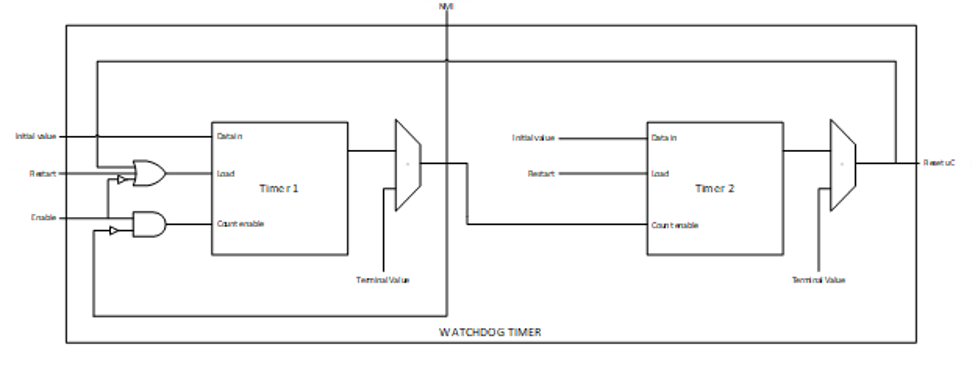

### Prescale settings

Assuming a clock source of 500 MHz, a timeout value of 32’hFFFF\_FFFF results in a timeout period of ~8.5 seconds. Two 32-bit registers are provided for each timer, allowing a 64-bit timeout period to be programmed for each timer. This accommodates a maximum timeout value of over 1000 years for the same 500 Mhz clock source.

## Microcontroller interface

The Caliptra microcontroller communicates with the mailbox through its internal AHB-Lite fabric.

### AHB-lite interface

AHB-lite is a subset of the full AHB specification. It is primarily used in single master systems. This interface connects VeeR EL2 Core (LSU master) to the slave devices as shown in Figure 1.

The interface can be customized to support variable address and data widths, and a variable number of slave devices. Each slave device is assigned an address range within the 32-bit address memory map region. The interface includes address decoding logic to route data to the appropriate AHB slave device based on the address specified.

The integration parameters for Caliptra’s AHB-lite interface are shown in the following table.

| Parameter     | Value |
| :------------ | :---- |
| ADDRESS_WIDTH | 32    |
| DATA_WIDTH    | 64    |
| NUM_OF_SLAVES | 17    |

Each IP component in the Caliptra system uses a native AHB data width of 32-bits (1 dword). The AHB responder logic in each IP component contains width conversion logic that transforms from the fabric data width of 64-bits to this native 32-bit width. The conversion involves calculating the dword offset (either 0 or 1) relative to the native 64-bit width by evaluating bit [2] of the address line. This information is used to extract the correct 32-bits from the native write data line. If there is a data offset, data is shifted down by 32-bits; otherwise, the upper 32-bits are simply truncated. This new dword-address is passed to the internal register interface along with the dword-sized data. A similar conversion works in reverse to correctly place read data in the response data line from the responder.

As a result of this implementation, 64-bit data transfers are not supported on the Caliptra AHB fabric. Firmware running on the internal microprocessor may only access memory and registers using a 32-bit or smaller request size, as 64-bit transfer requests will be corrupted.

## Cryptographic subsystem

For details, see the [Cryptographic subsystem architecture](#cryptographic-subsystem-architecture) section.

## Peripherals subsystem

Caliptra includes QSPI and UART peripherals that are used to facilitate alternative operating modes and debug. In the first generation, Caliptra includes code to enable QSPI in the RTL, but does not support the BMI profile. Therefore, QSPI must not be enabled. Similarly, the UART interface exists to facilitate firmware debug in an FPGA prototype, but should be disabled in final silicon. SystemVerilog defines used to disable these peripherals are described in the [Caliptra Integration Specification](https://github.com/chipsalliance/caliptra-rtl/blob/main/docs/CaliptraIntegrationSpecification.md). Operation of these peripherals is described in the following sections.

### QSPI Flash Controller

Caliptra implements a QSPI block that can communicate with 2 QSPI devices. This QSPI block is accessible to FW over the AHB-lite Interface.

The QSPI block is composed of the spi\_host implementation. For information, see the [SPI\_HOST HWIP Technical Specification](https://opentitan.org/book/hw/ip/spi_host/index.html). The core code (see [spi\_host](https://github.com/lowRISC/opentitan/tree/master/hw/ip/spi_host)) is reused but the interface to the module is changed to AHB-lite and the number of chip select lines supported is increased to 2. The design provides support for Standard SPI, Dual SPI, or Quad SPI commands. The following figure shows the QSPI flash controller.

*Figure 5: QSPI flash controller*

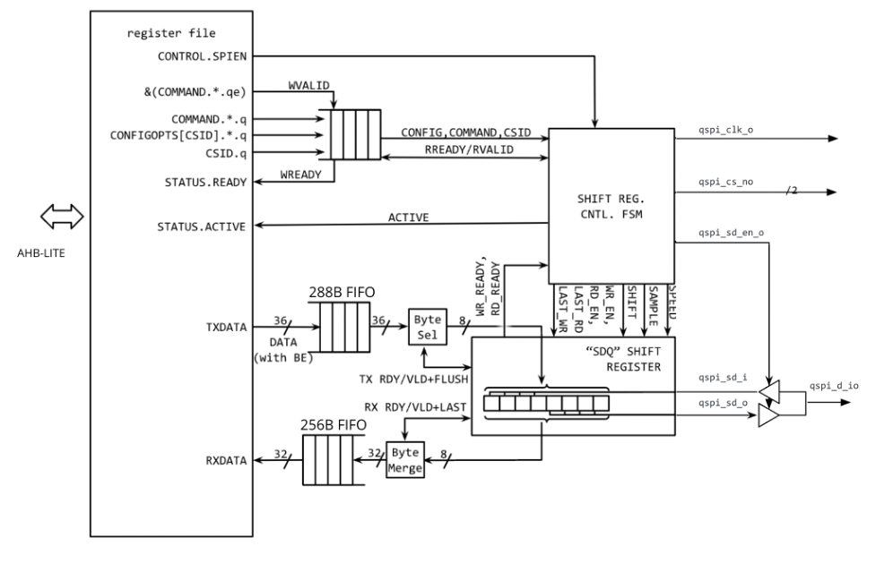

#### Operation

Transactions flow through the QSPI block starting with AHB-lite writes to the TXDATA FIFO. Commands are then written and processed by the control FSM, orchestrating transmissions from the TXDATA FIFO and receiving data into the RXDATA FIFO.

The structure of a command depends on the device and the command itself. In the case of a standard SPI device, the host IP always transmits data on qspi\_d\_io[0] and always receives data from the target device on qspi\_d\_io[1]. In Dual or Quad modes, all data lines are bi-directional, thus allowing full bandwidth in transferring data across 4 data lines.

A typical SPI command consists of different segments that are combined as shown in the following example. Each segment can configure the length, speed, and direction. As an example, the following SPI read transaction consists of 2 segments.

*Figure 6: SPI read transaction segments*

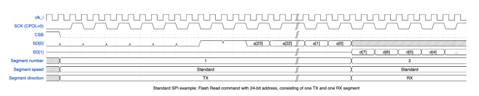

| Segment \# | Length (Bytes) | Speed    | Direction         | TXDATA FIFO  | RXDATA FIFO        |
| :--------- | :------------- | :------- | :---------------- | :----------- | :----------------- |
| 1          | 4  | standard | TX  qspi_d_io\[0\] | \[0\] 0x3 (ReadData)  \[1\] Addr\[23:16\]  \[2\] Addr\[15:8\]  \[3\] Addr\[7:0\] |  |
| 2          | 1  | standard | RX  qspi_d_io\[1\] |  | \[0\] Data \[7:0\] |

In this example, the ReadData (0x3) command was written to the TXDATA FIFO, followed by the 3B address. This maps to a total of 4 bytes that are transmitted out across qspi\_d\_io[0] in the first segment. The second segment consists of a read command that receives 1 byte of data from the target device across qspi\_d\_io[1].

QSPI consists of up to four command segments in which the host:

1. Transmits instructions or data at the standard rate
2. Transmits instructions address or data on 2 or 4 data lines
3. Holds the bus in a high-impedance state for some number of dummy cycles where neither side transmits
4. Receives information from the target device at the specified rate (derived from the original command)

The following example shows the QSPI segments.

*Figure 7: QSPI segments*

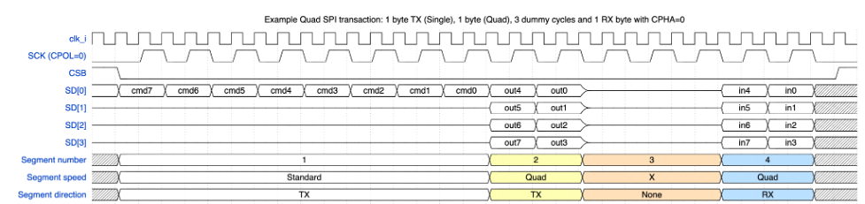

| Segment \# | Length (Bytes) | Speed    | Direction           | TXDATA FIFO  | RXDATA FIFO       |
| :--------- | :------------- | :------- | :------------------ | :----------- | :---------------- |
| 1          | 1              | standard | TX  qspi_d_io\[3:0\] | \[0\] 0x6B (ReadDataQuad) |                   |
| 2          | 3\*            | quad     | TX  qspi_d_io\[3:0\] | \[1\] Addr\[23:16\]  \[2\] Addr\[15:8\]  \[3\] Addr\[7:0\] |                   |
| 3          | 2              | N/A      | None (Dummy)        |     |                   |
| 4          | 1              | quad     | RX  qspi_d_io\[3:0\] |       | \[0\] Data\[7:0\] |

Note: In the preceding figure, segment 2 doesn’t show bytes 2 and 3 for brevity.

#### Configuration

The CONFIGOPTS multi-register has one entry per CSB line and holds clock configuration and timing settings that are specific to each peripheral. After the CONFIGOPTS multi-register is programmed for each SPI peripheral device, the values can be left unchanged.

The most common differences between target devices are the requirements for a specific SPI clock phase or polarity, CPOL and CPHA. These clock parameters can be set via the CONFIGOPTS.CPOL or CONFIGOPTS.CPHA register fields.

The SPI clock rate depends on the peripheral clock and a 16b clock divider configured by CONFIGOPTS.CLKDIV. The following equation is used to configure the SPI clock period:

By default, CLKDIV is set to 0, which means that the maximum frequency that can be achieved is at most half the frequency of the peripheral clock (Fsck = Fclk/2).

We can rearrange the equation to solve for the CLKDIV:

Assuming a 400MHz target peripheral, and a SPI clock target of 100MHz:

CONFIGOPTS.CLKDIV = (400/(2\*100)) -1 = 1

The following figure shows CONFIGOPTS.

*Figure 8: CONFIGOPTS*

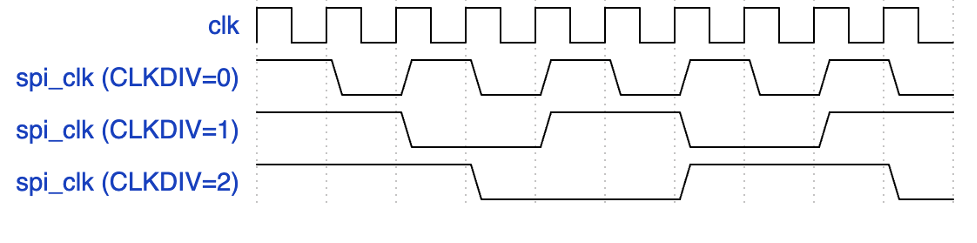

#### Signal descriptions

The QSPI block architecture inputs and outputs are described in the following table.

| Name                | Input or output | Description                                               |
| :------------------ | :-------------- | :-------------------------------------------------------- |
| clk_i               | input           | All signal timings are related to the rising edge of clk. |
| rst_ni              | input           | The reset signal is active LOW and resets the core.       |
| cio_sck_o           | output          | SPI clock                                                 |
| cio_sck_en_o        | output          | SPI clock enable                                          |
| cio_csb_o\[1:0\]    | output          | Chip select \# (one hot, active low)                      |
| cio_csb_en_o\[1:0\] | output          | Chip select \# enable (one hot, active low)               |
| cio_csb_sd_o\[3:0\] | output          | SPI data output                                           |
| cio_csb_sd_en_o     | output          | SPI data output enable                                    |
| cio_csb_sd_i\[3:0\] | input           | SPI data input                                            |

#### SPI\_HOST IP programming guide

The operation of the SPI\_HOST IP proceeds in seven general steps.

To initialize the IP:

1. Program the CONFIGOPTS multi-register with the appropriate timing and polarity settings for each csb line.
2. Set the desired interrupt parameters.
3. Enable the IP.

Then for each command:

4. Load the data to be transmitted into the FIFO using the TXDATA memory window.
5. Specify the target device by programming the CSID.
6. Specify the structure of the command by writing each segment into the COMMAND register.

    For multi-segment transactions, assert COMMAND.CSAAT for all but the last command segment.

7. For transactions that expect to receive a reply, the data can then be read back from the RXDATA window.

Steps 4-7 are then repeated for each subsequent command.

### UART

Caliptra implements a UART block that can communicate with a serial device that is accessible to FW over the AHB-lite Interface. This is a configuration that the SoC opts-in by defining CALIPTRA\_INTERNAL\_UART.

The UART block is composed of the uart implementation. For information, see the [UART HWIP Technical Specification](https://opentitan.org/book/hw/ip/uart/). The design provides support for a programmable baud rate. The UART block is shown in the following figure.

*Figure 9: UART block*

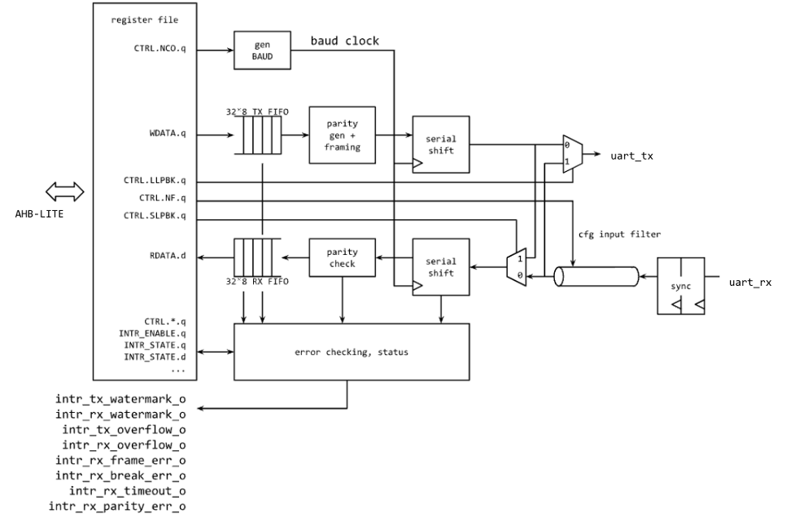

#### Operation

Transactions flow through the UART block starting with an AHB-lite write to WDATA, which triggers the transmit module to start a UART TX serial data transfer. The TX module dequeues the byte from the internal FIFO and shifts it out bit by bit at the baud rate. If TX is not enabled, the output is set high and WDATA in the FIFO is queued up.

The following figure shows the transmit data on the serial lane, starting with the START bit, which is indicated by a high to low transition, followed by the 8 bits of data.

*Figure 10: Serial transmission frame*

On the receive side, after the START bit is detected, the data is sampled at the center of each data bit and stored into a FIFO. A user can monitor the FIFO status and read the data out of RDATA.

#### Configuration

The baud rate can be configured using the CTRL.NCO register field. This should be set using the following equation:

If the desired baud rate is 115,200bps:

#### Signal descriptions

The UART block architecture inputs and outputs are described in the following table.

| Name     | Input or output | Description                                               |
| :------- | :-------------- | :-------------------------------------------------------- |
| clk_i    | input           | All signal timings are related to the rising edge of clk. |
| rst_ni   | input           | The reset signal is active LOW and resets the core.       |
| cio_rx_i | input           | Serial receive bit                                        |
| cio_tx_o | output          | Serial transmit bit                                       |

## SoC mailbox

For more information on the mailbox protocol, see [Mailbox](https://github.com/chipsalliance/caliptra-rtl/blob/main/docs/Caliptra_rtl.md#mailbox) in the Caliptra Integration Specification. TODO: Fix this!

The following table describes the mailbox control registers.

| Control register          | Start address     | Description        |
| :------------------------ | :---------------- | :----------------- |
| MBOX_LOCK                 | 0x30020000        | Mailbox lock register for mailbox access. Reading 0 sets the lock. |
| MBOX_USER                 | 0x30020004        | Stores the user that locked the mailbox.|
| MBOX_CMD                  | 0x30020008        | Command requested for data in mailbox. |
| MBOX_DLEN                 | 0x3002000c        | Data length for mailbox access. |
| MBOX_DATAIN               | 0x30020010        | Data in register. Writes the next data to mailbox. |
| MBOX_DATAOUT              | 0x30020010        | Data out register. Reads the next data from mailbox.|
| MBOX_EXECUTE              | 0x30020018        | Mailbox execute register indicates to the receiver that the sender is done. |
| MBOX_STATUS               | 0x3002001c        | Status of the mailbox command:   CMD_BUSY - 2’b00 – Indicates the requested command is still in progress   DATA_READY - 2’b01 – Indicates the return data is in the mailbox for the requested command   CMD_COMPLETE- 2’b10 – Indicates the successful completion of the requested command   CMD_FAILURE- 2’b11 – Indicates the requested command failed |
| HW_ERROR_FATAL            | 0x30030000        | Indicates fatal hardware error. |
| HW_ERROR_NON_FATAL        | 0x30030004        | Indicates non-fatal hardware error. |
| FW_ERROR_FATAL            | 0x30030008        | Indicates fatal firmware error. |
| FW_ERROR_NON_FATAL        | 0x3003000c        | Indicates non-fatal firmware error. |
| HW_ERROR_ENC              | 0x30030010        | Encoded error value for hardware errors. |
| FW_ERROR_ENC              | 0x30030014        | Encoded error value for firmware errors. |
| BOOT_STATUS               | 0x30030018        | Reports the boot status. |
| FLOW_STATUS               | 0x3003001c        | Reports the status of the firmware flows. |
| GENERIC_INPUT_WIRES       | 0x30030024        | Generic input wires connected to the SoC interface. |
| GENERIC_OUTPUT_WIRES      | 0x3003002c        | Generic output wires connected to the SoC interface. |
| KEY_MANIFEST_PK_HASH      | 0x300302b0        | |
| KEY_MANIFEST_PK_HASH_MASK | 0x30030370        | |
| KEY_MANIFEST_SVN          | 0x30030374        | |
| BOOT_LOADER_SVN           | 0x30030384        | |
| RUNTIME_SVN               | 0x30030388        | |
| ANTI_ROLLBACK_DISABLE     | 0x3003038c        | |
| IEEE_IDEVID_CERT_CHAIN    | 0x30030390        | |
| FUSE_DONE                 | 0x300303f0        | |

## Security state

Caliptra uses the MSB of the security state input to determine whether or not Caliptra is in debug mode.

When Caliptra is in debug mode:

* Security state MSB is set to 0.

* Caliptra JTAG is opened for the microcontroller and HW debug.

* Device secrets (UDS, FE, key vault, and obfuscation key) are programmed to debug values.

If a transition to debug mode happens during ROM operation, any values computed from the use of device secrets may not match expected values.

Transitions to debug mode trigger a hardware clear of all device secrets, and also trigger an interrupt to FW to inform of the transition. FW is responsible for initiating another hardware clear of device secrets utilizing the clear secrets register, in case any derivations were in progress and stored after the transition was detected. FW may open the JTAG after all secrets are cleared.

Debug mode values may be set by integrators in the Caliptra configuration files. The default values are shown in the following table.

| Name                        | Default value |
| :-------------------------- | :------------ |
| Obfuscation Key Debug Value | All 0x1       |
| UDS Debug Value             | All 0x1       |
| Field Entropy Debug Value   | All 0x1       |
| Key Vault Debug Value 0     | All 0xA       |
| Key Vault Debug Value 1     | All 0x5       |

## Clock gating

Caliptra provides a clock gating feature that turns off clocks when the microcontroller is halted. Clock gating is disabled by default, but can be globally enabled via the following register.

| Control register     | Start address     | Description               |
| :------------------- | :---------------- | :------------------------ |
| CPTRA_CLK_GATING_EN  | 0x300300bc        | Register bit to enable or disable the clock gating feature. |

When enabled, halting the microcontroller turns off clocks to all of the cryptographic subsystem, the vaults (keyvault, PCR vault, and data vault), mailbox SRAM, SoC interface, and peripherals subsystem. The Watchdog timer and SoC registers run on the gated RDC clock. The RV core implements its own clock gating mechanism. Halting the core automatically turns off its clock.

There are a total of 4 clocks in Caliptra: ungated clock, gated clock, gated RDC clock, and gated SoC IFC clock. The following table shows the different modules and their designated clocks.

| Module                | Clock                                   |
| :-------------------- | :-------------------------------------- |
| RV core               | Clk                                     |
| SOC IFC               | Clk; clk_cg; rdc_clk_cg; soc_ifc_clk_cg |
| Crypto subsystem      | Clk_cg                                  |
| Vaults                | Clk_cg                                  |
| Peripherals subsystem | Clk_cg                                  |
| AHB Lite IF, 2to1 Mux | Clk_cg                                  |
| TRNG                  | Clk_cg                                  |

### Wake up conditions

For details on halting the core and waking up the core from the halt state, see section 5 of the [RISC-V VeeR EL2 Programmer's Reference Manual](https://github.com/chipsalliance/Cores-VeeR-EL2/blob/main/docs/RISC-V_VeeR_EL2_PRM.pdf).

When the RV core wakes up, all clocks are enabled. However, when the core is halted, it is possible to wake up Caliptra clocks through:

* A change in generic\_input\_wires

* Cptra\_fatal\_error assertion

* Entry to debug or scan modes

* JTAG accesses

* APB transactions

Activity on the APB interface only wakes up the SoC IFC clock. All other clocks remain off until any other condition is met or the core exits the halt state.

| Cpu_halt_status | PSEL | Generic input wires  \|\| fatal error  \|\| debug/scan mode    \|\|JTAG access | Expected behavior |
| :-------------- | :--- | :---------- | :-------------- |
| 0  | X    | X | All gated clocks active                                                                                                   |
| 1  | 0    | 0 | All gated clocks inactive                                                                                                 |
| 1  | 0    | 1 | All gated clocks active (as long as condition is true)                                                                    |
| 1  | 1    | 0 | Soc_ifc_clk_cg active (as long as PSEL = 1)  All other clks inactive                                                   |
| 1  | 1    | 1 | Soc_ifc_clk_cg active (as long as condition is true OR PSEL = 1)  All other clks active (as long as condition is true) |

### Usage

The following applies to the clock gating feature:

* The core should only be halted after all pending vault writes are done and cryptographic operations are complete.
* While the core is halted, any APB transaction wakes up the SoC interface clock and leaves all other clocks disabled. If the core is still halted when the APB transactions are done, the SoC interface clock is returned to a disabled state. .
* The RDC clock is similar to an ungated clock and is only disabled when a reset event occurs. This avoids metastability on flops. The RDC clock operates independently of core halt status.

### Timing information

The following figure shows the timing information for clock gating.

*Figure 11: Clock gating timing*

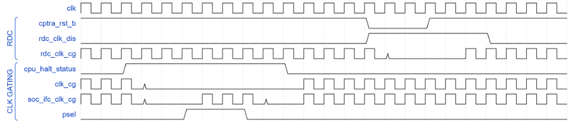

## Integrated TRNG

Caliptra implements a true random number generator (TRNG) block for local use models. Firmware is able to read a random number from the TRNG core by accessing its register block over the AHB-lite interface. This is a configuration that SoC integrators enable by defining CALIPTRA\_INTERNAL\_TRNG.

This TRNG block is a combination of entropy source and CSRNG implementations. For information, see the [ENTROPY\_SRC HWIP Technical Specification](https://opentitan.org/book/hw/ip/entropy_src/index.html) and the [CSRNG HWIP Technical Specification](https://opentitan.org/book/hw/ip/csrng/). The core code (see [entropy source](https://github.com/lowRISC/opentitan/tree/master/hw/ip/entropy_src) and [csrng](https://github.com/lowRISC/opentitan/tree/master/hw/ip/csrng)) is reused from here but the interface to the module is changed to AHB-lite. This design provides an interface to an external physical random noise generator. This is also referred to as a physical true random number generator (PTRNG). The PTRNG external source is a physical true random noise source. A noise source and its relation to an entropy source are defined by [SP 800-90B](https://csrc.nist.gov/publications/detail/sp/800-90b/final).

The block is instantiated based on a design parameter chosen at integration time. This is to provide options for SoC to reuse an existing TRNG to build an optimized SoC design. For the optimized scenarios, SoC needs to follow the TODO: heading link in markdown.

The following figure shows the integrated TRNG block.

*Figure 12: Integrated TRNG block*

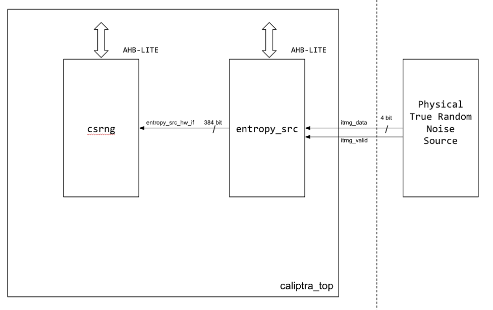

The following figure shows the CSRNG block.

*Figure 13: CSRNG block*

The following figure shows the entropy source block.

*Figure 14: Entropy source block*

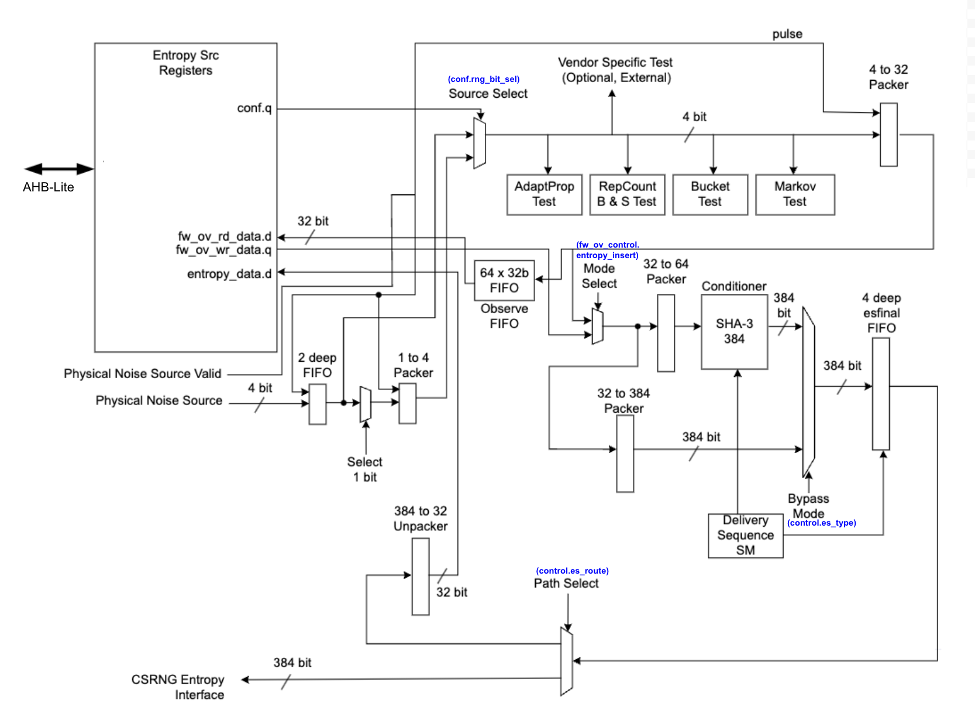

### Operation

Requests for entropy bits start with [command requests](https://opentitan.org/book/hw/ip/csrng/doc/theory_of_operation.html#general-command-format) over the AHB-lite interface to the csrng [CMD\_REQ](https://chipsalliance.github.io/caliptra-rtl/main/internal-regs/?p=clp.csrng_reg.CMD_REQ) register. 

The following describes the fields of the command request header:

* Application Command: Selects one of five operations to perform. The commands supported are instantiate, reseed, generate, update, and uninstantiate.

* Command Length: Number of 32-bit words that can optionally be appended to the command. A value of zero will only transfer the command header. A value of 4'hc transfers the header plus an additional twelve 32-bit words of data.

* Command Flag0: flag0 is associated with the current command. Setting this field to True (4’h6) enables flag0 to be enabled. Note that flag0 is used for the instantiate and reseed commands only; for all other commands, the flag0 value is ignored.

* Generate Length: Only defined for the generate command, this field is the total number of cryptographic entropy blocks requested. Each unit represents 128 bits of entropy returned.  A value of 8 would return a total of 1024 bits. The maximum size supported is 4096.

First an instantiate command is requested over the SW application interface to initialize an instance in the CSRNG module. Depending on the flag0 and clen fields in the command header, a request to the entropy\_src module over the entropy interface is sent to seed the csrng. This can take a few milliseconds if the seed entropy is not immediately available. 

Example instantiation:

acmd = 0x1 (Instantiate)

clen/flag0 = The seed behavior is described in the following table.

glen = Not used

| flag0 | clen | Description                                                  |
| :---- | :--- | :----------------------------------------------------------- |
| F     | 0    | Only entropy source seed is used.                            |
| F     | 1-12 | Entropy source seed is xor'ed with provided additional data. |
| T     | 0    | Seed of zero is used (no entropy source seed used).          |
| T     | 1-12 | Only provided additional data is used as seed.               |

Next a generate command is used to request generation of cryptographic entropy bits. The glen field defines how many 128 bit words are to be returned to the application interface. After the generated bits are ready, they can be read out via the GENBITS register. This register must be read out glen \* 4 times for each request made. 

Example generate command:

acmd = 0x3 (Generate)

clen = 0

flag0 = false (4’h9)

glen = 4 (4 \*128 = 512b)

This requires 16 reads from GENBITS to read out all of the generated entropy.

### Configuration

The HW application interfaces are not supported. Only the SW application interface should be used for this design.

### Physical true random noise source signal descriptions

These are the top level signals defined in caliptra\_top.

| Name        | Input or output | Description                                                                                             |
| :---------- | :-------------- | :------------ |
| itrng_data  | input           | Physical true random noise source data                                                                  |
| itrng_valid | input           | Valid is asserted high for one cycle when data is valid. The expected valid output rate is about 50KHz. |

The following figure shows the top level signals defined in caliptra\_top.

*Figure 15: caliptra\_top signals*

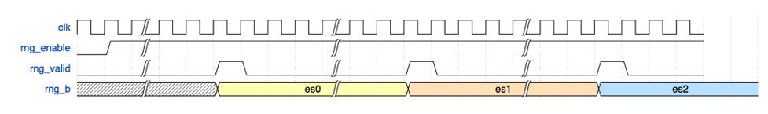

### Entropy source signal descriptions

The following table provides descriptions of the entropy source signals.

| Name | Input or output | Description |
| :------------------ | :-------------- | :--------------- |
| clk_i               | input           | All signal timings are related to the rising edge of clk.                                                                         |
| rst_ni              | input           | The reset signal is active LOW and resets the core.                                                                               |
| entropy_src_rng_req | output          | Request from the entropy_src module to the physical true random noise source to start generating data.                            |
| entropy_src_rng_rsp | input           | Contains the internal TRNG data and a flag indicating the data is valid. Valid is asserted high for one cycle when data is valid. |
| entropy_src_hw_if_i | input           | Downstream block request for entropy bits.                                                                                        |
| entropy_src_hw_if_o | output          | 384 bits of entropy data. Valid when es_ack is asserted high.                                                                     |
| cs_aes_halt_i       | input           | Response from csrng that all requests to AES block are halted.                                                                    |
| cs_aes_halt_o       | output          | Request to csrng to halt requests to the AES block for power leveling purposes.                                                   |

The following figure shows the entropy source signals.

*Figure 16: Entropy source signals*

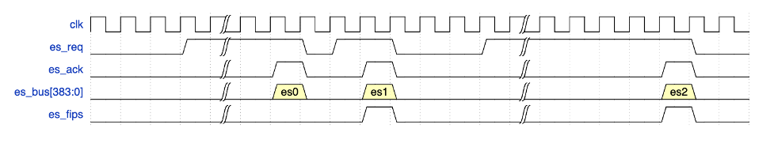

### CSRNG signal descriptions

The following table provides descriptions for the CSRNG signals.

| Name                       | Input or output | Description                                                                                           |
| :------------------------- | :-------------- | :---------------------------------------------------------------------------------------------------- |
| clk_i                      | input           | All signal timings are related to the rising edge of clk.                                             |
| rst_ni                     | input           | The reset signal is active LOW and resets the core.                                                   |
| otp_en_csrng_sw_app_read_i | input           | Enable firmware to access the ctr_drbg internal state and genbits through registers.                  |
| lc_hw_debug_en_i           | input           | Lifecycle that selects which diversification value is used for xoring with the seed from entropy_src. |
| entropy_src_hw_if_i        | input           | 384 bits of entropy data. Valid when es_ack is asserted high.                                         |
| entropy_src_hw_if_o        | output          | Downstream block request for entropy bits.                                                            |
| cs_aes_halt_i              | input           | Request from entropy_src to halt requests to the AES block for power leveling purposes.               |
| cs_aes_halt_o              | output          | Response to entropy_src that all requests to AES block are halted.                                    |

The CSRNG may only be enabled if entropy\_src is enabled. After it is disabled, CSRNG may only be re-enabled after entropy\_src has been disabled and re-enabled.

## External-TRNG REQ HW API

For SoCs that choose to not instantiate Caliptra’s integrated TRNG, Caliptra provides a TRNGREQ HW API.

1. Caliptra asserts TRNG\_REQ wire (FW made the request for a TRNG).
2. SoC writes the TRNG architectural registers.
3. SoC writes a done bit in the TRNG architectural registers.
4. Caliptra desserts TRNG\_REQ.

The reason to have a separate interface from the SoC mailbox is to ensure that this request is not intercepted by any SoC FW agents that communicate with the SoC mailbox. It is required for FIPS compliance that this TRNG HW API is always handled by a SoC HW gasket logic and not handled by SoC ROM/FW code.

## SoC-SHA accelerator HW API

Caliptra provides a SHA accelerator HW API for SoC and Caliptra internal FW to use. It is atomic in nature in that only one of them can use the SHA accelerator HW API at the same time. Details of the SHA accelerator register block may be found in the GitHub repository in [documentation](https://chipsalliance.github.io/caliptra-rtl/main/external-regs/?p=caliptra_top_reg.sha512_acc_csr) generated from the register definition file.

Using the HW API:

* A user of the HW API first locks the accelerator by reading the LOCK register. A read that returns the value 0 indicates that the resource was locked for exclusive use by the requesting user. A write of ‘1 clears the lock.
* The USER register captures the APB pauser value of the requestor that locked the SHA accelerator. This is the only user that is allowed to control the SHA accelerator by performing APB register writes. Writes by any other agent on the APB interface are dropped.
* MODE register is written to set the SHA execution mode.
     * SHA accelerator supports both SHA384 and SHA512 modes of operation.
     * SHA supports **streaming** mode: SHA is computed on a stream of incoming data to the DATAIN register. The EXECUTE register, when set, indicates to the accelerator that streaming is complete. The accelerator can then publish the result into the DIGEST register. When the VALID bit of the STATUS register is set, then the result in the DIGEST register is valid.
     * SHA supports **Mailbox** mode: SHA is computed on LENGTH (DLEN) bytes of data stored in the mailbox beginning at START\_ADDRESS. This computation is performed when the EXECUTE register is set by the user. When the operation is completed and the result in the DIGEST register is valid, SHA accelerator sets the VALID bit of the STATUS register.
     * The SHA computation engine in the SHA accelerator requires big endian data, but the SHA accelerator can accommodate mailbox input data in either the little endian or big endian format. By default, input data is assumed to be little endian and is swizzled to big endian at the byte level prior to computation. For the big endian format, data is loaded into the SHA engine as-is. Users may configure the SHA accelerator to treat data as big endian by setting the ENDIAN\_TOGGLE bit appropriately.
     * See the register definition for the encodings.
* SHA engine also provides a ‘zeroize’ function through its CONTROL register to clear any of the SHA internal state. This can be used when the user wants to conceal previous state for debug or security reasons.

## JTAG implementation

For specific debug flows, see the [JTAG/TAP Debug](https://chipsalliance.github.io/Caliptra/doc/Caliptra.html#jtagtap-debug) section in Caliptra: A Datacenter System on a Chip (SoC) Root of Trust (RoT).

The following figure shows the JTAG implementation within the Caliptra boundary. The output of the existing DMI wrapper is used to find the non-Core (Caliptra uncore) aperture to route the JTAG commands.

Caliptra’s JTAG/TAP should be implemented as a TAP EP. JTAG is open if the debug mode is set at the time of Caliptra reset deassertion.

Note: If the debug security state switches to debug mode anytime, the security assets and keys are still flushed even though JTAG is not open.

*Figure 17: JTAG implementation*

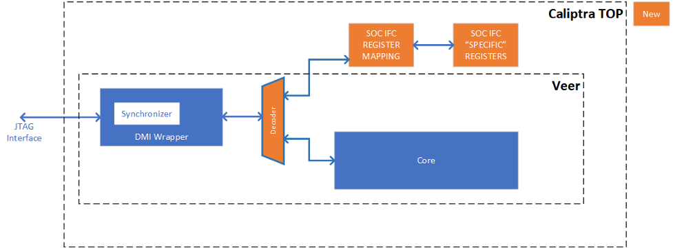

# Cryptographic subsystem architecture

The architecture of Caliptra cryptographic subsystem includes the following components:

* Symmetric cryptographic primitives
    * De-obfuscation engine
     * SHA512/384 (based on NIST FIPS 180-4 [2])
     * SHA256 (based on NIST FIPS 180-4 [2])
     * HMAC384 (based on [NIST FIPS 198-1](https://nvlpubs.nist.gov/nistpubs/FIPS/NIST.FIPS.198-1.pdf) [5] and [RFC 4868](https://tools.ietf.org/html/rfc4868) [6])
* Public-key cryptography
     * NIST Secp384r1 Deterministic Digital Signature Algorithm (based on FIPS-186-4  [11] and RFC 6979 [7])
* Key vault
     * Key slots
     * Key slot management

The high-level architecture of Caliptra cryptographic subsystem is shown in the following figure.

*Figure 18: Caliptra cryptographic subsystem TODO: fix this image*

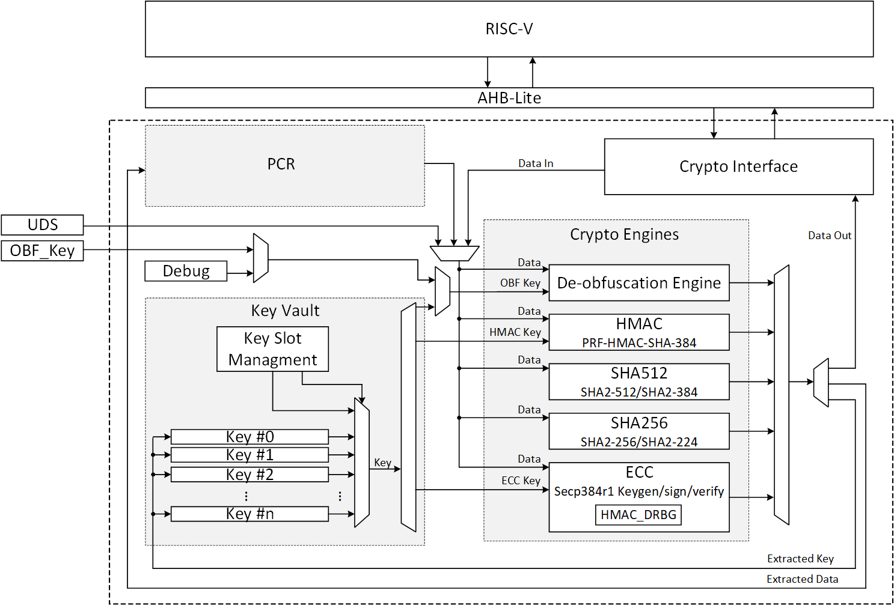

## SHA512/SHA384

SHA512 is a function of cryptographic hash algorithm SHA-2. The hardware implementation is based on [Secworks/SHA512](https://github.com/secworks/sha512) [1]. This implementation complies with the functionality in NIST FIPS 180-4 [2]. The implementation supports the SHA512 variants SHA-512/224, SHA-512/256, SHA384 and SHA512.

The SHA512 algorithm is described as follows:

* The message is padded by the host and broken into 1024-bit chunks
* For each chunk:
     * The message is fed to the SHA512 core
     * The core should be triggered by the host
     * The SHA512 core status is changed to ready after hash processing
* The result digest can be read after feeding all message chunks

### Operation

#### Padding

The message should be padded before feeding to the hash core. The input message is taken, and some padding bits are appended to it to get it to the desired length. The bits that are used for padding are simply ‘0’ bits with a leading ‘1’ (100000…000). The appended length of the message (before pre-processing), in bits, is a 128-bit big-endian integer.

The total size should be equal to 128 bits short of a multiple of 1024 since the goal is to have the formatted message size as a multiple of 1024 bits (N x 1024). The following figure shows the SHA512 input formatting.

*Figure 19: SHA512 input formatting*

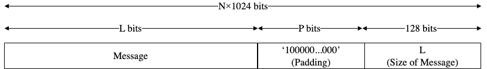

#### Hashing

The SHA512 core performs 80 iterative operations to process the hash value of the given message. The algorithm processes each block of 1024 bits from the message using the result from the previous block. For the first block, the initial vectors (IV) are used for starting the chain processing of each 1024-bit block.

### FSM

The SHA512 architecture has the finite-state machine as shown in the following figure.

*Figure 20: SHA512 FSM*

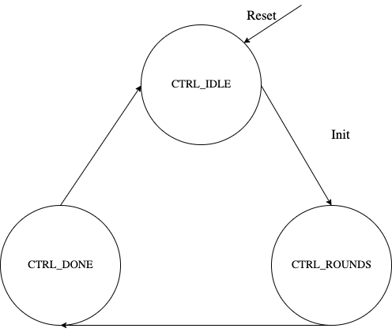

### Signal descriptions

The SHA512 architecture inputs and outputs are described in the following table.

| Name            | Inputs and outputs | Description                                                                                       |
|-----------------|--------------------|---------------------------------------------------------------------------------------------------|
| clk             | input              | All signal timings are related to the rising edge of clk.                                         |
| reset_n         | input              | The reset signal is active LOW and resets the core. This is the only active LOW signal.           |
| init            | input              | The core is initialized and processes the first block of message.                                 |
| next            | input              | The core processes the rest of the message blocks using the result from the previous blocks.      |
| mode\[1:0\]     | input              | Indicates the hash type of the function. This can be:  - SHA512/224  - SHA512/256  - SHA384  - SHA512 |
| zeroize         | input              | The core clears all internal registers to avoid any SCA information leakage.                      |
| block\[1023:0\] | input              | The input padded block of message.                                                                |
| ready           | output             | When HIGH, the signal indicates the core is ready.                                                |
| digest\[511:0\] | output             | The hashed value of the given block.                                                              |
| digest_valid    | output             | When HIGH, the signal indicates that the result is ready.                                         |

### Address map

The SHA512 address map is shown here: [sha512\_reg — clp Reference (chipsalliance.github.io)](https://chipsalliance.github.io/caliptra-rtl/main/internal-regs/?p=clp.sha512_reg)

### Pseudocode

The following pseudocode demonstrates how the SHA512 interface can be implemented.

*Figure 21: SHA512 pseudocode*

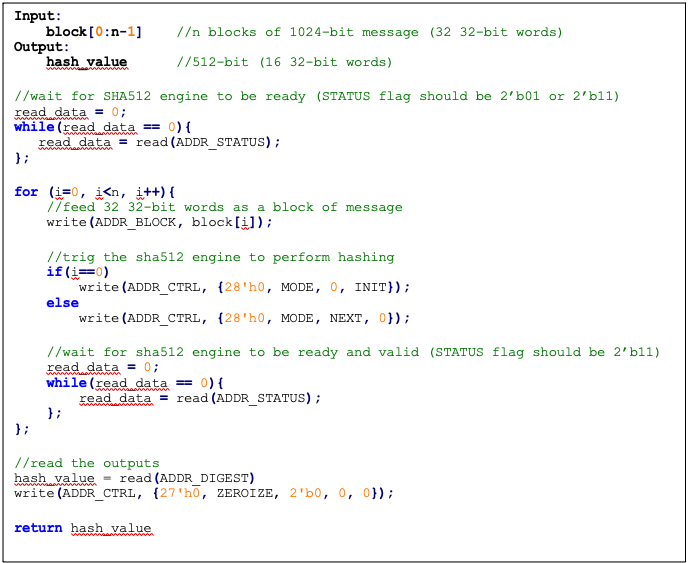

### SCA countermeasure

We do not propose any countermeasure to protect the hash functions. Inherently, hash functions do not work like other cryptographic engines. Hash functions target integrity without requiring a secret key. Hence, the attacker can target only messages. Also, the attacker cannot build a CPA or DPA platform on the hash function because the same message ideally gives the same side-channel behavior.

If the attacker works on the multi-message mechanism, the attacker then needs to work with single trace attacks, which are very unlikely in ASIC/FPGA implementations. Also, our hash implementation is a noisy platform. As a result, we do not propose any SCA implementation countermeasure on the hash functions.

### Performance

The SHA512 core performance is reported considering two different architectures: pure hardware architecture, and hardware/software architecture. These are described next.

#### Pure hardware architecture

In this architecture, the SHA512 interface and controller are implemented in hardware. The performance specification of the SHA512 architecture is shown in the following table.

| Operation             | Cycle count \[CCs\] | Time \[us\] @ 400 MHz | Throughput \[op/s\] |
| :-------------------- | :------------------ | :-------------------- | :------------------ |
| Data_In transmission  |                     | 0.08                  |                     |
| Process               | 87                  | 0.22                  |                     |
| Data_Out transmission | 16                  | 0.04                  |                     |
| Single block          | 136                 | 0.34                  | 2,941,176           |
| Double block          | 224                 | 0.56                  | 1,785,714           |
| 1 KiB message         | 840                 | 2.10                  | 476,190             |
| 128 KiB message       | 17,632              | 44.08                 | 22,686              |

#### Hardware/software architecture

In this architecture, the SHA512 interface and controller are implemented in RISC-V core. The performance specification of the SHA512 architecture is shown in the following table.

| Operation             | Cycle count \[CCs\] | Time \[us\]\] @ 400 MHz | Throughput \[op/s\] |
| :-------------------- | :------------------ | :---------------------- | :------------------ |
| Data_In transmission  | 990                 | 2.48                    |                     |
| Process               | 139                 | 0.35                    |                     |
| Data_Out transmission | 387                 | 0.97                    |                     |
| Single block          | 1,516               | 3.79                    | 263,852             |
| Double block          | 2,506               | 6.27                    | 159,617             |
| 1 KiB message         | 9,436               | 23.59                   | 42,391              |
| 128 KiB message       | 1,015,276           | 2,538.19                | 394                 |

#### Pure software architecture

In this architecture, the SHA512 algorithm is implemented fully in software. The implementation is derived from the [OpenSSL](https://www.openssl.org/docs/man3.0/man3/SHA512.html) SHA512 implementation [3]. The performance numbers for this architecture are shown in the following table.

| Data size |  Cycle count |
| :------------ | :-------------- |
| 1 KiB         | 147,002         |
| 4 KiB         | 532,615         |
| 8 KiB         | 1,046,727       |
| 12 KiB        | 1,560,839       |
| 128 KiB       | 16,470,055      |

## SHA256

SHA256 is a function of the SHA-2 cryptographic hash algorithm. The hardware implementation is based on [Secworks/SHA256](https://github.com/secworks/sha256) [1]. The implementation supports the two variants: SHA256/224 and SHA256.

The SHA256 algorithm is described as follows:

* The message is padded by the host and broken into 512-bit chunks
* For each chunk:
     * The message is fed to the sha256 core
     * The core should be triggered by the host
     * The sha256 core status is changed to ready after hash processing
* The result digest can be read after feeding all message chunks

### Operation

#### Padding

The message should be padded before feeding to the hash core. The input message is taken, and some padding bits are appended to the message to get it to the desired length. The bits that are used for padding are simply ‘0’ bits with a leading ‘1’ (100000…000). The appended length of the message (before pre-processing), in bits, is a 64-bit big-endian integer.

The total size should be equal to 64 bits, short of a multiple of 512 because the goal is to have the formatted message size as a multiple of 512 bits (N x 512).

The following figure shows SHA256 input formatting.

*Figure 22: SHA256 input formatting*

#### Hashing

The SHA256 core performs 64 iterative operations to process the hash value of the given message. The algorithm processes each block of 512 bits from the message using the result from the previous block. For the first block, the initial vectors (IV) are used to start the chain processing of each 512-bit block.

### FSM

The SHA256 architecture has the finite-state machine as shown in the following figure.

*Figure 23: SHA256 FSM*

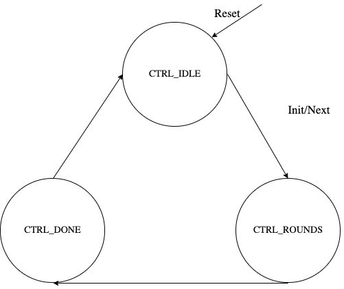

### Signal descriptions

The SHA256 architecture inputs and outputs are described as follows.

| Name            | Input or output | Description                                                                                  |
| :-------------- | :-------------- | :------------------------------------------------------------------------------------------- |
| clk             | input           | All signal timings are related to the rising edge of clk.                                    |
| reset_n         | input           | The reset signal is active LOW and resets the core. This is the only active LOW signal.      |
| init            | input           | The core is initialized and processes the first block of message.                            |
| next            | input           | The core processes the rest of the message blocks using the result from the previous blocks. |
| mode            | input           | Indicates the hash type of the function. This can be:   - SHA256/224   - SHA256        |
| zeroize         | input           | The core clears all internal registers to avoid any SCA information leakage.                 |
| block\[511:0\]  | input           | The input padded block of message.                                                           |
| ready           | output          | When HIGH, the signal indicates the core is ready.                                           |
| digest\[255:0\] | output          | The hashed value of the given block.                                                         |
| digest_valid    | output          | When HIGH, the signal indicates the result is ready.                                         |

### Address map

The SHA256 address map is shown here: [sha256\_reg — clp Reference (chipsalliance.github.io)](https://chipsalliance.github.io/caliptra-rtl/main/internal-regs/?p=clp.sha256_reg).

### Pseudocode

The following pseudocode demonstrates how the SHA256 interface can be implemented.

*Figure 24: SHA256 pseudocode*

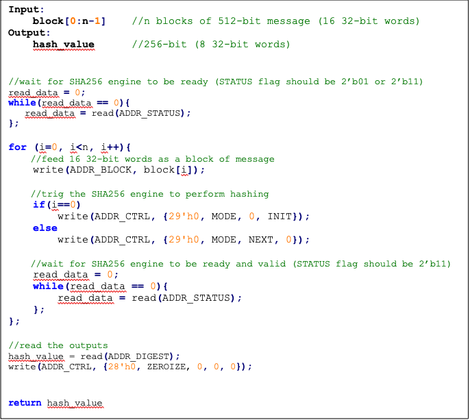

### SCA countermeasure

We do not propose any countermeasure to protect the hash functions. For more information, see SCA countermeasure in the [SHA512/SHA384](#sha512sha384) section.

### Performance

The SHA256 core performance is reported considering two different architectures: pure hardware architecture, and hardware/software architecture. These are described next.

#### Pure hardware architecture

In this architecture, the SHA256 interface and controller are implemented in hardware. The performance specification of the SHA256 architecture is reported as shown in the following table.

| Operation             | Cycle count \[CCs\] | Time \[us\] @ 400 MHz | Throughput \[op/s\] |
| :-------------------- | :------------------ | :-------------------- | :------------------ |
| Data_In transmission  | 17                  | 0.04                  |                     |
| Process               | 66                  | 0.17                  |                     |
| Data_Out transmission | 8                   | 0.02                  |                     |
| Single block          | 91                  | 0.23                  | 4,395,604           |
| Double block          | 158                 | 0.40                  | 2,531,646           |
| 1 KiB message         | 1163                | 2.91                  | 343,938             |

#### Hardware/software architecture

In this architecture, the SHA256 interface and controller are implemented in RISC-V core. The performance specification of the SHA256 architecture is reported as shown in the following table.

| Operation             | Cycle count \[CCs\] | Time \[us\] @ 400 MHz | Throughput \[op/s\] |
| :-------------------- | :------------------ | :-------------------- | :------------------ |
| Data_In transmission  | 500                 | 1.25                  |                     |
| Process               | 66                  | 0.17                  |                     |
| Data_Out transmission | 195                 | 0.49                  |                     |
| Single block          | 761                 | 1.90                  | 525,624             |
| Double block          | 1355                | 3.39                  | 295,203             |
| 1 KiB message         | 8761                | 21.90                 | 45,657              |

## HMAC384

Hash-based message authentication code (HMAC) is a cryptographic authentication technique that uses a hash function and a secret key. HMAC involves a cryptographic hash function and a secret cryptographic key. This implementation supports HMAC-SHA-384-192 as specified in [NIST FIPS 198-1](https://nvlpubs.nist.gov/nistpubs/FIPS/NIST.FIPS.198-1.pdf) [5]. The implementation is compatible with the HMAC-SHA-384-192 authentication and integrity functions defined in [RFC 4868](https://tools.ietf.org/html/rfc4868) [6].

Caliptra HMAC implementation uses SHA384 as the hash function, accepts a 384-bit key, and generates a 384-bit tag.

The implementation also supports PRF-HMAC-SHA-384. The PRF-HMAC-SHA-384 algorithm is identical to HMAC-SHA-384-192, except that variable-length keys are permitted, and the truncation step is not performed.

The HMAC algorithm is described as follows:
* The key is fed to the HMAC core to be padded
* The message is broken into 1024-bit chunks by the host
* For each chunk:
     * The message is fed to the HMAC core
     * The HMAC core should be triggered by the host
     * The HMAC core status is changed to ready after hash processing
* The result digest can be read after feeding all message chunks

### Operation

#### Padding

The message should be padded before feeding to the HMAC core. Internally, the i\_padded key is concatenated with the message. The input message is taken, and some padding bits are appended to the message to get it to the desired length. The bits that are used for padding are simply ‘0’ bits with a leading ‘1’ (100000…000).

The total size should be equal to 128 bits, short of a multiple of 1024 because the goal is to have the formatted message size as a multiple of 1024 bits (N x 1024).

*Figure 25: HMAC input formatting*

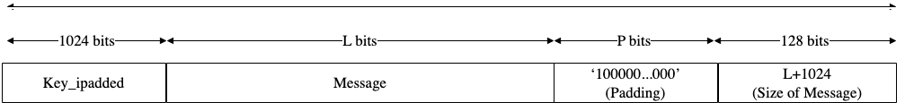

The following figures show examples of input formatting for different message lengths.

*Figure 26: Message length of 1023 bits*

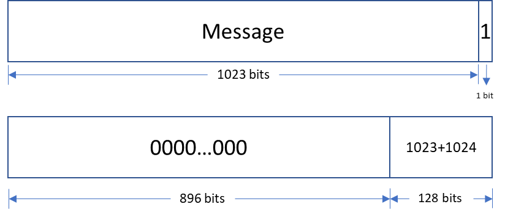

When the message is 1023 bits long, padding is given in the next block along with message size.

*Figure 27: 1 bit padding*

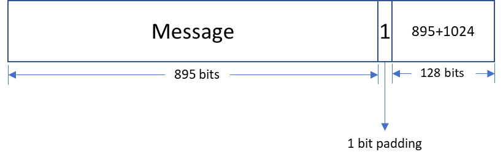

When the message size is 895 bits, a padding of ‘1’ is also considered valid, followed by the message size.

*Figure 28: Multi block message*

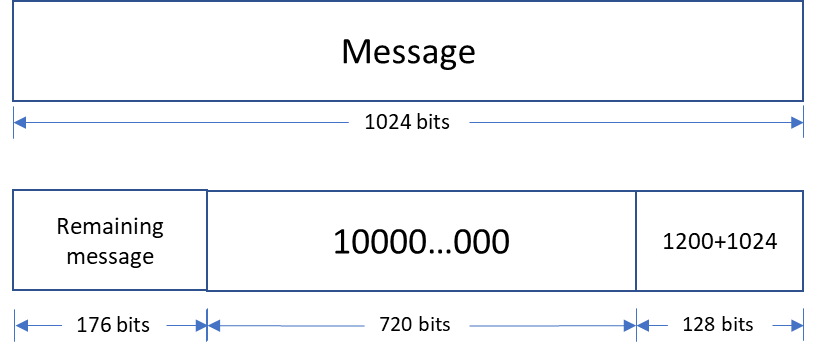

Messages with a length greater than 1024 bits are broken down into N 1024-bit blocks. The last block contains padding and the size of the message.

#### Hashing

The HMAC core performs the sha2-384 function to process the hash value of the given message. The algorithm processes each block of the 1024 bits from the message, using the result from the previous block. This data flow is shown in the following figure.

*Figure 29: HMAC-SHA-384-192 data flow*

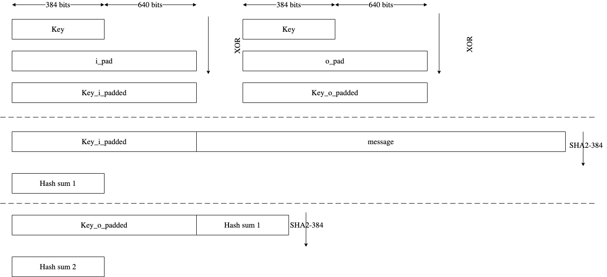

### FSM

The HMAC architecture has the finite-state machine as shown in the following figure.

*Figure 30: HMAC FSM*

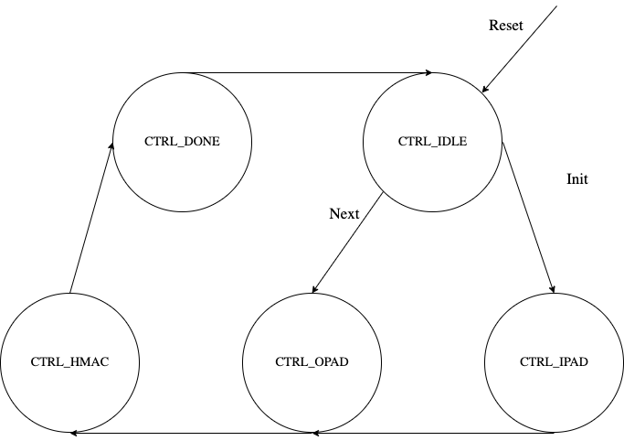

### Signal descriptions

The HMAC architecture inputs and outputs are described in the following table.

| Name               | Input or output | Description  |
| :----------------- | :-------------- | :----------- |
| clk                | input           | All signal timings are related to the rising edge of clk.                                                                                                                   |
| reset_n            | input           | The reset signal is active LOW and resets the core. This is the only active LOW signal.                                                                                     |
| init               | input           | The core is initialized and processes the key and the first block of the message.                                                                                           |
| next               | input           | The core processes the rest of the message blocks using the result from the previous blocks.                                                                                |
| zeroize            | input           | The core clears all internal registers to avoid any SCA information leakage.                                                                                                |
| key\[383:0\]       | input           | The input key.                                                                                                                                                              |
| block\[1023:0\]    | input           | The input padded block of message.                                                                                                                                          |
| LFSR_seed\[159:0\] | Input           | The input to seed PRNG to enable the masking countermeasure for SCA protection.                                                                                             |
| ready              | output          | When HIGH, the signal indicates the core is ready.                                                                                                                          |
| tag\[383:0\]       | output          | The HMAC value of the given key or block. For PRF-HMAC-SHA-384, a 384-bit tag is required. For HMAC-SHA-384-192, the host is responsible for reading 192 bits from the MSB. |
| tag_valid          | output          | When HIGH, the signal indicates the result is ready.                                                                                                                        |

### Address map

The HMAC address map is shown here: [hmac\_reg — clp Reference (chipsalliance.github.io)](https://chipsalliance.github.io/caliptra-rtl/main/internal-regs/?p=clp.hmac_reg).

### Pseudocode

The following pseudocode demonstrates how the HMAC interface can be implemented.

*Figure 31: HMAC pseudocode*

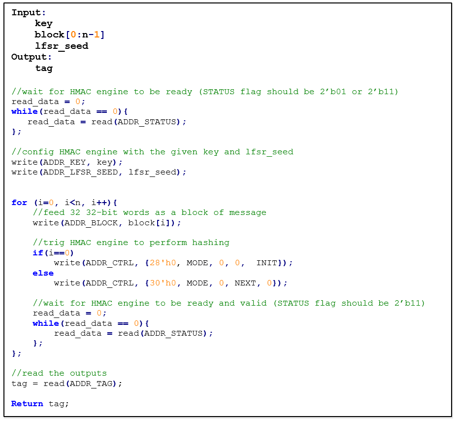

### SCA countermeasure

In an attack model, an attacker can form hypotheses about the secret key value and compute the corresponding output values by using the Hamming Distance model as an appropriate leakage model. An attacker who has knowledge of the implementation for open-source architecture has an advantage. The attacker can capture the power consumption traces to verify their hypotheses, by partitioning the acquisitions or using Pearson’s correlation coefficient.

To protect the HMAC algorithm from side-channel attacks, a masking countermeasure is applied. This means that random values are added to the intermediate variables during the algorithm’s execution, so that the side-channel signals do not reveal any information about them.

The embedded countermeasures are based on "Differential Power Analysis of HMAC Based on SHA-2, and Countermeasures" by McEvoy et. al. To provide the required random values for masking intermediate values, a lightweight 74-bit LFSR is implemented. Based on “Spin Me Right Round Rotational Symmetry for FPGA-specific AES” by Wegener et. al., LFSR is sufficient for masking statistical randomness.

Each round of SHA512 execution needs 6,432 random bits, while one HMAC operation needs at least 4 rounds of SHA512 operations. However, the proposed architecture requires only 160-bit LFSR seed and provides first-order DPA attack protection at the cost of 10% latency overhead with negligible hardware resource overhead.

### Performance

The HMAC core performance is reported considering two different architectures: pure hardware architecture, and hardware/software architecture. These are described next.

#### Pure hardware architecture

In this architecture, the HMAC interface and controller are implemented in hardware. The performance specification of the HMAC architecture is reported as shown in the following table.

| Operation             | Cycle count \[CCs\] | Time \[us\] @ 400 MHz | Throughput \[op/s\] |
| :-------------------- | :------------------ | :-------------------- | :------------------ |
| Data_In transmission  | 44                  | 0.11                  | -                   |
| Process               | 254                 | 0.635                 | -                   |
| Data_Out transmission | 12                  | 0.03                  | -                   |
| Single block          | 310                 | 0.775                 | 1,290,322           |
| Double block          | 513                 | 1.282                 | 780,031             |
| 1 KiB message         | 1,731               | 4.327                 | 231,107             |
| 128 KiB message       | 207,979             | 519.947               | 1,923               |

#### Hardware/software architecture 

In this architecture, the HMAC interface and controller are implemented in RISC-V core. The performance specification of the HMAC architecture is reported as shown in the following table. 

| Operation             | Cycle count \[CCs\] | Time \[us\] @ 400 MHz | Throughput \[op/s\] |
| :-------------------- | :------------------ | :-------------------- | :------------------ |
| Data_In transmission  | 1389                | 3.473                 | -                   |
| Process               | 253                 | 0.633                 | -                   |
| Data_Out transmission | 290                 | 0.725                 | -                   |
| Single block          | 1932                | 4.83                  | 207,039             |
| Double block          | 3166                | 7.915                 | 136,342             |
| 1 KiB message         | 10,570              | 26.425                | 37,842              |
| 128 KiB message       | 1,264,314           | 3,160.785             | 316                 |

## HMAC_DRBG

Hash-based message authentication code (HMAC) deterministic random bit generator (DRBG) is a cryptographic random bit generator that uses a HMAC function. HMAC_DRBG involves a cryptographic HMAC function and a seed. This architecture is designed as specified in section 10.1.2. of NIST SP 800-90A [12]. For ECC signing operation, the implementation is compatible with section 3.1. of RFC 6979 [7].

Caliptra HMAC_DRBG implementation uses HMAC384 as the HMAC function, accepts a 384-bit seed, and generates a 384-bit random value.

The HMAC algorithm is described as follows:

* The seed is fed to HMAC_DRBG core by the host
* For each 384-bit random value
     * The core should be triggered by the host
     * The HMAC_DRBG core status is changed to ready after HMAC processing
     * The result digest can be read

### Operation

HMAC_DRBG uses a loop of HMAC(K, V) to generate the random bits. In this algorithm, two constant values of K_init and V_init are used as follows:

            1. 	Set V_init = 0x01 0x01 0x01 ... 0x01  (V has 384-bit)
            2. 	Set K_init = 0x00 0x00 0x00 ... 0x00  (K has 384-bit)
            3. 	K_tmp = HMAC(K_init, V_init || 0x00 || entropy || nonce) 
            4. 	V_tmp = HMAC(K_tmp,  V_init)
            5. 	K_new = HMAC(K_tmp,  V_tmp  || 0x01 || entropy || nonce)
            6. 	V_new = HMAC(K_new,  V_tmp)
            7. 	Set T = []
            8. 	T = T || HMAC(K_new, V_new)
            9. 	Return T if T is within the [1,q-1] range, otherwise:
            10.	K_new = HMAC(K_new,  V_new || 0x00)
            11.	V_new = HMAC(K_new,  V_new)
            12.	Jump to 8

For ECC KeyGen operation, HMAC_DRBG is used to generate privkey as follows:

    Privkey = HMAC_DRBG(seed, nonce)

For ECC SIGNING operation, HMAC_DRBG is used to generate k as follows:

    K = HMAC_DRBG(privkey, hashed_msg)

### Signal descriptions

The HMAC_DRBG architecture inputs and outputs are described in the following table.

| Name                 | Input or output | Description                                                                             |
| :------------------- | :-------------- | :-------------------------------------------------------------------------------------- |
| clk                  | input           | All signal timings are related to the rising edge of clk.                               |
| reset_n              | input           | The reset signal is active LOW and resets the core. This is the only active LOW signal. |
| init                 | input           | The core is initialized with the given seed and generates a 384-bit random value.       |
| next                 | input           | The core generates a new 384-bit random value using the result from the previous run.   |
| zeroize              | input           | The core clears all internal registers to avoid any SCA information leakage.            |
| entropy \[383:0\]    | input           | The input entropy.                                                                      |
| nonce \[383:0\]      | input           | The input nonce.                                                                        |
| LFSR_seed \[147 :0\] | input           | The input to seed PRNG to enable masking countermeasure for SCA protection.             |
| ready                | output          | When HIGH, the signal indicates the core is ready.                                      |
| drbg \[383:0\]       | output          | The hmac_drbg value of the given inputs.                                                |
| valid                | output          | When HIGH, the signal indicates the result is ready.                                    |

### Address map

The HMAC_DRBG is embedded into ECC architecture, since there is no address map to access it from FW.

### SCA countermeasure

For information, see SCA countermeasure in the [HMAC384](#hmac384) section.

## ECC

The ECC unit includes the ECDSA (Elliptic Curve Digital Signature Algorithm) engine, offering a variant of the cryptographically secure Digital Signature Algorithm (DSA), which uses elliptic curve (ECC). A digital signature is an authentication method in which a public key pair and a digital certificate are used as a signature to verify the identity of a recipient or sender of information.

The hardware implementation supports deterministic ECDSA, 384 Bits (Prime Field), also known as NIST-Secp384r1, described in RFC6979.

Secp384r1 parameters are shown in the following figure.

*Figure 32: Secp384r1 parameters*

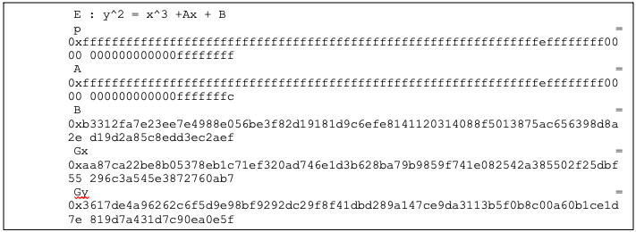

### Operation

The ECDSA consists of three operations, shown in the following figure.

*Figure 33: ECDSA operations*

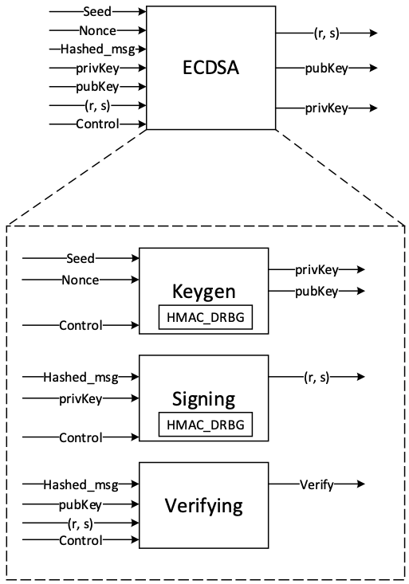

#### KeyGen

In the deterministic key generation, the paired key of (privKey, pubKey) is generated by KeyGen(seed, nonce), taking a deterministic seed and nonce. The KeyGen algorithm is as follows:

* Compute privKey = HMAC_DRBG(seed, nonce) to generate a random integer in the interval [1, n-1] where n is the group order of Secp384 curve.
* Generate pubKey(x,y) as a point on ECC calculated by pubKey=privKey × G, while G is the generator point over the curve.

#### Signing

In the signing algorithm, a signature (r, s) is generated by Sign(privKey, h), taking a privKey and hash of message m, h = hash(m), using a cryptographic hash function, SHA384. The signing algorithm includes:

* Generate a random number k in the range [1..n-1], while k = HMAC\_DRBG(privKey, h)
* Calculate the random point R = k × G
* Take r = Rx mod n, where Rx is x coordinate of R=(Rx, Ry)
* Calculate the signature proof: s = k-1 × (h + r × privKey) mod n
* Return the signature (r, s), each in the range [1..n-1]

#### Verifying

The signature (r, s) can be verified by Verify(pubKey ,h ,r, s) considering the public key pubKey and hash of message m, h=hash(m) using the same cryptographic hash function SHA384. The output is r’ value of verifying a signature. The ECDSA verify algorithm includes:

* Calculate s1 = s−1 mod n
* Compute R' = (h × s1) × G + (r × s1) × pubKey
* Take r’ = R'x mod n, while R'x is x coordinate of R’=(R'x, R'y)
* Verify the signature by comparing whether r' == r

### Architecture

The ECC top-level architecture is shown in the following figure.

*Figure 34: ECDSA architecture*

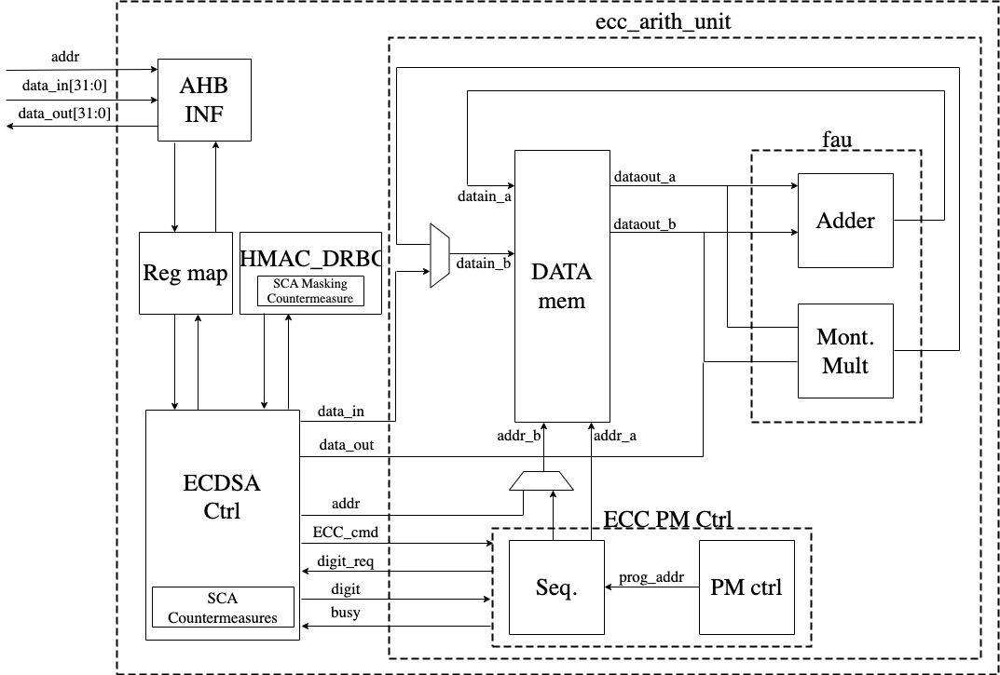

### Signal descriptions

The ECDSA architecture inputs and outputs are described in the following table.

| Name                       | Input or output | Description  |
| :------------------------- | :-------------- | :----------- |
| clk                        | input           | All signal timings are related to the rising edge of clk.                                                                  |
| reset_n                    | input           | The reset signal is active LOW and resets the core. This is the only active LOW signal.                                    |
| ctrl\[1:0\]                | input           | Indicates the AES type of the function. This can be:  − 0b00: No Operation  − 0b01: KeyGen  − 0b10: Signing  − 0b11: Verifying |
| zeroize                    | input           | The core clears all internal registers to avoid any SCA information leakage.                                               |
| seed \[383:0\]             | input           | The deterministic seed for HMAC_DRBG in the KeyGen operation.                                                              |
| nonce \[383:0\]            | input           | The deterministic nonce for HMAC_DRBG in the KeyGen operation.                                                             |
| privKey_in\[383:0\]        | input           | The input private key used in the signing operation.                                                                       |
| pubKey_in\[1:0\]\[383:0\]  | input           | The input public key(x,y) used in the verifying operation.                                                                 |
| hashed_msg\[383:0\]        | input           | The hash of message using SHA384.                                                                                          |
| ready                      | output          | When HIGH, the signal indicates the core is ready.                                                                         |
| privKey_out\[383:0\]       | output          | The generated private key in the KeyGen operation.                                                                         |
| pubKey_out\[1:0\]\[383:0\] | output          | The generated public key(x,y) in the KeyGen operation.                                                                     |
| r\[383:0\]                 | output          | The signature value of the given priveKey/message.                                                                         |
| s\[383:0\]                 | output          | The signature value of the given priveKey/message.                                                                         |
| r’\[383:0\]                | Output          | The signature verification result.                                                                                         |
| valid                      | output          | When HIGH, the signal indicates the result is ready.                                                                       |

### Address map

The ECDSA address map is shown here: [ecc\_reg — clp Reference (chipsalliance.github.io)](https://chipsalliance.github.io/caliptra-rtl/main/internal-regs/?p=clp.ecc_reg).

### Pseudocode

The following pseudocode blocks demonstrate example implementations for KeyGen, Signing, and Verifying.

#### KeyGen

*Figure 35: KeyGen pseudocode*

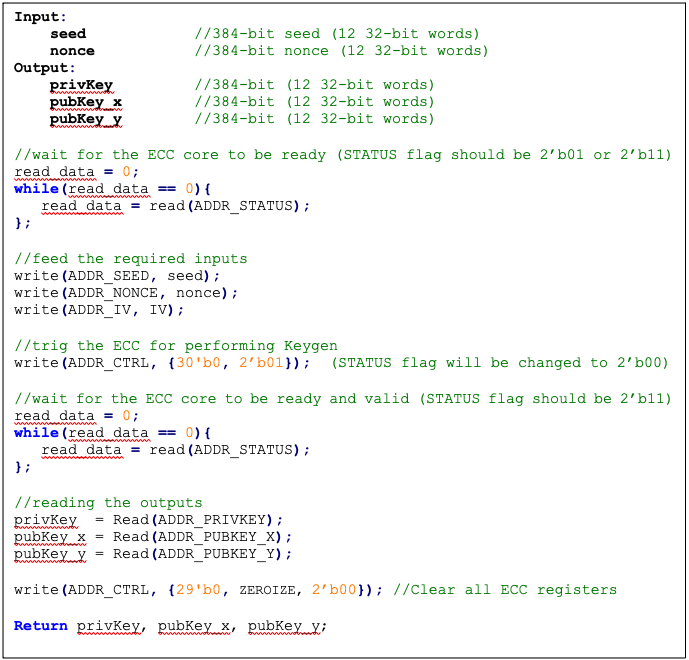

#### Signing

*Figure 36: Signing pseudocode*

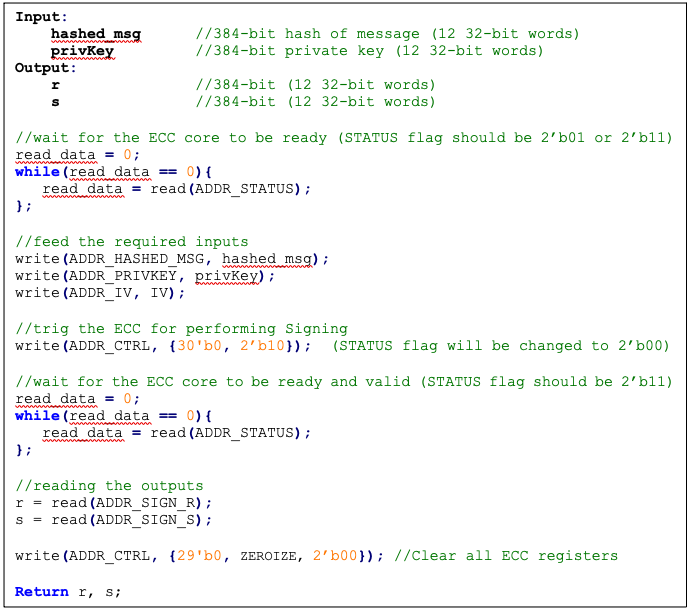

#### Verifying

*Figure 37: Verifying pseudocode*

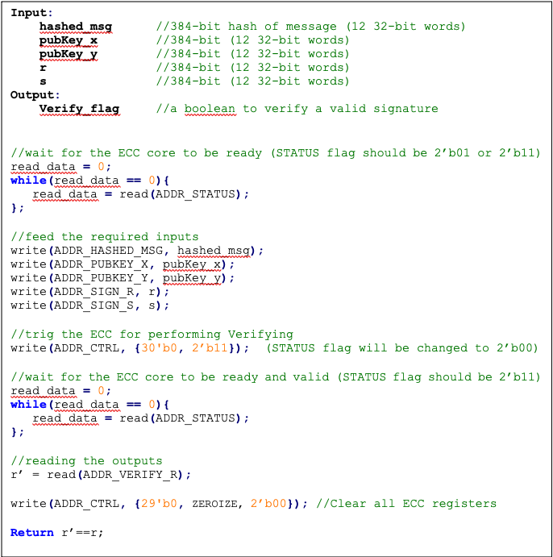

### SCA countermeasure

The described ECDSA has three main routines: KeyGen, Signing, and Verifying. Since the Verifying routine requires operation with public values rather than a secret value, our side-channel analysis does not cover this routine. Our evaluation covers the KeyGen and Signing routines where the secret values are processed. 

KeyGen consists of HMAC DRBG and scalar multiplication, while Signing first requires a message hashing and then follows the same operations as KeyGen (HMAC DRBG and scalar multiplication). The last step of Signing is generating “S” as the proof of signature. Since HMAC DRBG and hash operations are evaluated separately in our document, this evaluation covers scalar multiplication and modular arithmetic operations. 

#### Scalar multiplication 

To perform the scalar multiplication, the Montgomery ladder is implemented, which is inherently resistant to timing and single power analysis (SPA) attacks.

Implementation of complete unified addition formula for the scalar multiplication avoids information leakage and enhances architecture from security and mathematical perspectives.

To protect the architecture against horizontal power/electromagnetic (EM) and differential power analysis (DPA) attacks, several countermeasures are embedded in the design [9]. Since these countermeasures require random inputs, HMAC-DRBG is fed by IV to generate these random values.

Since HMAC-DRBG generates random value in a deterministic way, firmware MUST feed different IV to ECC engine for EACH keygen and signing operation. 

#### Base point randomization

This countermeasure is achieved using the randomized base point in projective coordinates. Hence, the base point G=(Gx, Gy) in affine coordinates is transformed and randomized to projective coordinates as (X, Y, Z) using a random value  as follows:

This approach does not have the performance or area overhead because the architecture is variable-base-point implemented.

#### Scalar blinding

This countermeasure is achieved by randomizing the scalar  as follows:

Based on [10], half of the bit size of  is required to prevent advanced DPA attacks. Therefore,  has 192 bits, and the blinded scalar  has 576 bits. Hence, this countermeasure extends the Montgomery ladder iterations due to extended scalar.

This approach is achieved at the cost of 50% more latency on scalar multiplication and adding one lightweight block, including one 32\*32 multiplier and an accumulator.

Note: the length of rand is configurable to have a trade-off between the required protection and performance.

#### Making countermeasures embedded into HMAC\_DRBG

In the first step of the KeyGen operation, the privkey is generated using HMAC\_DRBG by feeding the following two inputs: seed and nonce. To avoid SCA information leakage during this operation, we embed masking countermeasures into the HMAC\_DRBG architecture.

Each round of SHA512 execution needs 6,432 random bits, and one HMAC operation needs at least 4 rounds of SHA512 operations. Furthermore, each HMAC\_DRBG round needs at least 5 rounds of HMAC operations. However, the proposed architecture uses a lightweight LFSR and provides first-order DPA attack protection with negligible latency and hardware resource overhead.

#### ECDSA signing nonce leakage

Generating “S” as the proof of signature at the steps of the signing operation leaks where the hashed message is signed with private key and ephemeral key as follows:

Since the given message is known or the signature part r is known, the attacker can perform a known-plaintext attack. The attacker can sign multiple messages with the same key, or the attacker can observe part of the signature that is generated with multiple messages but the same key. 

The evaluation shows that the CPA attack can be performed with a small number of traces, respectively. Thus, an arithmetic masked design for these operations is implemented.

##### Masking signature

This countermeasure is achieved by randomizing the privkey as follows:

Although computation of “S” seems the most vulnerable point in our scheme, the operation does not have a big contribution to overall latency. Hence, masking these operations has low overhead on the cost of the design. 

#### Random number generator for SCA countermeasure

The ECC countermeasure requires several random vectors to randomize the intermediate values, as described in the preceding section. HMAC\_DRBG is used to take one random vector of 384-bit (i.e., ECC\_IV register) and to generate the required random vectors for different countermeasures.

The state machine of HMAC\_DRBG utilization is shown in the following figure, including three main states:

1. SCA random generator: Running HMAC\_DRBG with IV and an internal counter to generate the required random vectors.
2. KEYGEN PRIVKEY: Running HMAC\_DRBG with seed and nonce to generate the privkey in KEYGEN operation.
3. SIGNING NONCE: Running HMAC\_DRBG based on RFC6979 in SIGNING operation with privkey and hashed\_msg.

*Figure 38: HMAC\_DRBG utilization*

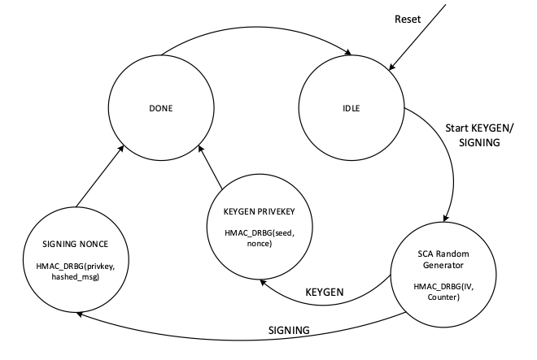

In SCA random generator state:

* This state (in KeyGen operation mode) generates 3 384-bit random vectors for the following: LFSR, base point randomization, and scalar blinding randomization.
* This state (in signing operation) generates 4 384-bit random vectors for the following: LFSR, base point randomization, scalar blinding, and masking signature randomization.
* HMAC\_DRBG is initialized with IV and an internal counter. This 64-bit counter enables after reset and zeroization and contains different values depending on when ECC is called.
* HMAC\_DRBG is enabled by the INIT command. To generate all required vectors, HMAC-DRBG is continued by the NEXT command that increments the built-in counter inside the HMAC-DRBG unit.
* To initialize the required seed for LFSR, LFSR\_INIT\_SEED is set as a constant by RTL after reset and zeroization. However, this value is updated before enabling HMAC\_DRBG as follows:
     * In the first execution of HMAC\_DRBG after reset and zeroization, hmac\_lfsr\_seed is equal to LFSR\_INIT\_SEED XORed by internal 64-bit counter.
     * In the next executions of HMAC\_DRBG, hmac\_lfsr\_seed is equal to HMAC\_DRBG output of the first execution XORed by internal 64-bit counter.

The data flow of the HMAC\_DRBG operation in keygen operation mode is shown in the following figure.

*Figure 39: HMAC\_DRBG data flow*

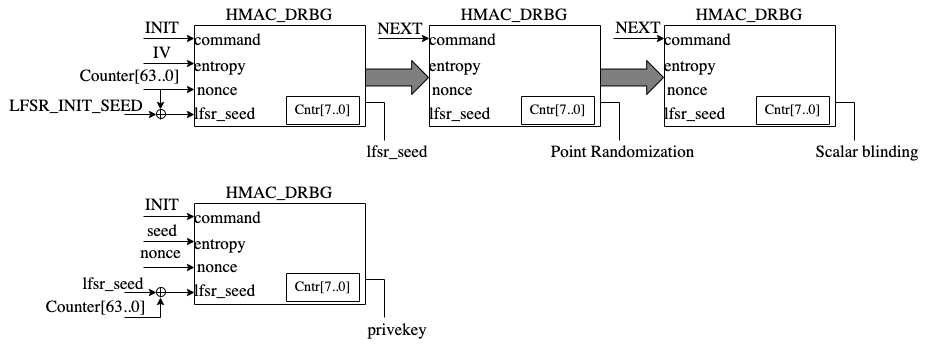

#### TVLA results

Test vector leakage assessment (TVLA) provides a robust test using a 𝑡-test. This test evaluates the differences between sets of acquisitions to determine if one set of measurement can be distinguished from the other. This technique can detect different types of leakages, providing a clear indication of leakage or lack thereof.

In practice, observing a t-value greater than a specific threshold (mainly 4.5) indicates the presence of leakage. However, in ECC, due to its latency, around 5 million samples are required to be captured. This latency leads to many false positives and the TVLA threshold can be considered a higher value than 4.5. Based on the following figure from “Side-Channel Analysis and Countermeasure Design for Implementation of Curve448 on Cortex-M4” by Bisheh-Niasar et. al., the threshold can be considered equal to 7 in our case.

*Figure 40: TVLA threshold as a function of the number of samples per trace*

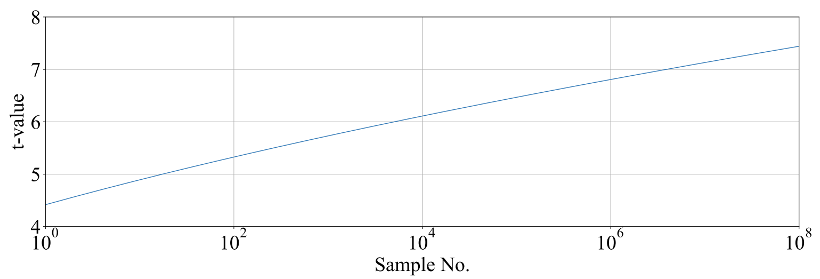

##### Keygen TVLA

TODO: provide content for this section

##### Signing TVLA

The TVLA results for performing privkey-dependent leakage detection using 20,000 traces is shown in the following figure. Based on this figure, there is no leakage in ECC signing by changing the privkey after 20,000 operations.

*Figure 41: privkey-dependent leakage detection using TVLA for ECC signing after 20,000 traces*

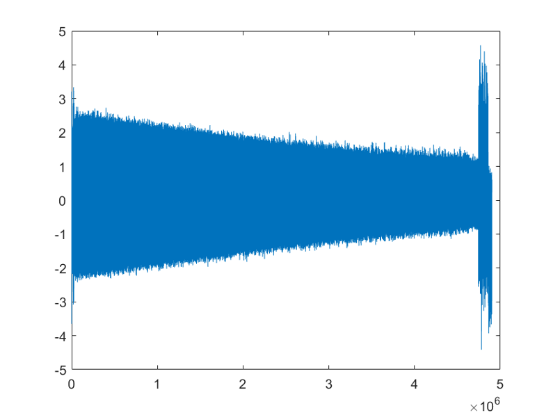

The TVLA results for performing message-dependent leakage detection using 64,000 traces is shown in the following figure. Based on this figure, there is no leakage in ECC signing by changing the message after 64,000 operations.

*Figure 42: Message-dependent leakage detection using TVLA for ECC signing after 64,000 traces*

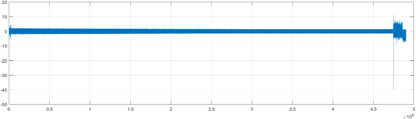

The point with t-value equal to -40 is mapped to the Montgomery conversion of the message that is a publicly known value (no secret is there). By ignoring those corresponding samples, there are some sparse samples with a t-value greater than 7, as shown in the following table.

| Sample    | Duration   | Cycle     | t-value | Operation               |
| :-------- | :--------- | :-------- | :------ | :---------------------- |
| 4,746,127 | 214        | 911,381.4 | 11.2    | start of mont_conv(msg) |
| 4,746,341 |            | 911,422.5 | -40     | end of mont_conv(msg)   |
| 4,757,797 | 1          | 913,622.0 | 7.4     | inv_q                   |
| 4,768,302 | 1          | 915,639.0 | 7.8     | inv_q                   |
| 4,779,610 | 1          | 917,810.1 | -9.1    | inv_q                   |
| 4,788,120 | 1          | 919,444.0 | 7.6     | inv_q                   |
| 4,813,995 | 1          | 924,412.0 | 7.3     | inv_q                   |
| 4,822,693 | 1          | 926,082.1 | 7.5     | inv_q                   |
| 4,858,671 | to the end | 932,989.8 | -7.6    | Ended ECC signing       |

### Performance

The ECC core performance is reported in the next section.

### Pure hardware architecture

In this architecture, the ECC interface and controller are implemented in hardware. The performance specification of the ECC architecture is reported as shown in the following table.

| Operation | Cycle count \[CCs\] | Time \[ms\] @ 400 MHz | Throughput \[op/s\] |
| :-------- | :------------------ | :-------------------- | :------------------ |
| Keygen    | 909,648             | 2.274                 | 439                 |
| Signing   | 932,990             | 2.332                 | 428                 |
| Verifying | 1,223,938           | 3.060                 | 326                 |
## PCR vault

* Platform Configuration Register (PCR) vault is a register file that stores measurements to be used by the microcontroller.
* PCR entries are read-only registers of 384 bits each.
* Control bits allow for entries to be cleared by FW, which sets their values back to 0.
* A lock bit can be set by FW to prevent the entry from being cleared. The lock bit is sticky and only resets on a powergood cycle.

| PCRV register                     | Address Offset | Description                    |
| :---------------------------------| :------------- | :----------------------------- |
| PCR Control\[31:0\]               | 0x1001a000         | 32 Control registers, 32 bits each |
| PCR Entry\[31:0\]\[11:0\]\[31:0\] | 0x1001a600         | 32 PCR entries, 384 bits each      |

### PCR vault functional block

PCR entries are hash extended using a hash extension function. The hash extension function takes the data currently in the PCR entry specified, concatenates data provided by the FW, and performs a SHA384 function on that data, storing the result back into the same PCR entry.

### PCR hash extend function

FW provides the PCR entry to use as source and destination of the hash extend. HW copies the PCR into the start of the SHA block and locks those dwords from FW access. FW then provides the new data, and runs the SHA function as usual. After initialization, the locked dwords are unlocked.

FW must set a last cycle flag before running the last iteration of the SHA engine. This could be the first “init” cycle, or the Nth “next” cycle. This flag allows HW to copy the final resulting hash output back to the source PCR.

### PCR signing

* PCR signing uses the key in key slot index 7 for PCR signing
* HW implements a HW function called GEN\_PCR\_HASH
     * HW reads all the PCRs from all the PCR slots and hash extends them along with the NONCE that Caliptra FW provides
     * PCR Hash = Hash(PCR[0], …, PCR[31], Nonce)
* HW also implements a HW function called SIGN\_PCR. This function takes the PCR digest that was generated by the previous routine and signs it using the key in key slot 7, following the same ECC sign flow defined in the [ECC](#ecc) section.
     * The resulting PCR DIGEST is used only once for signing by the HW. If a new PCR signing is required, GEN\_PCR\_HASH needs to be redone.

## Key vault

Key Vault (KV) is a register file that stores the keys to be used by the microcontroller, but this register file is not observed by the microcontroller. Each cryptographic function has a control register and functional block designed to read from and write to the KV.  

| KV register                      | Description                                              |
| :------------------------------- | :------------------------------------------------------- |
| Key Control\[7:0\]               | 8 Control registers, 32 bits each                        |
| Key Entry\[7:0\]\[15:0\]\[31:0\] | 8 Key entries, 512 bits each  No read or write access |

### Key vault functional block

Keys and measurements are stored in 512b register files. These have no read or write path from the microcontroller. The entries are read through a passive read mux driven by each cryptographic block. Locked entries return zeroes.  

Entries in the KV must be cleared via control register, or by de-assertion of pwrgood.   

Each entry has a control register that is writable by the microcontroller.  

The destination valid field is programmed by FW in the cryptographic block generating the key, and it is passed here at generation time. This field cannot be modified after the key is generated and stored in the KV.  

| KV Entry Ctrl Fields      | Reset             | Description            |
|---------------------------|-------------------|------------------------|
| Lock wr\[0\]              | core_only_rst_b   | Setting the lock wr field prevents the entry from being written by the microcontroller. Keys are always locked. After a lock is set, it cannot be reset until cptra_rst_b is de-asserted.               |
| Lock use\[1\]             | core_only_rst_b   | Setting the lock use field prevents the entry from being used in any cryptographic blocks. After the lock is set, it cannot be reset until cptra_rst_b is de-asserted.                                  |
| Clear\[2\]                | cptra_rst_b       | If unlocked, setting the clear bit causes KV to clear the associated entry. The clear bit is reset after entry is cleared.                                                                              |
| Copy\[3\]                 | cptra_rst_b       | ENHANCEMENT: Setting the copy bit causes KV to copy the key to the entry written to Copy Dest field.                                                                                                    |
| Copy Dest\[8:4\]          | cptra_rst_b       | ENHANCEMENT: Destination entry for the copy function.                                                                                                                                                   |
| Dest_valid\[16:9\]        | hard_reset_b      | KV entry can be used with the associated cryptographic block if the appropriate index is set.  \[0\] - HMAC KEY  \[1\] - HMAC BLOCK  \[2\] - SHA BLOCK  \[2\] - ECC PRIVKEY  \[3\] - ECC SEED  \[7:5\] - RSVD |
| last_dword\[20:19\] | hard_reset_b      | Store the offset of the last valid dword, used to indicate the last cycle for read operations.                                                                                                          |

### Key vault cryptographic functional block  

A generic block is instantiated in each cryptographic block to enable access to KV. 

Each input to a cryptographic engine can have a key vault read block associated with it. The KV read block takes in a keyvault read control register that drives an FSM to copy an entry from the keyvault into the appropriate input register of the cryptographic engine.

Each output generated by a cryptographic engine can have its result copied to a slot in the keyvault. The KV write block takes in a keyvault write control register. This register drives an FSM to copy the result from the cryptographic engine into the appropriate keyvault entry. It also programs a control field for that entry to indicate where that entry can be used.

After programming the key vault read control, FW needs to query the associated key vault read status to confirm that the requested key was copied successfully. After valid is set and the error field reports success, the key is ready to be used.

Similarly, after programming the key vault write control and initiating the cryptographic function that generates the key to be written, FW needs to query the associated key vault write status to confirm that the requested key was generated and written successfully.

The following tables describe read, write, and status values for key vault blocks.

| KV Read Ctrl Reg     | Description                                                                                                                            |
| :------------------- | :------------------------------------------------------------------------------------------------------------------------------------- |
| read_en\[0\]         | Indicates that the read data is to come from the key vault. Setting this bit to 1 initiates copying of data from the key vault.        |
| read_entry\[5:1\]    | Key vault entry to retrieve the read data from the engine.                                                                             |
| pcr_hash_extend\[6\] | Requested entry is a PCR. This is used only for the SHA engine to hash extend. It is not functional in any other cryptographic engine. |
| rsvd\[31:7\]         | Reserved field                                                                                                                         |

| KV Write Ctrl Reg          | Description                                                                                                                            |
| :------------------------- | :------------------------------------------------------------------------------------------------------------------------------------- |
| write_en\[0\]              | Indicates that the result is to be stored in the key vault. Setting this bit to 1 copies the result to the key vault when it is ready. |
| write_entry\[5:1\]         | Key vault entry to store the result.                                                                                                   |
| hmac_key_dest_valid\[6\]   | HMAC KEY is a valid destination.                                                                                                       |
| hmac_block_dest_valid\[7\] | HMAC BLOCK is a valid destination.                                                                                                     |
| sha_block_dest_valid\[8\]  | SHA BLOCK is a valid destination.                                                                                                      |
| ecc_pkey_dest_valid\[9\]   | ECC PKEY is a valid destination.                                                                                                       |
| ecc_seed_dest_valid\[10\]  | ECC SEED is a valid destination.                                                                                                       |
| rsvd\[31:11\]              | Reserved field                                                                                                                         |

| KV Status Reg | Description                                                                                                                                     |
| :------------ | :---------------------------------------------------------------------------------------------------------------------------------------------- |
| ready\[0\]    | Key vault control is idle and ready for a command.                                                                                              |
| valid\[1\]    | Requested flow is done.                                                                                                                         |
| error\[9:2\]  | SUCCESS - 0x0 - Key Vault flow was successful  KV_READ_FAIL - 0x1 - Key Vault Read flow failed  KV_WRITE_FAIL - 0x2 - Key Vault Write flow failed |

### De-obfuscation engine

To protect software intellectual property from different attacks and, particularly, for thwarting an array of supply chain threats, code obfuscation is employed. Hence, the de-obfuscation engine is implemented to decrypt the code.

Advanced Encryption Standard (AES) is used as a de-obfuscation function to encrypt and decrypt data [4]. The hardware implementation is based on[ Secworks/aes](https://github.com/secworks/aes) [1]. The implementation supports the two variants: 128- and 256-bit keys with a block/chunk size of 128 bits.

The AES algorithm is described as follows:

* The key is fed to an AES core to compute and initialize the round key
* The message is broken into 128-bit chunks by the host
* For each chunk:
     * The message is fed to the AES core
     * The AES core and its working mode (enc/dec) are triggered by the host
     * The AES core status is changed to ready after encryption or decryption processing
* The result digest can be read before processing the next message chunks

### Key vault de-obfuscation block operation

A de-obfuscation engine (DOE) is used in conjunction with AES cryptography to de-obfuscate the UDS and field entropy.   

1. The obfuscation key is driven to the AES key. The data to be decrypted (either obfuscated UDS or obfuscated field entropy) is fed into the AES data.  
2. An FSM manually drives the AES engine and writes the decrypted data back to the key vault.  
3. FW programs the DOE with the requested function (UDS or field entropy de-obfuscation), and the destination for the result.  
4. After de-obfuscation is complete, FW can clear out the UDS and field entropy values from any flops until cptra\_pwrgood de-assertion.   

The following tables describe DOE register and control fields.

| DOE Register | Address    | Description                                                                                                                    |
| :----------- | :--------- | :----------------------------------------------------------------------------------------------------------------------------- |
| IV           | 0x10000000 | 128 bit IV for DOE flow. Stored in big-endian representation.                                                                  |
| CTRL         | 0x10000010 | Controls for DOE flows.                                                                                                        |
| STATUS       | 0x10000014 | Valid indicates the command is done and results are stored in keyvault. Ready indicates the core is ready for another command. |

| DOE Ctrl Fields  | Reset        | Description                                                                                                                                  |
| :--------------- | :----------- | :------------------------------------------------------------------------------------------------------------------------------------------- |
| COMMAND\[1:0\]   | Cptra_rst_b  | 2’b00 Idle  2’b01 Run UDS flow   2’b10 Run FE flow   2’b11 Clear Obf Secrets                                                                   |
| DEST\[4:2\]      | Cptra_rst_b  | Destination register for the result of the de-obfuscation flow. Field entropy writes into DEST and DEST+1   Key entry only, can’t go to PCR . |

### Key vault de-obfuscation flow  

1. ROM loads IV into DOE. ROM writes to the DOE control register the destination for the de-obfuscated result and sets the appropriate bit to run UDS and/or the field entropy flow.  
2. DOE state machine takes over and loads the Caliptra obfuscation key into the key register.  
3. Next, either the obfuscated UDS or field entropy are loaded into the block register 4 DWORDS at a time.  
4. Results are written to the KV entry specified in the DEST field of the DOE control register.  
5. State machine resets the appropriate RUN bit when the de-obfuscated key is written to KV. FW can poll this register to know when the flow is complete. 
6. The clear obf secrets command flushes the obfuscation key, the obfuscated UDS, and the field entropy from the internal flops. This should be done by ROM after both de-obfuscation flows are complete.

## Data vault

Data vault is a set of generic scratch pad registers with specific lock functionality and clearable on cold and warm resets.

* 48B scratchpad registers that are lockable but cleared on cold reset (10 registers)
* 48B scratchpad registers that are lockable but cleared on warm reset (10 registers)
* 4B scratchpad registers that are lockable but cleared on cold reset (8 registers)
* 4B scratchpad registers that are lockable but cleared on warm reset (10 registers)
* 4B scratchpad registers that are cleared on warm reset (8 registers)

## Cryptographic blocks fatal and non-fatal errors

The following table describes cryptographic errors. 

| Errors     | Error type         | Description                                                                                                                                               |
| :--------- | :----------------- | :-------------------------------------------------------------------------------------------------------------------------------------------------------- |
| ECC_R_ZERO | HW_ERROR_NON_FATAL | Indicates a non-fatal error in ECC signing if the computed signature R is equal to 0. FW should change the message or privkey to perform a valid signing. |

# Terminology

The following terminology is used in this document.

| Abbreviation | Description                                    |
| :----------- | :--------------------------------------------- |
| AES          | Advanced Encryption Standard                   |
| BMC          | Baseboard Management Controller                |
| CA           | Certificate Authority                          |
| CDI          | Composite Device Identifier                    |
| CPU          | Central Processing Unit                        |
| CRL          | Certificate Revocation List                    |
| CSR          | Certificate Signing Request                    |
| CSP          | Critical Security Parameter                    |
| DICE         | Device Identifier Composition Engine           |
| DME          | Device Manufacturer Endorsement                |
| DPA          | Differential Power Analysis                    |
| DRBG         | Deterministic Random Bit Generator             |
| DWORD        | 32-bit (4-byte) data element                   |
| ECDSA        | Elliptic Curve Digital Signature Algorithm     |
| FMC          | FW First Mutable Code                          |
| FSM          | Finite State Machine                           |
| GPU          | Graphics Processing Unit                       |
| HMAC         | Hash-based message authentication code         |
| IDevId       | Initial Device Identifier                      |
| iRoT         | Internal RoT                                   |
| IV           | Initial Vector                                 |
| KAT          | Known Answer Test                              |
| KDF          | Key Derivation Function                        |
| LDevId       | Locally Significant Device Identifier          |
| MCTP         | Management Component Transport Protocol        |
| NIC          | Network Interface Card                         |
| NIST         | National Institute of Standards and technology |
| OCP          | Open Compute Project                           |
| OTP          | One-time programmable                          |
| PCR          | Platform Configuration Register                |
| PKI          | Public Key infrastructure                      |
| PUF          | Physically unclonable function                 |
| RNG          | Random Number Generator                        |
| RoT          | Root of Trust                                  |
| RTI          | RoT for Identity                               |
| RTM          | RoT for Measurement                            |
| RTR          | RoT for Reporting                              |
| SCA          | Side-Channel Analysis                          |
| SHA          | Secure Hash Algorithm                          |
| SoC          | System on Chip                                 |
| SPA          | Simple Power Analysis                          |
| SPDM         | Security Protocol and Data Model               |
| SSD          | Solid State Drive                              |
| TCB          | Trusted Computing Base                         |
| TCI          | TCB Component Identifier                       |
| TCG          | Trusted Computing Group                        |
| TEE          | Trusted Execution Environment                  |
| TRNG         | True Random Number Generator                   |
| UECC         | Uncorrectable Error Correction Code            |

# References

1. J. Strömbergson, "Secworks," \[Online\]. Available at https://github.com/secworks. 
2. NIST, Federal Information Processing Standards Publication (FIPS PUB) 180-4 Secure Hash Standard (SHS). 
3. OpenSSL \[Online\]. Available at https://www.openssl.org/docs/man3.0/man3/SHA512.html. 
4. N. W. Group, RFC 3394, Advanced Encryption Standard (AES) Key Wrap Algorithm, 2002. 
5. NIST, Federal Information Processing Standards Publication (FIPS) 198-1, The Keyed-Hash Message Authentication Code, 2008. 
6. N. W. Group, RFC 4868, Using HMAC-SHA256, HMAC-SHA384, and HMAC-SHA512 with IPsec, 2007. 
7. RFC 6979, Deterministic Usage of the Digital Signature Algorithm (DSA) and Elliptic Curve Digital Signature Algorithm (ECDSA), 2013. 
8. TCG, Hardware Requirements for a Device Identifier Composition Engine, 2018. 
9. Coron, J.-S.: Resistance against differential power analysis for elliptic curve cryptosystems. In: Ko¸c, C¸ .K., Paar, C. (eds.) CHES 1999. LNCS, vol. 1717, pp. 292–302. 
10. Schindler, W., Wiemers, A.: Efficient side-channel attacks on scalar blinding on elliptic curves with special structure. In: NISTWorkshop on ECC Standards (2015). 
11. National Institute of Standards and Technology, "Digital Signature Standard (DSS)", Federal Information Processing Standards Publication (FIPS PUB) 186-4, July 2013. 
12. NIST SP 800-90A, Rev 1: "Recommendation for Random Number Generation Using Deterministic Random Bit Generators", 2012. |
13. CHIPS Alliance, “RISC-V VeeR EL2 Programmer’s Reference Manual” \[Online\] Available at https://github.com/chipsalliance/Cores-VeeR-EL2/blob/main/docs/RISC-V_VeeR_EL2_PRM.pdf. 
14. “The RISC-V Instruction Set Manual, Volume I: User-Level ISA, Document Version 20191213”, Editors Andrew Waterman and Krste Asanovi ́c, RISC-V Foundation, December 2019. Available at https://riscv.org/technical/specifications/. 
15. “The RISC-V Instruction Set Manual, Volume II: Privileged Architecture, Document Version 20211203”, Editors Andrew Waterman, Krste Asanovi ́c, and John Hauser, RISC-V International, December 2021. Available at https://riscv.org/technical/specifications/. 

[1] _Caliptra.**  **Spanish for “root cap” and describes the deepest part of the root_
