
Caliptra Integration Specification

Version 1.0

# Scope

This document describes the Caliptra hardware implementation requirements, details, and release notes. This document is intended for a high-level overview of the IP used in Caliptra.

This document is not intended for any micro-architectural design specifications. Detailed information on each of the IP components are shared in individual documents, where applicable.

# Overview

This document contains high level information on the Caliptra hardware design. The details include open-source IP information, configuration settings for open-source IP (if applicable), and IP written specifically for Caliptra.

For more information, see[ Caliptra: A Datacenter System on a Chip (SoC) Root of Trust (RoT)](https://chipsalliance.github.io/Caliptra/doc/Caliptra.html).

## References and related specifications

The blocks described in this document are either obtained from open-source GitHub repositories, developed from scratch, or modification of open-source implementations. Links to relevant documentation and GitHub sources are shared in the following table.

*Table 1: Related specifications*

| IP/Block | GitHub URL | Documentation | Link |
| :--------- | :--------- | :--------- |:--------- |
| Cores-VeeR | [GitHub - chipsalliance/Cores-VeeR-EL2](https://github.com/chipsalliance/Cores-VeeR-EL2) | VeeR EL2 Programmer’s Reference Manual | [chipsalliance/Cores-VeeR-EL2 · GitHubPDF](http://cores-swerv-el2/RISC-V_SweRV_EL2_PRM.pdf%20at%20master%20%C2%B7) |
| AHB Lite Bus | [aignacio/ahb_lite_bus: AHB Bus lite v3.0 (github.com)](https://github.com/aignacio/ahb_lite_bus) | AHB Lite Protocol  [Figure 1: SoC interface block diagram](#soc-interface-definition) | [ahb_lite_bus/docs at master · aignacio/ahb_lite_bus (github.com)](https://github.com/aignacio/ahb_lite_bus/tree/master/docs)  [ahb_lite_bus/diagram_ahb_bus.png at master · aignacio/ahb_lite_bus (github.com)](https://github.com/aignacio/ahb_lite_bus/blob/master/diagram_ahb_bus.png) |
| SHA 256 | [secworks/sha256: Hardware implementation of the SHA-256 cryptographic hash function (github.com)](https://github.com/secworks/sha256) | | |
| SHA 512 | | | |
| SPI Controller | <https://github.com/pulp-platform/axi_spi_master> | | |

# Caliptra Core

For information on the Caliptra Core, see the [High level architecture](https://chipsalliance.github.io/Caliptra/doc/Caliptra.html#high-level-architecture) section of [Caliptra: A Datacenter System on a Chip (SoC) Root of Trust (RoT)](https://chipsalliance.github.io/Caliptra/doc/Caliptra.html).

# SoC interface definition

The following figure shows the SoC interface definition.

*Figure 1: SoC Interface Block Diagram*

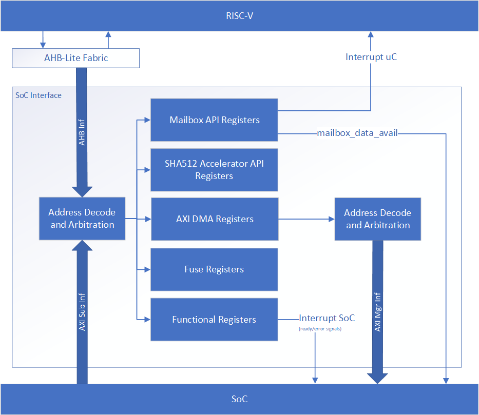

## Integration parameters

The following table describes integration parameters.

*Table 2: Integration parameters*

| **Parameter name** | **Width** | **Defines file** | **Description** |
| :--------- | :--------- | :--------- | :--------- |
| CPTRA_SET_MBOX_PAUSER_INTEG | 5               | soc_ifc_pkg.sv | Each bit hardcodes the valid PAUSER for mailbox at integration time. |
| CPTRA_MBOX_VALID_PAUSER     | \[4:0\]\[31:0\] | soc_ifc_pkg.sv | Each parameter corresponds to a hardcoded valid PAUSER value for mailbox, set at integration time. Must set corresponding bit in the CPTRA_SET_MBOX_PAUSER_INTEG parameter for this valid pauser override to be used. |
| CPTRA_DEF_MBOX_VALID_PAUSER | 32              | soc_ifc_pkg.sv | Sets the default valid PAUSER for mailbox accesses. This PAUSER is valid at all times. |
| CPTRA_SET_FUSE_PAUSER_INTEG | 1               | soc_ifc_pkg.sv | Sets the valid PAUSER for fuse accesses at integration time. |
| CPTRA_FUSE_VALID_PAUSER     | 32              | soc_ifc_pkg.sv | Overrides the programmable valid PAUSER for fuse accesses when CPTRA_SET_FUSE_PAUSER_INTEG is set to 1. |

*Table 3: Integration Defines*

| **Defines** | **Defines file** | **Description** |
| :--------- | :--------- | :--------- |
| CALIPTRA_INTERNAL_TRNG  | config_defines.svh | Defining this enables the internal TRNG source. |
| CALIPTRA_INTERNAL_UART  | config_defines.svh | Defining this enables the internal UART.        |
| CALIPTRA_INTERNAL_QSPI  | config_defines.svh | Defining this enables the internal QSPI.        |
| USER_ICG                | config_defines.svh | If added by an integrator, provides the name of the custom clock gating module that is used in [clk_gate.sv](../src/libs/rtl/clk_gate.sv). USER_ICG replaces the clock gating module, CALIPTRA_ICG, defined in [caliptra_icg.sv](../src/libs/rtl/caliptra_icg.sv). This substitution is only performed if integrators also define TECH_SPECIFIC_ICG. |
| TECH_SPECIFIC_ICG       | config_defines.svh | Defining this causes the custom, integrator-defined clock gate module (indicated by the USER_ICG macro) to be used in place of the native Caliptra clock gate module. |
| USER_EC_RV_ICG          | config_defines.svh | If added by an integrator, provides the name of the custom clock gating module that is used in the RISC-V core. USER_EC_RV_ICG replaces the clock gating module, TEC_RV_ICG, defined in [beh_lib.sv](../src/riscv_core/veer_el2/rtl/lib/beh_lib.sv). This substitution is only performed if integrators also define TECH_SPECIFIC_EC_RV_ICG. |
| TECH_SPECIFIC_EC_RV_ICG | config_defines.svh | Defining this causes the custom, integrator-defined clock gate module (indicated by the USER_EC_RV_ICG macro) to be used in place of the native RISC-V core clock gate module. |

## Interface

The following tables describe the interface signals.

*Table 4: Clocks and resets*

| Signal name | Width | Driver | Synchronous (as viewed from Caliptra’s boundary) | Description|
| :--------- | :--------- | :--------- | :--------- | :--------- |
| cptra_pwrgood | 1 | Input | Asynchronous Assertion  Synchronous deassertion to clk | Active high power good indicator.  Deassertion hard resets Caliptra. |
| cptra_rst_b | 1 | Input | Asynchronous Assertion  Synchronous deassertion to clk | Active low asynchronous reset. |
| clk | 1 | Input | | Convergence and validation done at 400MHz. All other frequencies are up to the user. |

*Table 5: APB Interface*

| Signal name | Width | Driver | Synchronous (as viewed from Caliptra’s boundary) | Description |
| :--------- | :--------- | :--------- | :--------- | :--------- |
| PADDR | CALIPTRA_APB_ADDR_WIDTH | Input | Synchronous to clk | Address bus |
| PPROT | 3 | Input | Synchronous to clk | Protection level |
| PSEL | 1 | Input | Synchronous to clk | Select line |
| PENABLE | 1 | Input | Synchronous to clk | Indicates the second and subsequent cycles. |
| PWRITE | 1 | Input | Synchronous to clk | Indicates transfer is a write when high or a read when low. |
| PWDATA | CALIPTRA_APB_DATA_WIDTH | Input | Synchronous to clk | Write data bus |
| PAUSER | CALIPTRA_APB_USER_WIDTH | Input | Synchronous to clk | Sideband signal indicating requestor ID for transfer. |
| PREADY | 1 | Output | Synchronous to clk | Used to extend an APB transfer by completer. |
| PRDATA | CALIPTRA_APB_DATA_WIDTH | Output | Synchronous to clk | Read data bus |
| PSLVERR | 1 | Output | Synchronous to clk | Transfer error |

*Table 6: QSPI signals*

| Signal name | Width | Driver | Synchronous (as viewed from Caliptra’s boundary) | Description |
| :--------- | :--------- | :--------- | :--------- | :--------- |
| qspi_clk_o  | 1 | Output | | QSPI clock |
| qspi_cs_no | 2 | Output | Synchronous to qspi_clk_o | QSPI chip select |
| qspi_d_i | 4 | Input | Synchronous to qspi_clk_o | QSPI data lanes for receiving data. |
| qspi_d_o | 4 | Output | Synchronous to qspi_clk_o | QSPI data output lanes for sending opcode and address. |
| qspi_d_en_o | 4 | Output | Synchronous to qspi_clk_o | QSPI enable pins to control data direction. |

*Table 7: Mailbox notifications*

| Signal name | Width | Driver | Synchronous (as viewed from Caliptra’s boundary) | Description |
| :--------- | :--------- | :--------- | :--------- | :--------- |
| ready_for_fuses | 1 | Output | Synchronous to clk | Indicates that Caliptra is ready for fuse programming. |
| ready_for_fw_push | 1 | Output | Synchronous to clk | Indicates that Caliptra is ready for firmware. |
| ready_for_runtime | 1 | Output | Synchronous to clk | Indicates that Caliptra firmware is ready for RT flow. |
| mailbox_data_avail | 1 | Output | Synchronous to clk | Indicates that the mailbox has data for SoC to read (reflects the value of the register). |
| mailbox_flow_done | 1 | Output | Synchronous to clk | Indicates that the mailbox flow is complete (reflects the value of the register). |

*Table 8: SRAM interface*

| Signal name | Width | Driver | Synchronous (as viewed from Caliptra’s boundary) | Description |
| :--------- | :--------- | :--------- | :--------- | :--------- |
| mbox_sram_cs | 1 | Output | Synchronous to clk | Chip select for mbox SRAM  |
| mbox_sram_we | 1 | Output | Synchronous to clk | Write enable for mbox SRAM |
| mbox_sram_addr | MBOX_ADDR_W | Output | Synchronous to clk | Addr lines for mbox SRAM |
| mbox_sram_wdata | MBOX_DATA_W | Output | Synchronous to clk | Write data for mbox SRAM |
| mbox_sram_rdata | MBOX_DATA_W | Input | Synchronous to clk | Read data for mbox SRAM |
| imem_cs | 1 | Output | Synchronous to clk | Chip select for imem SROM |
| imem_addr | IMEM_ADDR_WIDTH | Output | Synchronous to clk | Addr lines for imem SROM |
| imem_rdata | IMEM_DATA_WIDTH | Input | Synchronous to clk | Read data for imem SROM |
| iccm_clken | ICCM_NUM_BANKS | Input | Synchronous to clk | Per-bank clock enable |
| iccm_wren_bank | ICCM_NUM_BANKS | Input | Synchronous to clk | Per-bank write enable |
| iccm_addr_bank | ICCM_NUM_BANKS x (ICCM_BITS-4) | Input | Synchronous to clk | Per-bank address |
| iccm_bank_wr_data | ICCM_NUM_BANKS x 39 | Input | Synchronous to clk | Per-bank input data |
| iccm_bank_dout | ICCM_NUM_BANKS x 39 | Output | Synchronous to clk | Per-bank output data |
| dccm_clken | DCCM_NUM_BANKS | Input | Synchronous to clk | Per-bank clock enable |
| dccm_wren_bank | DCCM_NUM_BANKS | Input | Synchronous to clk | Per-bank write enable |
| dccm_addr_bank | DCCM_NUM_BANKS x (DCCM_BITS-4) | Input | Synchronous to clk | Per-bank address |
| dccm_wr_data_bank | DCCM_NUM_BANKS x DCCM_FDATA_WIDTH | Input | Synchronous to clk | Per-bank input data |
| dccm_bank_dout | DCCM_NUM_BANKS x DCCM_FDATA_WIDTH | Output | Synchronous to clk | Per-bank output data |

*Table 9: JTAG interface*

| Signal name | Width | Driver | Synchronous (as viewed from Caliptra’s boundary) | Description |
| :--------- | :--------- | :--------- | :--------- | :--------- |
| jtag_tck | 1 | input | | |
| jtag_tms | 1 | input | Synchronous to tck | |
| jtag_tdi | 1 | input | Synchronous to tck | |
| jtag_trst_n | 1 | input | Async Deassertion  Assertion Synchronous to tck | |
| jtag_tdo | 1 | output | Synchronous to tck | |

*Table 10: UART interface*

| Signal name | Width | Driver | Synchronous (as viewed from Caliptra’s boundary) | Description |
| :--------- | :--------- | :--------- | :--------- | :--------- |
| uart_tx | 1 | output | | UART transmit pin |
| uart_rx | 1 | input  | | UART receive pin  |

*Table 11: Security and miscellaneous*

| Signal name | Width | Driver  | Synchronous (as viewed from Caliptra’s boundary) | Description |
| :--------- | :--------- | :--------- | :--------- | :--------- |
| CPTRA_OBF_KEY | 256 | Input Strap | Asynchronous | Obfuscation key is driven by SoC at integration time. Ideally this occurs just before tape-in and the knowledge of this key must be protected unless PUF is driving this. The key is latched by Caliptra on caliptra powergood deassertion. It is cleared after its use and can only re-latched on a power cycle (powergood deassertion to assertion). |
| SECURITY_STATE | 3 | Input Strap | Synchronous to clk | Security state that Caliptra should take (for example, manufacturing, secure, unsecure, etc.). The key is latched by Caliptra on cptra_noncore_rst_b deassertion. Any time the state changes to debug mode, all keys, assets, and secrets stored in fuses or key vault are cleared. Cryptography core states are also flushed if they were being used. |
| scan_mode | 1 | Input Strap | Synchronous to clk | Must be set before entering scan mode. This is a separate signal than the scan chain enable signal that goes into scan cells. This allows Caliptra to flush any assets or secrets present in key vault and flops if the transition is happening from a secure state. |
| GENERIC_INPUT_WIRES | 64 | Input | Synchronous to clk | Placeholder of input wires for late binding features. These values are reflected into registers that are exposed to firmware. |
| GENERIC_OUTPUT_WIRES  | 64 | Output | Synchronous to clk | Placeholder of output wires for late binding features. Firmware can set the wires appropriately via register writes. |
| CALIPTRA_ERROR_FATAL | 1 | Output | Synchronous to clk | Indicates a fatal error from Caliptra. |
| CALIPTRA_ERROR_NON_FATAL | 1 | Output | Synchronous to clk | Indicates a non fatal error from Caliptra. |
| BootFSM_BrkPoint | 1 | Input Strap | Asynchronous | Stops the BootFSM to allow TAP writes set up behavior. Examples of these behaviors are skipping or running ROM flows, or stepping through BootFSM. |
| eTRNG_REQ | 1 | Output | Synchronous to clk | External source mode: TRNG_REQ to SoC. SoC writes to TRNG architectural registers with a NIST-compliant entropy.  Internal source mode: TRNG_REQ to SoC. SoC enables external RNG digital bitstream input into iTRNG_DATA/iTRNG_VALID. |
| iTRNG_DATA | 4 | Input | Synchronous to clk | External source mode: Not used.  Internal source mode only: Physical True Random Noise Source (PTRNG for "Number Generator") digital bit stream from SoC, which is sampled when iTRNG_VALID is high. See the [Hardware Specification](https://github.com/chipsalliance/caliptra-rtl/blob/main/docs/CaliptraHardwareSpecification.md#integrated-trng) for details on PTRNG expectations and iTRNG entropy capabilities. |
| iTRNG_VALID | 1 | Input | Synchronous to clk | External source mode: Not used.  Internal source mode only: RNG bit valid. This is valid per transaction. iTRNG_DATA can be sampled whenever this bit is high. The expected iTRNG_VALID output rate is about 50KHz. |

## Architectural registers and fuses

Control registers and fuses are documented on GitHub.

* External Registers: [caliptra\_top\_reg — caliptra\_top\_reg Reference (chipsalliance.github.io)](https://chipsalliance.github.io/caliptra-rtl/main/external-regs/?p=)
* Internal Registers - [clp — clp Reference (chipsalliance.github.io)](https://chipsalliance.github.io/caliptra-rtl/main/internal-regs/?p=)

## Fuses

Fuses are writable only one time and require a cptra\_pwrgood to be recycled to be written again.

After all fuses are written, the fuse done register at the end of the fuse address space must be set to 1 to lock the fuse writes and to proceed with the boot flow.

Although fuse values (and the fuse done register) persist across a warm reset, SoC is still required to perform a write to the fuse done register while in the BOOT\_FUSE state in order to complete the bringup from reset. See 6.1 Boot FSM for further details.

## Interface rules

The following figure shows the reset rules and timing for cold boot flows.

*Figure 2: Reset rules and timing diagram*

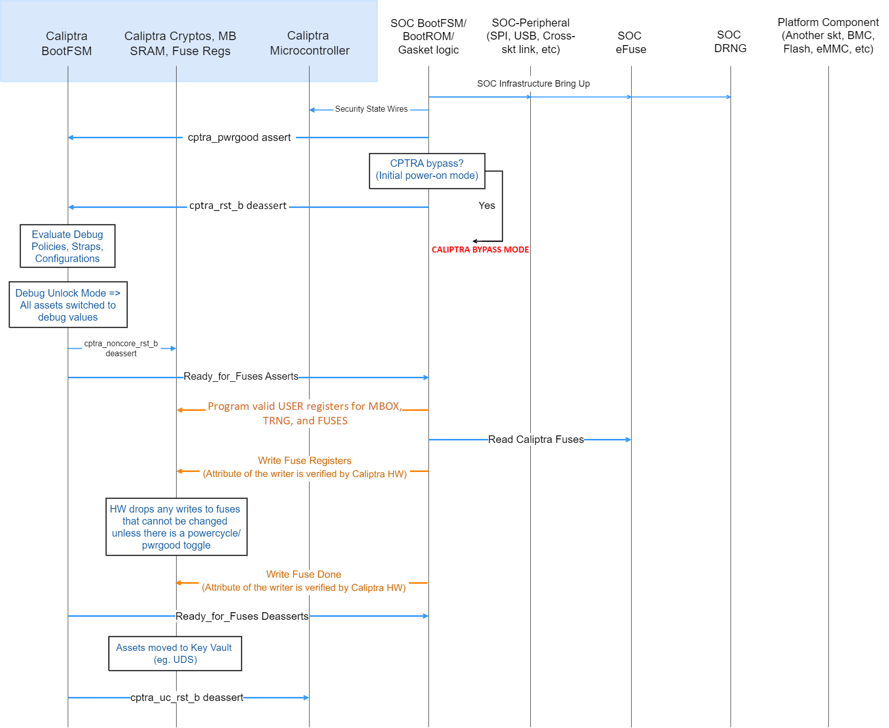

Deassertion of cptra\_pwrgood indicates a power cycle that results in returning Caliptra to its default state. All resettable flops are reset.

Deassertion of cptra\_rst\_b indicates a warm reset cycle that resets all but the “sticky” registers (fuses, error logging, etc.).

Assertion of BootFSM\_BrkPoint stops the boot flow from releasing Caliptra from reset after fuse download. Writing a 1 to the GO field of the CPTRA\_BOOTFSM\_GO register allows the boot flow to proceed.

### APB arbitration

Caliptra is a client on the APB bus, incapable of initiating transfers. If SoCs have multiple APBs or other proprietary-fabric protocols that require any special fabric arbitration, that arbitration is done at SoC level.

### Undefined address accesses

All accesses that are outside of the defined address space of Caliptra are responded to by Caliptra’s SoC interface:
* All reads to undefined addresses get completions with zero data.
* All writes to undefined addresses are dropped.
* All other undefined opcodes are silently dropped.
* Access to mailbox memory region with invalid PAUSER are dropped.
* Access to a fuse with invalid PAUSER are dropped.
* PSLVERR is asserted for any of the above conditions.

All accesses must be 32-bit aligned. Misaligned writes are dropped and reads return 0x0.

### Undefined mailbox usages

A trusted/valid requester that locks the mailbox and never releases the lock will cause the mailbox to be locked indefinitely.

Caliptra firmware internally has the capability to force release the mailbox based on various timers but there is no architectural requirement to use this capability.

### Straps

Straps are signal inputs to Caliptra that are sampled once on reset exit, and the latched value persists throughout the remaining uptime of the system. Straps are sampled on either caliptra pwrgood signal deassertion or cptra\_noncore\_rst\_b deassertion – refer to interface table for list of straps.

### Obfuscation key

SoC drives the key at the tape-in time of the SoC using an Engineering Change Order (ECO) and must be protected from common knowledge. For a given SoC construction, this can be driven using a PUF too.

The key must follow the security rules defined in the[ Caliptra architectural specification](https://chipsalliance.github.io/Caliptra/doc/Caliptra.html).

SoC must ensure that there are no SCAN cells on the flops that latch this key internally to Caliptra.

## Late binding interface signals

The interface signals GENERIC\_INPUT\_WIRES and GENERIC\_OUTPUT\_WIRES are placeholders on the SoC interface reserved for late binding features. This may include any feature that is required for correct operation of the design in the final integrated SoC and that may not be accommodated through existing interface signaling (such as the mailbox).

While these late binding interface pins are generic in nature until assigned a function, integrators must not define non-standard use cases for these pins. Defining standard use cases ensures that the security posture of Caliptra in the final implementation is not degraded relative to the consortium design intent. Bits in GENERIC\_INPUT\_WIRES that don't have a function defined in Caliptra must be tied to a 0-value. These undefined input bits shall not be connected to any flip flops (which would allow run-time transitions on the value).

Each wire connects to a register in the SoC Interface register bank through which communication to the internal microprocessor may be facilitated. Each signal is 64 bits in size.

Activity on any bit of the GENERIC\_INPUT\_WIRES triggers a notification interrupt to the microcontroller indicating a bit toggle.

The following table describes the allocation of functionality on GENERIC\_INPUT\_WIRES. All bits not listed in this table must be tied to 0.

*Table 12: GENERIC\_INPUT\_WIRES function binding*

| Bit  | Name               | Description                                         |
| :--------- | :--------- | :--------- |
| 0    | Zeroization status | Used by SoC to provide zeroization status of fuses. |
| 63:1 | RESERVED           | No allocated function.                              |

# SoC interface operation

The Caliptra mailbox is the primary communication method between Caliptra and the SoC that Caliptra is integrated into.

The Caliptra mailbox uses an APB interface to communicate with the SoC. The SoC can write to and read from various memory mapped register locations over the APB interface in order to pass information to Caliptra.

Caliptra in turn also uses the mailbox to pass information back to the SoC. The interface does not author any transaction on the APB interface. The interface only signals to the SoC that data is available in the mailbox and it is the responsibility of the SoC to read that data from the mailbox.

## Boot FSM

The Boot FSM detects that the SoC is bringing Caliptra out of reset. Part of this flow involves signaling to the SoC that Caliptra is ready for fuses. After fuses are populated and the SoC indicates that it is done downloading fuses, Caliptra can wake up the rest of the IP by deasserting the internal reset. The following figure shows the boot FSM state.

*Figure 3: Mailbox Boot FSM state diagram*

The boot FSM first waits for the SoC to assert cptra\_pwrgood and deassert cptra\_rst\_b. The SoC should wait a minimum of 10 clocks after asserting cptra\_pwrgood before deasserting cptra\_rst\_b.
In the BOOT\_FUSE state, Caliptra signals to the SoC that it is ready for fuses. After the SoC is done writing fuses, it sets the fuse done register and the FSM advances to BOOT\_DONE.

BOOT\_DONE enables Caliptra reset deassertion through a two flip-flop synchronizer.

## SoC access mechanism

The SoC communicates with the mailbox through an APB Interface. The SoC acts as the requester with the Caliptra mailbox as the receiver.

The PAUSER bits are used by the SoC to identify which device is accessing the mailbox.

## Mailbox

The Caliptra mailbox is a 128 KiB buffer used for exchanging data between the SoC and the Caliptra microcontroller.

When a mailbox is populated by the SoC, initiation of the operation by writing the execute bit triggers an interrupt to the microcontroller. This interrupt indicates that a command is available in the mailbox. The microcontroller is responsible for reading from and responding to the command.

When a mailbox is populated by the microcontroller, an output wire to the SoC indicates that a command is available in the mailbox. The SoC is responsible for reading from and responding to the command.

Mailboxes are generic data-passing structures with a specific protocol that defines legal operations. This protocol for writing to and reading from the mailbox is enforced in hardware as described in the [Caliptra mailbox errors](#caliptra-mailbox-errors) section. How the command and data are interpreted by the microcontroller and SoC are not enforced in this specification.

## Sender Protocol

**Sending data to the mailbox:**

1. Requester queries the mailbox by reading the LOCK control register.
    1. If LOCK returns 0, LOCK is granted and will be set to 1.
    2. If LOCK returns 1, MBOX is locked for another device.
2. 	Requester writes the command to the COMMAND register.
3. 	Requester writes the data length in bytes to the DLEN register.
4. 	Requester writes data packets to the MBOX DATAIN register.
5. 	Requester writes to the EXECUTE register.
6. 	Requester reads the STATUS register. Status can return:
    1. CMD\_BUSY - 2’b00 – Indicates the requested command is still in progress
    2. DATA\_READY - 2’b01 – Indicates the return data is in the mailbox for requested command
    3. CMD\_COMPLETE- 2’b10 – Indicates the successful completion of the requested command
    4. CMD\_FAILURE- 2’b11 – Indicates the requested command failed
7. Requester reads the response if DATA\_READY was the status.
8. Requester resets the EXECUTE register to release the lock.

**Notes on behavior:**

Once LOCK is granted, the mailbox is locked until that device has concluded its operation. Caliptra has access to an internal mechanism to terminate a lock early or release the lock if the device does not proceed to use it or to recover from deadlock scenarios. The following figure shows the sender protocol flow.

*Figure 4: Sender protocol flow chart*

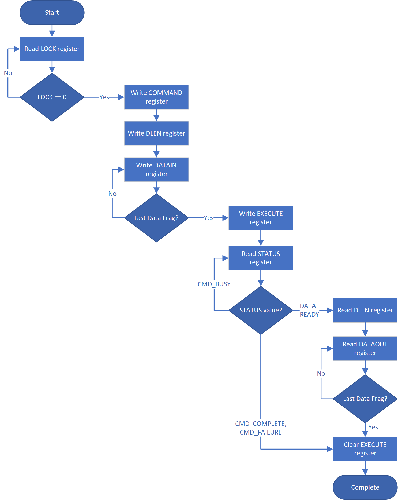

## Receiver Protocol

Upon receiving indication that mailbox has been populated, the appropriate device can read the mailbox. This is indicated by a dedicated wire that is asserted when Caliptra populates the mailbox for SoC consumption.

Caliptra will not initiate any mailbox commands that require a response from the SoC. Caliptra initiated mailbox commands are “broadcast” and available to any user on the SoC. SoC will not be able to write the DLEN or DATAIN register while processing a Caliptra initiated mailbox command.

**Receiving data from the mailbox:**
1. 	On mailbox\_data\_avail assertion, the receiver reads the COMMAND register.
2. Receiver reads the DLEN register.
3. Receiver reads the CMD register.
4. Receiver reads the MBOX DATAOUT register.
    * Continue reading MBOX DATAOUT register until DLEN bytes are read.
5. If a response is required, the receiver can populate the mailbox with the response by updating the DLEN register and writing to DATAIN with the response. (NOTE: The new DLEN value will not take effect until control is returned to the sender via write to the status register).
6. Set the mailbox status register appropriately to hand control back to the sender.
7. The sender will reset the EXECUTE register.
    * This releases the LOCK on the mailbox.

The following figure shows the receiver protocol flow.

*Figure 5: Receiver protocol flowchart*

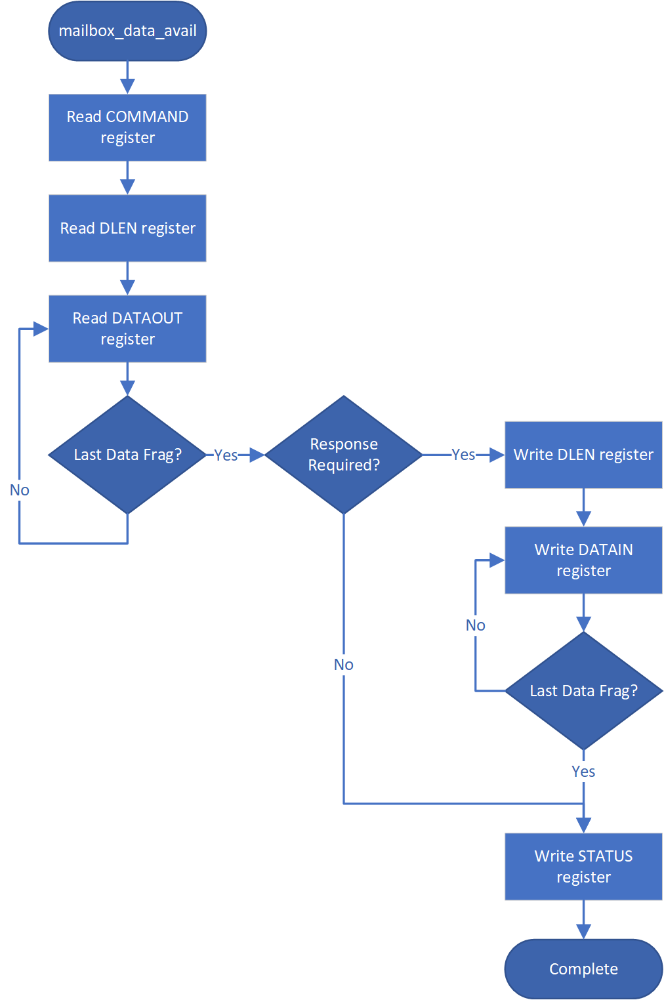

## Mailbox arbitration

From a mailbox protocol perspective, as long as CPTRA\_VALID\_PAUSER registers carry valid requestors, mailbox lock can be obtained by any of those valid requestors but only one of them at any given time. While the mailbox flow is happening, all other requestors will not get a grant.

A request for lock that is denied due to firmware having the lock results in an interrupt to the firmware. Firmware can optionally use this interrupt to release the lock.

There is no fair arbitration scheme between SoC and microcontroller. It is first come, first served. When the mailbox is locked for microcontroller use and SoC has unsuccessfully requested the mailbox (due to mailbox actively being used), the mailbox generates an interrupt to the microcontroller as a notification.

Further, there is no arbitration between various PAUSER attributes. PAUSER attributes exist for security and filtering reasons only.

## MAILBOX PAUSER attribute register

It is strongly recommended that these PAUSER registers are either set at integration time through integration parameters or be programmed by the SoC ROM before any mutable firmware or ROM patches are applied.

### Programmable registers

Caliptra provides 5 programmable registers that SoC can set at boot time to limit access to the mailbox peripheral. The default PAUSER set by the integration parameter CPTRA\_DEF\_MBOX\_VALID\_PAUSER is valid at all times. CPTRA\_MBOX\_VALID\_PAUSER registers become valid once the corresponding lock bit CPTRA\_MBOX\_PAUSER\_LOCK is set.

*Table 13: PAUSER register definition*

| Register                               | Description |
| :--------- | :--------- |
| CPTRA_MBOX_VALID_PAUSER\[4:0\]\[31:0\] | 5 registers for programming PAUSER values that are considered valid for accessing the mailbox protocol. Requests with PAUSER attributes that are not in this list will be ignored. |
| CPTRA_MBOX_PAUSER_LOCK\[4:0\]          | 5 registers, bit 0 of each will lock and mark VALID for the corresponding VALID_PAUSER register.                                                                                   |

### Parameter override

Another option for limiting access to the mailbox peripheral are the integration time parameters that override the programmable PAUSER registers. At integration time, the CPTRA\_SET\_MBOX\_PAUSER\_INTEG parameters can be set to 1 which enables the corresponding CPTRA\_MBOX\_VALID\_PAUSER parameters to override the programmable register.

*Table 14: PAUSER Parameter definition*

| Parameter                          | Description                                                                                                                            |
| :--------- | :--------- |
| CPTRA_SET_MBOX_PAUSER_INTEG\[4:0\] | Setting to 1 enables the corresponding CPTRA_MBOX_VALID_PAUSER parameter.                                                              |
| CPTRA_MBOX_VALID_PAUSER\[4:0\]     | Value to override programmable PAUSER register at integration time if corresponding CPTRA_SET_MBOX_PAUSER_INTEG parameter is set to 1. |

## Caliptra mailbox protocol

After the SoC side has written the EXECUTE register, the mailbox sends an interrupt to the microcontroller.

The microcontroller reads the COMMAND and DLEN registers, as well as the data populated in the mailbox.

The microcontroller can signal back to SoC through functional registers, and populate COMMAND, DLEN, and MAILBOX as well.

## Caliptra mailbox errors

Mailbox is responsible for only accepting writes from the device that requested and locked the mailbox.

If the SoC violates this protocol, the mailbox flags a protocol violation and enters an error state. Two protocol violations are detected:
1. Access without lock: Writes to any mailbox register by SoC or reads from the dataout register, without having first acquired the lock, are a violation.
    1. If any agent currently has the lock, accesses by agents other than the one holding the lock are ignored.
    2. If no agent currently has the lock, the violation results in a flagged error.
2. 	Out of order access: SoC must follow the rules for the sender and receiver protocol that define access ordering and progression for a mailbox command.
    1. If, after acquiring the lock, an SoC agent performs any register write (or read from the dataout register) outside of the prescribed ordering, this is a flagged violation.
    2. Such access by any SoC agent that does not have the lock is ignored.

After a mailbox protocol violation is flagged, it is reported to the system in several ways:
* The mailbox FSM enters the ERROR state in response to an out of order access violation, and the new FSM state is readable via the mailbox status register. The LOCK value is preserved on entry to the ERROR state. The access without lock violation does not result in a state change. After entering the ERROR state, the mailbox may only be restored to the IDLE state by:
    * System reset
    * Write to the force unlock register by firmware inside Caliptra (via internal bus)

    Either of these mechanisms will also clear the mailbox LOCK.
* Mailbox protocol violations are reported as fields in the HW ERROR non-fatal register. These events also cause assertion of the cptra\_error\_non\_fatal interrupt signal to SoC. Upon detection, SoC may acknowledge the error by clearing the error field in this register via bus write.
* Mailbox protocol violations generate an internal interrupt to the Caliptra microcontroller.  Caliptra firmware is aware of the protocol violation.

The following table describes APB transactions that cause the Mailbox FSM to enter the ERROR state, given that the register “mbox\_user” contains the value of the APB PAUSER that was used to originally acquire the mailbox lock.

*Table 15: Mailbox protocol error trigger conditions*

| FSM state         | SoC HAS LOCK | APB PAUSER eq mbox_user | Error state trigger condition                                                        |
| :--------- | :--------- | :--------- | :--------- |
| MBOX_RDY_FOR_CMD  | 1            | true                    | Read from mbox_dataout. Write to any register other than mbox_cmd.                    |
| MBOX_RDY_FOR_CMD  | 1            | false                   | \-                                                                                   |
| MBOX_RDY_FOR_CMD  | 0            | \-                      | \-                                                                                   |
| MBOX_RDY_FOR_DLEN | 1            | true                    | Read from mbox_dataout. Write to any register other than mbox_dlen.                   |
| MBOX_RDY_FOR_DLEN | 1            | false                   | \-                                                                                   |
| MBOX_RDY_FOR_DLEN | 0            | \-                      | \-                                                                                   |
| MBOX_RDY_FOR_DATA | 1            | true                    | Read from mbox_dataout. Write to any register other than mbox_datain or mbox_execute. |
| MBOX_RDY_FOR_DATA | 1            | false                   | \-                                                                                   |
| MBOX_RDY_FOR_DATA | 0            | \-                      | \-                                                                                   |
| MBOX_EXECUTE_UC   | 1            | true                    | Read from mbox_dataout. Write to any register.                                        |
| MBOX_EXECUTE_UC   | 1            | false                   | \-                                                                                   |
| MBOX_EXECUTE_UC   | 0            | \-                      | \-                                                                                   |
| MBOX_EXECUTE_SOC  | 1            | true                    | Write to any register other than mbox_execute.                                       |
| MBOX_EXECUTE_SOC  | 1            | false                   | \-                                                                                   |
| MBOX_EXECUTE_SOC  | 0            | true/false\*            | Write to any register other than mbox_status.                                        |

\* mbox\_user value is not used when Caliptra has lock and is sending a Caliptra to SoC mailbox operation.

# SoC SHA acceleration block

## Overview

The SHA acceleration block is in the SoC interface. The SoC can access the accelerator’s hardware API and stream data to be hashed over the APB interface.

SHA acceleration block uses a similar protocol to the mailbox, but has its own dedicated registers.

SHA\_LOCK register is set on read. A read of 0 indicates the SHA was unlocked and will now be locked for the requesting user.

SHA\_MODE register sets the mode of operation for the SHA.

See the Hardware specification for additional details.
* 2’b00 - SHA384 streaming mode
* 2’b01 - SHA512 streaming mode
* 2’b10 - SHA384 mailbox mode (Caliptra only, invalid for SoC requests)
* 2’b11 - SHA512 mailbox mode (Caliptra only, invalid for SoC requests)

## SoC Sender Protocol

**Sending data to the SHA accelerator:**
1. Requester queries the accelerator by reading the SHA\_LOCK control register.
    * If SHA\_LOCK returns 0, SHA\_LOCK is granted and is set to 1.
    * If SHA\_LOCK returns 1, it is locked for another device.
2. Requester writes the SHA\_MODE register to the appropriate mode of operation.
3. Requester writes the data length in bytes to the SHA\_DLEN register.
4. Requester writes data packets to the SHA\_DATAIN register until SHA\_DLEN bytes are written.
5. Requester writes the SHA\_EXECUTE register, this indicates that it is done streaming data.
6. Requesters can poll the SHA\_STATUS register for the VALID field to be asserted.
7. Once VALID is asserted, the completed hash can be read from the SHA\_DIGEST register.
8. Requester must write 1 to the LOCK register to release the lock.

# TRNG REQ HW API

For SoCs that choose to not instantiate Caliptra’s embedded TRNG, we provide a TRNQ REQ HW API.

**While the use of this API is convenient for early enablement, the current
Caliptra hardware is unable to provide the same security guarantees with an
external TRNG. In particular, it is highly advisable to instantiate an internal
TRNG if ROM glitch protection is important.**

1. Caliptra asserts TRNG\_REQ wire (this may be because Caliptra’s internal hardware or firmware made the request for a TRNG).
2. SoC writes the TRNG architectural registers.
3. SoC write a done bit in the TRNG architectural registers.
4. Caliptra deasserts TRNG\_REQ.

Having an interface that is separate from the SoC mailbox ensures that this request is not intercepted by any SoC firmware agents (which communicate with SoC mailbox). It is a requirement for FIPS compliance that this TRNG HW API is always handled by SoC hardware gasket logic (and not some SoC ROM or firmware code).

TRNG DATA register is tied to TRNG VALID PAUSER. SoC can program the TRNG VALID PAUSER and lock the register using TRNG\_PAUSER\_LOCK[LOCK]. This ensures that TRNG DATA register is read-writeable by only the PAUSER programmed into the TRNG\_VALID\_PAUSER register. If the CPTRA\_TNRG\_PAUSER\_LOCK.LOCK is set to ‘0, then any agent can write to the TRNG DATA register. If the lock is set, only an agent with a specific TRNG\_VALID\_PAUSER can write.

The ROM and firmware currently time out on the TRNG interface after 250,000
attempts to read a DONE bit. This bit is set in the architectural registers, as
referenced in 3 in the preceding list.

# SRAM implementation

## Overview

SRAMs are instantiated at the SoC level. Caliptra provides the interface to export SRAMs from internal components.

SRAM repair logic (for example, BIST) and its associated fuses, which are proprietary to companies and their methodologies, is implemented external to the Caliptra boundary.

SRAMs must NOT go through BIST or repair flows across a “warm reset”. SoC shall perform SRAM repair during a powergood cycling event ("cold reset") and only prior to deasserting cptra\_rst\_b. During powergood cycling events, SoC shall also initialize all entries in the SRAM to a 0 value, prior to deasserting caliptra\_rst\_b.

Mailbox SRAM is implemented with ECC protection. Data width for the mailbox is 32-bits, with 7 parity bits for a Hamming-based SECDED (single-bit error correction and double-bit error detection).

## RISC-V internal memory export

To support synthesis flexibility and ease memory integration to various fabrication processes, all SRAM blocks inside the RISC-V core are exported to an external location in the testbench. A single unified interface connects these memory blocks to their parent logic within the RISC-V core. Any memory implementation may be used to provide SRAM functionality in the external location in the testbench, provided the implementation adheres to the interface requirements connected to control logic inside the processor. Memories behind the interface are expected to be implemented as multiple banks of SRAM, from which the RISC-V processor selects the target using an enable vector. The I-Cache has multiple ways, each containing multiple banks of memory, but I-Cache is disabled in Caliptra and this may be removed for synthesis.

The following memories are exported:
* Instruction Closely-Coupled Memory (ICCM)
* Data Closely Coupled Memory (DCCM)

Table 4 indicates the signals contained in the memory interface. Direction is relative to the exported memory wrapper that is instantiated outside of the Caliptra subsystem (that is, from the testbench perspective).

## SRAM timing behavior
* [Writes] Input wren signal is asserted simultaneously with input data and address. Input data is stored at the input address 1 clock cycle later.
* [Reads] Input clock enable signal is asserted simultaneously with input address. Output data is available 1 clock cycle later from a flip-flop register stage.
* [Writes] Input wren signal is asserted simultaneously with input data and address. Data is stored at the input address 1 clock cycle later.

The following figure shows the SRAM interface timing.

*Figure 6: SRAM interface timing*

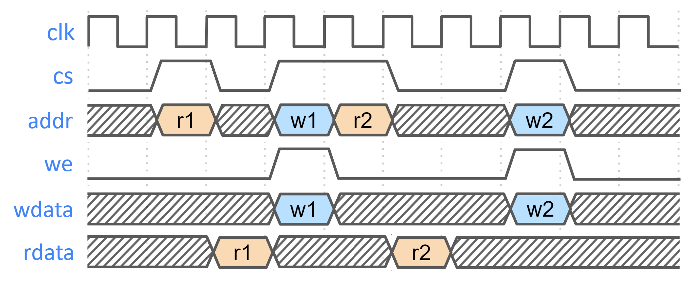

## SRAM parameterization

Parameterization for ICCM/DCCM memories is derived from the configuration of the VeeR RISC-V core that has been selected for Caliptra integration. Parameters defined in the VeeR core determine signal dimensions at the Caliptra top-level interface and drive requirements for SRAM layout. For details about interface parameterization, see the [Interface](#interface) section. The following configuration options from the RISC-V Core dictate this behavior:

*Table 16: SRAM parameterization*

| Parameter       | Value | Description |
| :--------- | :--------- | :--------- |
| ICCM_ENABLE     | 1     | Configures ICCM to be present in VeeR core.                                                                               |
| ICCM_NUM_BANKS  | 4     | Determines the number of physical 39-bit (32-bit data + 7-bit ECC) SRAM blocks that are instantiated in the ICCM.         |
| ICCM_INDEX_BITS | 13    | Address bit width for each ICCM Bank that is instantiated.                                                                |
| ICCM_SIZE       | 128   | Capacity of the ICCM in KiB. Total ICCM capacity in bytes is given by 4 \* ICCM_NUM_BANKS \* 2ICCM_INDEX_BITS. |
| DCCM_ENABLE     | 1     | Configures DCCM to be present in VeeR core.                                                                               |
| DCCM_NUM_BANKS  | 4     | Determines the number of physical 39-bit (32-bit data + 7-bit ECC) SRAM blocks that are instantiated in the DCCM.         |
| DCCM_INDEX_BITS | 13    | Address bit width for each DCCM Bank that is instantiated.                                                                |
| DCCM_SIZE       | 128   | Capacity of the DCCM in KiB. Total DCCM capacity in bytes is given by 4 \* DCCM_NUM_BANKS \* 2DCCM_INDEX_BITS. |

## Example SRAM machine check reliability integration

This section describes an example implementation of integrator machine check reliability.

This example is applicable to scenarios where an integrator may need control of or visibility into SRAM errors for purposes of reliability or functional safety. In such cases, integrators may introduce additional layers of error injection, detection, and correction logic surrounding SRAMs. The addition of such logic is transparent to the correct function of Caliptra, and removes integrator dependency on Caliptra for error logging or injection.

Note that the example assumes that data and ECC codes are in non-deterministic bit-position in the exposed SRAM interface bus. Accordingly, redundant correction coding is shown in the integrator level logic (i.e., integrator\_ecc(calitpra\_data, caliptra\_ecc)). If the Caliptra data and ECC are deterministically separable at the Caliptra interface, the integrator would have discretion to store the ECC codes directly and calculate integrator ECC codes for the data alone.

*Figure 7: Example machine check reliability implementation*

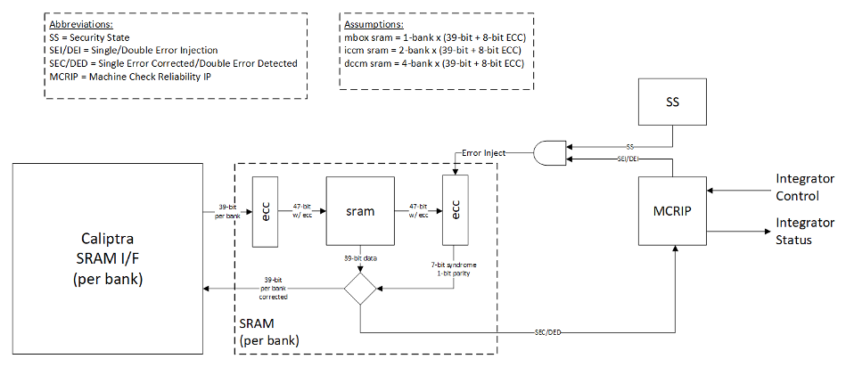

### Error detection and logging

1. Caliptra IP shall interface to ECC protected memories.
2. Caliptra IP calculates and applies its own ECC code, which produces a total of 39-bit data written to external or INTEGRATOR instantiated SRAMs.
3. Each 39-bit bank memory internally calculates 8-bit ECC on a write and stores 47 bits of data with ECC into SRAM.
4. On read access syndrome is calculated based on 39-bit data.
5. If parity error is detected and syndrome is valid, then the error is deemed single-bit and correctable.
6. If no parity error is detected but syndrome == 0 or the syndrome is invalid, the error is deemed uncorrectable.
7. On both single and double errors, the read data is modified before being returned to Caliptra.
8. Since single-bit errors shall be corrected through INTEGRATOR instantiated logic, Caliptra never sees single-bit errors from SRAM.
9. Double-bit or uncorrectable errors would cause unpredictable data to be returned to Caliptra. Since this condition shall be detected and reported to MCRIP, there is no concern or expectation that Caliptra will operate correctly after a double error.
10. On detection, single errors are reported as transparent to MCRIP, double errors are reported as fatal.
11. Along with error severity, MCRIP logs physical location of the error.
12. After MCRIP logs an error, it has a choice to send out in-band notification to an external agent.
13.  MCRIP logs can be queried by SoC software.

### Error injection

1. MCRIP supports two error injection modes: intrusive and non-intrusive.
2. Intrusive error injection:
    1. Can force a single or double error to be injected, which would result in incorrect data to be returned on read access.
    2. The intrusive error injection mode is disabled in Production fused parts via Security State signal.
3. Non-intrusive error injection:
    1. Allows external software to write into MCRIP error log registers.
    2. The non-intrusive error injection does not interfere with the operation of memories.
    3. The non-intrusive error injection is functional in Production fused parts.

### Caliptra error and recovery flow

1. Caliptra Stuck:
    1. SoC BC timeout mechanism with 300us timeout.
2. Caliptra reports non-fatal error during boot flow:
    1. cptra\_error\_non\_fatal is an output Caliptra signal, which shall be routed to SoC interrupt controller.
    2. SoC can look at the Caliptra non-fatal error register for error source.
    3. Assume Caliptra can report a non-fatal error at any time.
    4. SoC should monitor the error interrupt or check it before sending any mailbox command.
    5. In the event of a non-fatal error during boot (that is, prior to a ready for RT signal), SoC should enter recovery flow and attempt to boot again using alternate boot part/partition.
    6. If SoC sees that a non-fatal error has occurred AFTER receiving the ready for RT signal, SoC may attempt to recover Caliptra by executing the “Run Self-Test” mailbox command (not yet defined).
    7. If this command completes successfully, SoC may continue using Caliptra as before.
    8. If this command is unsuccessful, Caliptra is in an error state for the remainder of the current boot.
    9. Non-fatal ECC errors are never reported by Caliptra; SoC needs to monitor MCRIP for non-fatal Caliptra ECC errors.
3. Caliptra reports fatal error during boot flow:
    1. cptra\_error\_fatal is an output Caliptra signal, which shall be routed to SoC interrupt controller.
    2. SoC can look at the Caliptra fatal error register for error source.
    3. Assume Caliptra can report a fatal error at any time.
    4. Fatal errors are generally hardware in nature. SoC may attempt to recover by full reset of the entire SoC, or can move on and know that Caliptra will be unavailable for the remainder of the current boot.
    5. We cannot assume that uncorrectable errors will be correctly detected by Caliptra, ECC fatal errors shall be reported by SoC MCRIP.

# SoC integration requirements

The following table describes SoC integration requirements.

*Table 17: SoC integration requirements*

| Category                         | Requirement                                                                                                                                                                                                                                                                    | Definition of done       | Rationale                                         |
| :--------- | :--------- | :--------- | :--------- |
| Obfuscation Key                  | SoC backend flows shall generate obfuscation key with appropriate NIST compliance as dictated in the Caliptra RoT specification.                                                                                                                                               | Statement of conformance | Required by UDS and Field Entropy threat model    |
| Obfuscation Key                  | If not driven through PUF, SoC backend flows shall ECO the obfuscation key before tapeout.                                                                                                                                                                                     | Statement of conformance | Required by UDS and Field Entropy threat model    |
| Obfuscation Key                  | Rotation of the obfuscation key (if not driven through PUF) between silicon steppings of a given product (for example, A0 vs. B0 vs. PRQ stepping) is dependent on company-specific policies.                                                                                  | Statement of conformance | Required by UDS and Field Entropy threat model    |
| Obfuscation Key                  | SoC backend flows should not insert obfuscation key flops into the scan chain.                                                                                                                                                                                                 | Synthesis report         | Required by UDS and Field Entropy threat model    |
| Obfuscation Key                  | For defense in depth, it is strongly recommended that debofuscation key flops are not on the scan chain.   Remove the following signals from the scan chain:   cptra\_scan\_mode\_Latched\_d   cptra\_scan\_mode\_Latched\_f   field\_storage.internal\_obf\_key   | Statement of conformance | Caliptra HW threat model                          |
| Obfuscation Key                  | SoC shall ensure that obfuscation key is available (and wires are stable) before Caliptra reset is de-asserted.                                                                                                                                                                | Statement of conformance | Functionality and security                        |
| Obfuscation Key                  | SoC shall implement protections for obfuscation key generation logic and protect against debug/sw/scandump visibility. 1. Any flops outside of Caliptra that store obfuscation key or parts of the key should be excluded from scandump. 2. SoC shall ensure that the obfuscation key is sent only to Caliptra through HW wires, and it is not visible anywhere outside of Caliptra. | Statement of conformance | Required for Caliptra threat model |
| DFT                              | Before scan is enabled (separate signal that SoC implements on scan insertion), SoC shall set Caliptra's scan\_mode indication to '1 to allow secrets/assets to be flushed.                                                                                                    | Statement of conformance | Required by Caliptra threat model                 |
| DFT                              | Caliptra’s TAP should be a TAP endpoint.                                                                                                                                                                                                                                       | Statement of conformance | Functional requirement                            |
| Mailbox                          | SoC shall provide an access path between the mailbox and the application CPU complex on SoCs with such complexes (for example, Host CPUs and Smart NICs). See the [Sender Protocol](#sender-protocol) section for details about error conditions.                              | Statement of conformance | Required for Project Kirkland and TDISP TSM       |
| Fuses                            | SoC shall burn non-field fuses during manufacturing. Required vs. optional fuses are listed in the architectural specification.                                                                                                                                                | Test on silicon          | Required for UDS threat model                     |
| Fuses                            | SoC shall expose an interface for burning field fuses. Protection of this interface is the SoC vendor’s responsibility.                                                                                                                                                        | Test on silicon          | Required for Field Entropy                        |
| Fuses                            | SoC shall write fuse registers and fuse done via immutable logic or ROM code.                                                                                                                                                                                                  | Statement of conformance | Required for Caliptra threat model                |
| Fuses                            | SoC shall expose an API for programming Field Entropy as described in the architecture documentation. SoC shall ensure that Field Entropy can only be programmed via this API and shall explicitly prohibit burning of discrete Field Entropy bits and re-burning of already burned Field Entropy entries. | Test on silicon          | Required for Field Entropy                        |
| Fuses                            | SoC shall ensure that any debug read paths for fuses are disabled in PRODUCTION lifecycle state.                                                                                                                                                                               | Test on silicon          | Required for Field Entropy                        |
| Fuses                            | SoC shall ensure that UDS\_SEED and Field Entropy supplied to Caliptra come directly from OTP fuses and there are no debug paths to inject new values.                                                                                                                         | Statement of conformance | Required for Caliptra threat model                |
| Fuses                            | SoC shall add integrity checks for Caliptra fuses as per SoC policy.                                                                                                                                                                                                           | Statement of conformance | Reliability                                       |
| Fuses                            | SoC should apply shielding/obfuscation measures to protect fuse macro.                                                                                                                                                                                                         | Statement of conformance | Required for Caliptra threat model                |
| Fuses                            | SoCs that intend to undergo FIPS 140-3 zeroization shall expose zeroization API as described in zeroization requirements in architecture specification. SoC shall apply appropriate authentication for this API to protect against denial of service and side channel attacks. | Test on silicon          | FIPS 140-3 certification                          |
| Security State                   | SoC shall drive security state wires in accordance with the SoC's security state.                                                                                                                                                                                              | Statement of conformance | Required for Caliptra threat model                |
| Security State                   | If SoC is under debug, then SoC shall drive debug security state to Caliptra.                                                                                                                                                                                                  | Statement of conformance | Required for Caliptra threat model                |
| Resets and Clocks                | SoC shall start input clock before caliptra\_pwrgood assertion.                                                                                                                                                                                                                | Statement of conformance | Functional                                        |
| Resets and Clocks                | SoC reset logic shall assume reset assertions are asynchronous and deassertions are synchronous.                                                                                                                                                                               | Statement of conformance | Functional                                        |
| Resets and Clocks                | SoC shall ensure Caliptra's powergood is tied to SoC’s own powergood or any other reset that triggers SoC’s cold boot flow.                                                                                                                                                    | Statement of conformance | Required for Caliptra threat model                |
| Resets and Clocks                | SoC shall ensure Caliptra clock is derived from an on-die oscillator circuit.                                                                                                                                                    | Statement of conformance | Required for Caliptra threat model                |
| Resets and Clocks                | SoC shall ensure that any programmable Caliptra clock controls are restricted to the SoC Manager.                                                                                                                                                    | Statement of conformance | Required for Caliptra threat model                |
| Resets and Clocks                | SoC should defend against external clock stop attacks.                                                                                                                                                    | Statement of conformance | Required for Caliptra threat model                |
| Resets and Clocks                | SoC should defend against external clock glitching attacks.                                                                                                                                                    | Statement of conformance | Required for Caliptra threat model                |
| Resets and Clocks                | SoC should defend against external clock overclocking attacks.                                                                                                                                                    | Statement of conformance | Required for Caliptra threat model                |
| TRNG                             | SoC shall either provision Caliptra with a dedicated TRNG or shared TRNG. It is highly recommended to use dedicated ITRNG                                                                                                                                                      | Statement of conformance | Required for Caliptra threat model and Functional |
| TRNG                             | SoC shall provision the Caliptra embedded TRNG with an entropy source if that is used (vs. SoC-shared TRNG API support).                                                                                                                                                       | Statement of conformance | Functional                                        |
| TRNG                             | If the TRNG is shared, then upon TRNG\_REQ, SoC shall use immutable logic or code to program Caliptra's TRNG registers.                                                                                                                                                        | Statement of conformance | Required for Caliptra threat model and Functional |
| SRAMs                            | SoC shall ensure timing convergence with 1-cycle read path for SRAMs.                                                                                                                                                                                                          | Synthesis report         | Functional                                        |
| SRAMs                            | SoC shall size SRAMs to account for SECDED.                                                                                                                                                                                                                                    | Statement of conformance | Functional                                        |
| SRAMs                            | SoC shall write-protect fuses that characterize the SRAM.                                                                                                                                                                                                                      | Statement of conformance | Required for Caliptra threat model                |
| SRAMs                            | SoC shall ensure SRAM content is only destroyed on powergood cycling.                                                                                                                                                                                                          | Statement of conformance | Functional (Warm Reset, Hitless Update)           |
| SRAMs                            | SoC shall only perform SRAM repair on powergood events and prior to caliptra\_rst\_b deassertion. SoC shall also ensure that SRAMs are initialized with all 0 data during powergood events, and prior to caliptra\_rst\_b deassertion.                                         | Statement of conformance | Functional (Warm Reset, Hitless Update)           |
| Backend convergence              | Caliptra supports frequencies up to 400MHz using an industry standard, moderately advanced technology node as of 2023 September.                                                                                                                                               | Statement of conformance | Functional                                        |
| Power saving                     | Caliptra clock gating shall be controlled by Caliptra firmware alone. SoC is provided a global clock gating enable signal (and a register) to control.                                                                                                                         | Statement of conformance | Required for Caliptra threat model                |
| Power saving                     | SoC shall not power-gate Caliptra independently of the entire SoC.                                                                                                                                                                                                             | Statement of conformance | Required for Caliptra threat model                |
| PAUSER                           | SoC shall drive PAUSER input in accordance with the IP integration spec.                                                                                                                                                                                                       | Statement of conformance | Required for Caliptra threat model                |
| Error reporting                  | SoC shall report Caliptra error outputs.                                                                                                                                                                                                                                       | Statement of conformance | Telemetry and monitoring                          |
| Error reporting                  | SoC shall only recover Caliptra fatal errors via SoC power-good reset.                                                                                                                                                                                                         | Statement of conformance | Required for Caliptra threat model                |
| TRNG PAUSER Programming rules    | If SoC doesn’t program the CPTRA\_TRNG\_PAUSER\_LOCK\[LOCK\], then Caliptra HW will not accept TRNG data from any SoC entity.                                                                                                                                                  | Security                 | Required for Caliptra threat model                |
| TRNG PAUSER Programming rules    | If SoC programs CPTRA\_TRNG\_VALID\_PAUSER and sets CPTRA\_TRNG\_PAUSER\_LOCK\[LOCK\], then Caliptra HW will accept TRNG data only from the entity that is programmed into the PAUSER register.                                                                                | Security                 | Required for Caliptra threat model                |
| TRNG PAUSER Programming rules    | It is strongly recommended that these PAUSER registers are either set at integration time through integration parameters or be programmed by the SoC ROM before any mutable FW or ROM patches are absorbed.                                                                    | Security                 | Required for Caliptra threat model                |
| MAILBOX PAUSER programming rules | 5 PAUSER attribute registers are implemented at SoC interface.                                                                                                                                                                                                                 | Security                 | Required for Caliptra threat model                |
| MAILBOX PAUSER programming rules | At boot time, a default SoC or PAUSER can access the mailbox. The value of this PAUSER is an integration parameter, CPTRA\_DEF\_MBOX\_VALID\_PAUSER.                                                                                                                           | Security                 | Required for Caliptra threat model                |
| MAILBOX PAUSER programming rules | The value of CPTRA\_MBOX\_VALID\_PAUSER\[4:0\] register can be programmed by SoC. After it is locked, it becomes a valid PAUSER for accessing the mailbox.                                                                                                                     | Security                 | Required for Caliptra threat model                |
| MAILBOX PAUSER programming rules | CPTRA\_SET\_MBOX\_PAUSER\_INTEG parameter can be set along with the corresponding CPTRA\_MBOX\_VALID\_PAUSER parameter at integration time. If set, these integration parameters take precedence over the CPTRA\_MBOX\_VALID\_PAUSER\[4:0\] register.                          | Security                 | Required for Caliptra threat model                |
| MAILBOX PAUSER programming rules | SoC logic (ROM, HW) that is using the Caliptra mailbox right out of cold reset, without first configuring the programmable mailbox PAUSER registers, must send the mailbox accesses with the default PAUSER, CPTRA\_DEF\_MBOX\_VALID\_PAUSER.                                  | Security                 | Required for Caliptra threat model                |
| MAILBOX PAUSER programming rules | For CPTRA\_MBOX\_VALID\_PAUSER\[4:0\], the corresponding lock bits MUST be programmed to ‘1. This enables the mailbox to accept transactions from non-default PAUSERS.                                                                                                         | Security                 | Required for Caliptra threat model                |
| MAILBOX PAUSER programming rules | It is strongly recommended that mailbox PAUSER registers are either set at integration time through integration parameters or are programmed by the SoC ROM before any mutable FW or ROM patches are applied.                                                                  | Security                 | Required for Caliptra threat model                |
| FUSE PAUSER programming rules    | 1 PAUSER attribute register is implemented at SoC interface: CPTRA\_FUSE\_VALID\_PAUSER.                                                                                                                                                                                       | Security                 | Required for Caliptra threat model                |
| FUSE PAUSER programming rules    | CPTRA\_FUSE\_PAUSER\_LOCK locks the programmable valid pauser register, and marks the programmed value as valid.                                                                                                                                                               | Security                 | Required for Caliptra threat model                |
| FUSE PAUSER programming rules    | Integrators can choose to harden the valid pauser for fuse access by setting the integration parameter, CPTRA\_FUSE\_VALID\_PAUSER, to the desired value in RTL, and by setting CPTRA\_SET\_FUSE\_PAUSER\_INTEG to 1. If set, these integration parameters take precedence over the CPTRA\_FUSE\_VALID\_PAUSER register. | Security                 | Required for Caliptra threat model                |
| Manufacturing                    | SoC shall provision an IDevID certificate with fields that conform to the requirements described in [Provisioning IDevID during manufacturing](https://github.com/chipsalliance/Caliptra/blob/main/doc/Caliptra.md#provisioning-idevid-during-manufacturing).                  | Statement of conformance | Functionality                                     |
| Manufacturing                    | Caliptra relies on obfuscation for confidentiality of UDS\_SEED. It is strongly advised to implement manufacturing policies to protect UDS\_SEED as defense in depth measures.  1, Prevent leakage of UDS\_SEED on manufacturing floor. 2. Implement policies to prevent cloning (programming same UDS\_SEED into multiple devices). 3. Implement policies to prevent signing of spurious IDEVID certs. | Statement of conformance | Required for Caliptra threat model |
| Chain of trust                   | SoC shall ensure all mutable code and configuration measurements are stashed into Caliptra. A statement of conformance lists what is considered mutable code and configuration vs. what is not. The statement also describes the start of the boot sequence of the SoC and how Caliptra is incorporated into it. | Statement of conformance | Required for Caliptra threat model | 
| Chain of trust                   | SoC shall limit the mutable code and configuration that persists across the Caliptra powergood reset. A statement of conformance lists what persists and why this persistence is necessary.                                                                                    | Statement of conformance | Required for Caliptra threat model                |
| Implementation                   | SoC shall apply size-only constraints on cells tagged with the "u\_\_size\_only\_\_" string and shall ensure that these are not optimized in synthesis and PNR                                                                                                                 | Statement of conformance | Required for Caliptra threat model                |
| GLS FEV                          | GLS FEV must be run to make sure netlist and RTL match and none of the countermeasures are optimized away. See the following table for example warnings from synthesis runs to resolve through FEV                                                                             | GLS simulations pass                 | Functional requirement                |

*Table 18: Caliptra synthesis warnings for FEV evaluation*

| Module                    | Warning | Line No. | Description |
| :--------- | :--------- | :--------- | :--------- |
| sha512_acc_top            | Empty netlist for always_comb                                                             | 417      |Unused logic (no load)| 
| ecc_scalar_blinding       | Netlist for always_ff block does not contain flip flop                                    | 301      |Output width is smaller than internal signals, synthesis optimizes away the extra internal flops with no loads|
| sha512_masked_core        | "masked_carry" is read before being assigned. Synthesized result may not match simulation | 295, 312 ||
| ecc_montgomerymultiplier  | Netlist for always_ff block does not contain flip flop                                    | 274, 326 |Output width is smaller than internal signals, synthesis optimizes away the extra internal flops with no loads|
| Multiple modules          | Signed to unsigned conversion occurs                                                      |          ||

## Integrator RTL modification requirements

Several files contain code that may be specific to an integrator's implementation and should be overridden. This overridable code is either configuration parameters with integrator-specific values or modules that implement process-specific functionality. Code in these files should be modified or replaced by integrators using components from the cell library of their fabrication vendor. The following table describes recommended modifications for each file.

*Table 19: Caliptra integrator custom RTL file list*

| File                                                                                   | Description                                                            |
| :------------------------------------------------------------------------------------- | :--------------------------------------------------------------------- |
| [config_defines.svh](../src/integration/rtl/config_defines.svh)                        | Enable Caliptra internal TRNG (if applicable). Declare name of custom clock gate module by defining USER_ICG. Enable custom clock gate by defining TECH_SPECIFIC_ICG.                |
| [soc_ifc_pkg.sv](../src/soc_ifc/rtl/soc_ifc_pkg.sv)                                    | Define PAUSER default behavior and (if applicable) override values. See [Integration Parameters](#integration-parameters). |
| [caliptra_icg.sv](../src/libs/rtl/caliptra_icg.sv)                                     | Replace with a technology-specific clock gater. Modifying this file is not necessary if integrators override the clock gate module that is used by setting TECH_SPECIFIC_ICG. |
| [beh_lib.sv](../src/riscv_core/veer_el2/rtl/lib/beh_lib.sv)                            | Replace rvclkhdr/rvoclkhdr with a technology-specific clock gater. Modifying this file may not be necessary if integrators override the clock gate module that is used by setting TECH_SPECIFIC_EC_RV_ICG. |
| [beh_lib.sv](../src/riscv_core/veer_el2/rtl/lib/beh_lib.sv)                            | Replace rvsyncss (and rvsyncss_fpga if the design will be implemented on an FPGA) with a technology-specific sync cell. |
| [caliptra_prim_flop_2sync.sv](../src/caliptra_prim/rtl/caliptra_prim_flop_2sync.sv)    | Replace with a technology-specific sync cell.                            |
| [caliptra_2ff_sync.sv](../src/libs/rtl/caliptra_2ff_sync.sv)                           | Replace with a technology-specific sync cell.                            |
| [dmi_jtag_to_core_sync.v](../src/riscv_core/veer_el2/rtl/dmi/dmi_jtag_to_core_sync.v)  | Replace with a technology-specific sync cell. This synchronizer implements edge detection logic using a delayed flip flop on the output domain to produce a pulse output. Integrators must take care to ensure logical equivalence when replacing this logic with custom cells. |

# CDC analysis and constraints

Clock Domain Crossing (CDC) analysis is performed on the Caliptra core IP. The following are the results and recommended constraints for Caliptra integrators using standard CDC analysis EDA tools.

In an unconstrained environment, several CDC violations are anticipated. CDC analysis requires the addition of constraints to identify valid synchronization mechanisms and/or static/pseudo-static signals.

## Analysis of missing synchronizers
* All of the signals, whether single-bit or multi-bit, originate from the rvjtag\_tap module internal register on TCK clock, and the Sink/Endpoint is the rvdff register, which is in CalitpraClockDomain clock.
* JTAG does a series of “jtag writes” for each single “register write”.
* We only need to synchronize the controlling signal for this interface.
* Inside the dmi\_wrapper, the dmi\_reg\_en and dmi\_reg\_wr\_en comes from dmi\_jtag\_to\_core\_sync, which is a 2FF synchronizer.

The following code snippet and schematic diagram illustrate JTAG originating CDC violations.

*Figure 8: Schematic diagram and code snippet showing JTAG-originating CDC violations*

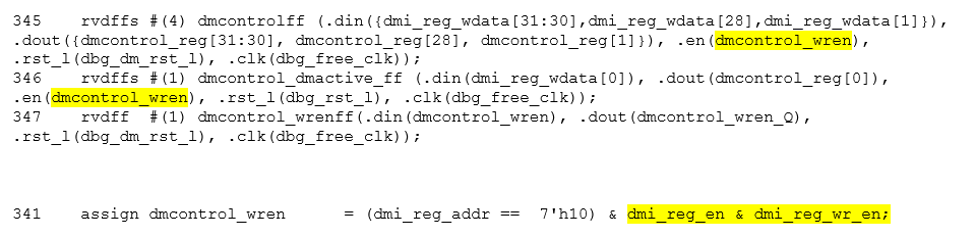

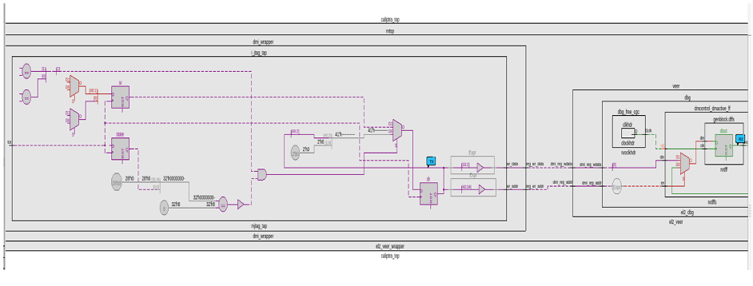

## CDC analysis conclusions
* Missing synchronizers appear to be the result of “inferred” and/or only 2-FF instantiated synchronizers.
    * dmi\_jtag\_to\_core\_sync.v contains inferred 2FF synchronizers on the control signals “dmi\_reg\_wr\_en” and “dmi\_reg\_rd\_en”.
    * 2FF synchronizer inferences are considered non-compliant and should be replaced by an explicitly instantiated synchronization module, which is intended to be substituted on a per-integrator basis.
        * cdc report scheme two\_dff -severity violation
* Multi-bit signals are effectively pseudo-static and are qualified by synchronized control qualifiers.
    * Pseudo-static: wr\_data, wr\_addr
        * cdc signal reg\_wr\_data  -module dmi\_wrapper -stable
        * cdc signal reg\_wr\_addr  -module dmi\_wrapper -stable
* The core clock frequency must be at least twice the TCK clock frequency for the JTAG data to pass correctly through the synchronizers. 

## CDC constraints
* cdc report scheme two\_dff -severity violation
* cdc signal reg\_wr\_data  -module dmi\_wrapper -stable
* cdc signal reg\_wr\_addr  -module dmi\_wrapper -stable

# RDC analysis and constraints

Reset Domain Crossing (RDC) analysis is performed on the Caliptra core IP. The following are the results and recommended constraints for Caliptra integrators using standard RDC analysis EDA tools.

In an unconstrained environment, several RDC violations are anticipated. RDC analysis requires the addition of constraints to identify valid synchronization mechanisms from one reset domain to another.

## Constraining reset domains

### Reset domains
The following table identifies the major reset domains in Caliptra core IP design.

*Table 20: Reset definitions (functional resets are marked in **bold**)*

| Reset name | Reset type | Reset polarity | Definition point | Reset generated by |
| ---------- | ---------- | -------------- | ---------------- | ------------------ |
| **CPTRA_PWRGD**        | Async | Active Low | cptra_pwrgood                                                    | Primary Input                                                                                    |
| **CPTRA_RST**          | Async | Active Low | cptra_rst_b                                                      | Primary Input                                                                                    |
| **CPTRA_UC_RST**       | Async | Active Low | caliptra_top.soc_ifc_top1.i_soc_ifc_boot_fsm.cptra_uc_rst_b      | Generated by Boot FSM                                                                            |
| **CPTRA_NON_CORE_RST** | Async | Active Low | caliptra_top.soc_ifc_top1.i_soc_ifc_boot_fsm.cptra_noncore_rst_b | Generated by Boot FSM                                                                            |
| RISCV_VEER_CORE_RST    | Async | Active Low | caliptra_top.rvtop.veer.core_rst_l                               | AND of BOOT_FSM_CPTRA_UC_RST and RISCV_VEER_DBG_CORE_RST *Functionally same as CPTRA_UC_RST*  |
| RISCV_VEER_DBG_DM_RST  | Async | Active Low | caliptra_top.rvtop.veer.dbg.dbg_dm_rst_l                         | AND of CPTRA_PWRGD and a bit controlled from JTAG TAP *Functionally same as CPTRA_PWRGD*      |
| CPTRA_JTAG_RST     | Async | Active Low | jtag_trst_n                                                      | Primary Input                                                                                    |

### Reset structure

The reset definitions can be visually represented as shown in the following diagram.

*Figure 9: Reset tree for Caliptra*

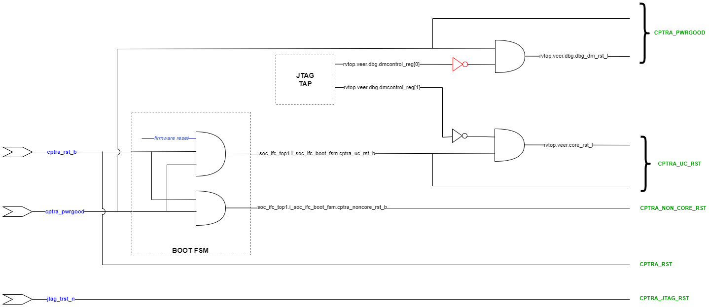

## RDC false paths

The following table shows the false paths between various reset groups.

*Table 21: Reset domain crossing false paths*

| Launch flop reset | Capture flop reset | Comment |
| ------------------| ------------------ | ------- |
| CPTRA_PWRGD        | all other groups   | CPTRA_PWRGD is the deepest reset domain, so all RDC paths from CPTRA_PWRGD can be set as false paths                      |
| CPTRA_RST          | CPTRA_UC_RST       | Boot FSM is reset by CPTRA_RST                                                                                            |
| CPTRA_RST          | CPTRA_NON_CORE_RST | Boot FSM is reset by CPTRA_RST                                                                                            |
| CPTRA_NON_CORE_RST | CPTRA_RST          | CPTRA_NON_CORE_RST can be asserted only by asserting CPTRA_RST                                                            |
| CPTRA_NON_CORE_RST | CPTRA_UC_RST       | CPTRA_NON_CORE_RST can be asserted only by asserting CPTRA_RST Asserting CPTRA_RST means CPTRA_UC_RST will be asserted |                                       |

## Reset sequencing scenarios

The resets defined in *Table 20* have the following sequencing phases, which are applicable for different reset scenarios: cold boot, cold reset, warm reset and firmware reset. 

The reset sequencing is illustrated in the following waveform.

*Figure 10: Reset sequencing waveform for Caliptra*

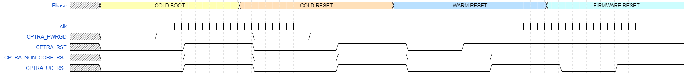

## Reset ordering

The following table defines the order in which resets can get asserted. A ">>" in a cell at row X and column Y indicates that if the reset in row X is asserted, the reset in row Y is also asserted. For rest of the cells (in which symbol ">>" is not present) the preceding assumption is not true and so the paths between those resets are potential RDC violations. The black cells are ignored because they are between the same resets.

*Table 22: Reset sequence ordering constraints*

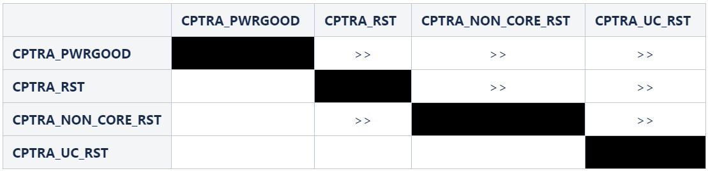

## Reset constraints and assumptions

The following set of constraints and assumptions must be provided before running RDC structural analysis of Caliptra Core IP.

1. Caliptra Core IP assumes the primary reset inputs are already synchronized to their respective clocks. The integrator must add external reset synchronizers to achieve the same.
    - *cptra_pwrgood* and *cptra_rst_b* resets must be synchronzied to *cptra_clk*
    - *jtag_trst_n* reset must be synchronzied to *jtag_clk*
2. The following debug register, which is driven from JTAG, is not toggled during functional flow.
    - u_caliptra.rvtop.veer.dbg.dmcontrol_reg[0] = 0
3. Set *scan_mode* to 0 for functional analysis.
4. Stamp or create functional resets for *cptra_noncore_rst_b* and *cptra_uc_rst_b* at the definition points, as mentioned in *Table 20*. 
5. Create funtional reset grouping - This step must be customized as per the EDA tool, which is being used for RDC analysis. The goal of this customization is to achieve the following three sequencing requirements/constraints.
    - Gate all clocks when *cptra_noncore_rst_b* is asserted. This ensures that the capture flop clock is gated while the source flop's reset is getting asserted, thereby preventing the capture flop from becoming metastable. The result is when *cptra_noncore_rst_b* is going to be asserted, the following signals are constrained to be at 1 at around that time.
        - soc_ifc_top1.i_soc_ifc_boot_fsm.rdc_clk_dis
        - soc_ifc_top1.i_soc_ifc_boot_fsm.arc_IDLE
    - Gate Veer core clock when *cptra_uc_rst_b* is asserted. This ensures that the capture flop clock is gated while the source flop's reset is getting asserted, thereby preventing the capture flop from becoming metastable. The result is when *cptra_uc_rst_b* is going to be asserted, the following signal is constrained to be at 1 at around that time.
        - soc_ifc_top1.i_soc_ifc_boot_fsm.fw_update_rst_window
    - Quiesce the AHB bus before *cptra_uc_rst_b* is asserted. Since the firmware reset request is triggered by software, it can ensure that all AHB transcations are flushed out before initiating a reset request. This is done by generating a signal, *fw_update_rst_window*, which is asserted (driven to 1) around the firmware reset assertion edge. When *fw_update_rst_window* is asserted, the *force_bus_idle* signal of the AHB decoder is driven to 1, which ensures that all AHB requestes are driven low. So when *cptra_uc_rst_b* is going to get asserted, the following signals are constrained to be at 0 at around that time.
        - doe.doe_inst.i_doe_reg.s_cpuif_req
        - ecc_top1.ecc_reg1.s_cpuif_req
        - hmac.hmac_inst.i_hmac_reg.s_cpuif_req
        - key_vault1.kv_reg1.s_cpuif_req
        - pcr_vault1.pv_reg1.s_cpuif_req
        - data_vault1.dv_reg1.s_cpuif_req
        - sha512.sha512_inst.i_sha512_reg.s_cpuif_req
        - soc_ifc_top1.i_ahb_slv_sif_soc_ifc.dv
        - sha256.sha256_inst.i_sha256_reg.s_cpuif_req
        - csrng.u_reg.u_ahb_slv_sif.dv
        - entropy_src.u_reg.u_ahb_slv_sif.dv
6. Constrain the RDC false paths as per *Table 21*.

## RDC violations and waivers

Considering the given constraints, three sets of crossings were identified as RDC violations. All of them can be waived as explained in *Table 23*. Note that the report may differ across EDA tools due to variations in structural analysis, which can be influenced by a range of settings.

*Table 23: Reset domain crossing violations*

| Sl no | Launch reset | Launch flop | Capture reset | Capture flop |
| ------| ------------ | ----------- | ------------- | ------------ |
| 1 | cptra_uc_rst_b | rvtop.veer.dec.tlu.exthaltff.genblock.dff.dout[7] | cptra_noncore_rst_b | cg.user_soc_ifc_icg.clk_slcg_0_generated_icg.p_clkgate.vudpi0.q           |
| 2 | cptra_uc_rst_b | rvtop.veer.dec.tlu.exthaltff.genblock.dff.dout[7] | cptra_noncore_rst_b | cg.user_icg.clk_slcg_0_generated_icg.p_clkgate.vudpi0.q                   |
| 3 | cptra_uc_rst_b | rvtop.veer.Gen_AXI_To_AHB.lsu_axi4_to_ahb*        | cptra_noncore_rst_b | entropy_src.u_entropy_src_core.u_caliptra_prim_packer_fifo_bypass.data_q* |
| 4 | cptra_uc_rst_b | rvtop.veer.Gen_AXI_To_AHB.lsu_axi4_to_ahb*        | cptra_noncore_rst_b | entropy_src.u_entropy_src_core.u_caliptra_prim_packer_fifo_precon.data_q* |

 

For violations in Sl No 1 and 2, the schematic for the crossing is shown in the following figure. 

*Figure 11: Schematic for RDC violations #1 and #2*

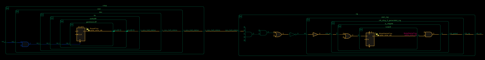

This violation can be waived because if the CPU is halted, there is no way to trigger a firmware update reset as it is initiated by the microcontroller itself. Thus, it can be ensured that on *cptra_uc_rst_b*, *cpu_halt_status* will be at the reset value already, which in turn ensures that there are no glitches on the output clock of CG.

For violations in Sl No 3 and 4, the schematic for the crossing is shown in the following figure.

*Figure 12: Schematic for RDC violations #3 and #4*

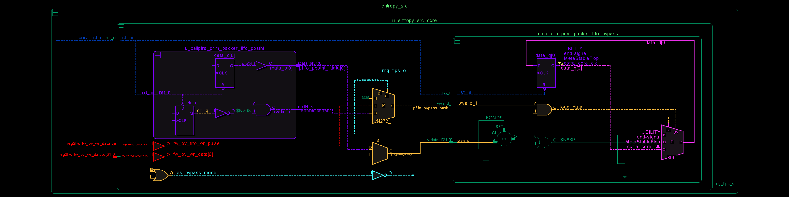

In the preceding schematic, an RDC crossing violation is identified at the *data_q* flop, which is located on the right-hand side of the figure. The analysis for *prim_packer_fifo_bypass* is elaborated here, with the same scenario applying to *prim_packer_fifo_recon*.

The fifo load and wr_data equations are as follows:

  assign pfifo_bypass_push = !es_bypass_mode ? 1'b0 :
                             fw_ov_mode_entropy_insert ? fw_ov_fifo_wr_pulse :
                             pfifo_postht_not_empty;
  assign pfifo_bypass_wdata = fw_ov_mode_entropy_insert ? fw_ov_wr_data :
                              pfifo_postht_rdata;

 
The following scenarios can occur.

 

*Table 24: Reset domain crossing scenarios for #3 and #4 crossing*

| #Case | *es_bypass_mode* | *fw_ov_mode_entropy_insert* | *pfifo_bypass_push* | *pfifo_bypass_wdata* | Comment |
| ------| ---------------- | --------------------------- | ------------------- | -------------------- | ------- |
| 1 | 0 | don't care | 0                     | don't care           | No RDC violations, since the recirculation mux on data_q (pink on lower right side) prevents the flop from loading.                                              |
| 2 | 1 | 0          | *pfifo_postht_rdata*  | *pfifo_postht_rdata* | No RDC violations, since recirculation mux switches to the leg that is on the same reset domain (shown in purple on left side)                                   |
| 3 | 0 | 1          | *fw_ov_fifo_wr_pulse* | *fw_ov_wr_data*      | RDC violations are suppressed because *fw_ov_fifo_wr_pulse* = 0 (the red data lines on *cptra_uc_rst_b* are not able to reach *data_q* because *load_data* is 0) |

Referring to the preceding table, if it can be ensured that *fw_ov_fifo_wr_pulse* is 0 when *cptra_uc_rst_b* is asserted, RDC crossings (Case #3) can be avoided. This condition is described in the preceding Constraints section.

# Synthesis findings

Synthesis experiments have so far found the following:
* Design converges at 400MHz 0.72V using an industry standard, moderately advanced technology node as of 2023 September.
* Design converges at 100MHz using TSMC 40nm process.

Note: Any synthesis warnings of logic optimization must be reviewed and accounted for.

# Netlist synthesis data

The following table illustrates representative netlist synthesis results using industry standard EDA synthesis tools and tool configurations.

These metrics are inclusive of VeeR core, Caliptra logic, imem/dmem RAM, ROM.

The area is expressed in units of square microns.

The target foundry technology node is an industry standard, moderately advanced technology node as of 2023 September.

*Table 25: Netlist synthesis data*

| **IP Name**      | **Date**  | **Path Group**       | **Target Freq** | **QoR WNS** | **QoR Achieveable Freq** |
| :--------- | :--------- | :--------- | :--------- | :--------- | :--------- |
| CALIPTRA_WRAPPER | 6/15/2023 | CALIPTRACLK          | 500MHz          | -15.93      | 496MHz                   |
| CALIPTRA_WRAPPER | 6/15/2023 | JTAG_TCK             | 100MHz          | 4606.5      | 100MHz                   |
| CALIPTRA_WRAPPER | 6/15/2023 | clock_gating_default | 500MHz          | 26.56       | 500MHz                   |
| CALIPTRA_WRAPPER | 6/15/2023 | io_to_io             | 500MHz          | -599.82     | 385MHz                   |
| CALIPTRA_WRAPPER | 6/15/2023 | io_to_flop           | 500MHz          | 0.25        | 500MHz                   |
| CALIPTRA_WRAPPER | 6/15/2023 | flop_to_io           | 500MHz          | -627.58     | 381MHz                   |

| **IP Name**      | **Date**  | **Stdcell Area** | **Macro Area** | **Memory Area** | **Total Area** | **Flop Count** | **No Clock Regs/Pins Count** | **FM Status** | **FM Eqv Pts** | **FM Non-Eqv Pts** | **FM Abort Pts** | **FM FM**  **Non-Comp** **Pts** |
| :--------- | :--------- | :--------- | :--------- | :--------- | :--------- | :--------- | :--------- | :--------- | :--------- | :--------- | :--------- | :--------- |
| CALIPTRA_WRAPPER | 10/4/2023 | 89279            | 7872           | 239937          | 337088         | 45601          | 31                           | SUCCEEDED     | 156211         | 0                  | 0                | 0                              |

# Recommended LINT rules

The following LINT rules are the recommended minimum set for standalone analysis of Caliptra IP. The same set is recommended as a minimum subset that may be applied by Caliptra integrators.

Error: "x" in casez statements not allowed

Error: All instance inputs must be driven

Error: An event variable is declared but never triggered

Error: Bit truncation hazard; LHS/RHS truncation of extra bits

Error: Blocking and non-blocking assignment to a signal/variable detected

Error: Case expression width mismatch; case expression width does not match case select expression width

Error: Combinational loops detected

Error: Constant value clock pin of sequential instance

Error: Detected a logical/scalar operation on a vector

Error: Detected that a tristate is used below top-level of design

Error: Detected always or process constructs that do not have an event control

Error: Detected arithmetic comparison operator with unequal length

Error: Detected conversion of unsigned (reg type) to integer

Error: Detected floating or unconnected inout port of an instance

Error: Detected loop step statement variables incorrectly incremented or decremented

Error: Detected nonblocking assignment in a combinational always block

Error: Detected reset or set used both synchronously and asynchronously

Error: Detected signal read inside combinational always block missing from sensitivity list

Error: Detected tri-state 'Z' or '?' value used in assign or comparison

Error: Detected two state data type signals; must support 4 state data type

Error: Detected undriven but loaded input of an instance

Error: Detected undriven but loaded net is detected

Error: Detected undriven but loaded output port of module

Error: Detected undriven output pins connected to instance input

Error: Detected unequal length operands in the bit-wise logical, arithmetic, and ternary operators

Error: Detected unpacked structure declaration outside the package

Error: Duplicate conditions of a case, unique-case, or priority-case

Error: Function return does not set all bits of return variable

Error: Inout port is not read or assigned

Error: Instance pin connections must use named-association rather than positional association

Error: LHS or RHS mismatch hazard; multi-bit expression assigned to single bit signal

Error: Latch inference not permitted

Error: Must declare enum base type explicitly as sized logic type

Error: Negative or enum array index detected

Error: Non-synthesizable construct; functions of type real detected

Error: Non-synthesizable construct; repeat statement

Error: Non-synthesizable construct; delays ignored by synthesis tools

Error: Non-synthesizable construct; modelling style where clock and reset cannot be inferred in sequential inference

Error: Non-synthesizable construct; states are not updated on the same clock phase in sequential inference

Error: Null Ports detected

Error: Port referred before definition

Error: Range index or slice of an array discrepancy

Error: Read before set hazard in blocking assignment signal

Error: Recursive task hazard

Error: Redeclaration of a port range

Error: Text Macro Redefinition TMR

Error: Variable is too short for array index

Error: Identified case constructs without the default or `OTHERS` clause

Fatal: Asynchronous reset inference must have "if" statement as first statement in the block

Fatal: Blocking assignment detected in sequential always block

Fatal: Detected a function or a sub-program sets a global signal or variable

Fatal: Detected a function or a sub-program uses a global signal or variable

Fatal: Detected assignment to input ports

Fatal: Detected edge and non-edge conditions in block sensitivity list

Fatal: Detected variable in which both the edges are used in an event control list

Fatal: Event control detected in RHS of assignment statement

Fatal: Illegal case construct label detected

Fatal: Module instance port connection mismatch width compared to the port definition

Fatal: Non-synthesizable construct; case equal operators (===) (!==) operators may not be synthesizable

Fatal: Non-synthesizable construct; detected real operands that are used in logical comparisons

Fatal: Non-synthesizable construct; detected real variables that are unsynthesizable

Fatal: Non-synthesizable construct; MOS switches, such as cmos, pmos, and nmos

Fatal: Non-synthesizable construct; disable statements detected

Fatal: Non-synthesizable construct; event control expressions have multiple edges in sequential inference

Fatal: Non-synthesizable construct; event variables

Fatal: Non-synthesizable construct; the tri0 net declarations

Fatal: Non-synthesizable construct; time declarations

Fatal: Non-synthesizable construct; tri1 net declarations

Fatal: Non-synthesizable construct; trireg declarations

Fatal: The 'default' or 'others' must be last case in a case statement

# Terminology

The following terminology is used in this document.

*Table 26: Terminology*

| Abbreviation | Description                                                                                      |
| :--------- | :--------- |
| AHB          | AMBA Advanced High-Performance Bus                                                               |
| APB          | AMBA Advanced Peripheral Bus                                                                     |
| AES          | Advanced Encryption Standard                                                                     |
| BMD          | Boot Media Dependent                                                                             |
| BMI          | Boot Media Integrated                                                                            |
| ECC          | Elliptic Curve Cryptography                                                                      |
| ECO          | Engineering Change Order (used to implement logic changes to a hardware design post-synthesis)   |
| QSPI         | Quad Serial Peripheral Interface                                                                 |
| RISC         | Reduced Instruction Set Computer                                                                 |
| SHA          | Secure Hashing Algorithm                                                                         |
| SPI          | Serial Peripheral Interface                                                                      |
| UART         | Universal Asynchronous Receiver Transmitter                                                      |
