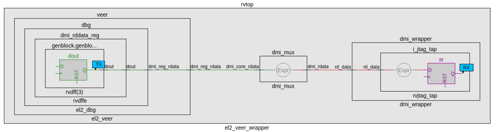

Caliptra Integration Specification

Version 2.0

# Scope

This document describes the Caliptra hardware implementation requirements, details, and release notes. This document is intended for a high-level overview of the IP used in Caliptra.

This document is not intended for any micro-architectural design specifications. Detailed information on each of the IP components are shared in individual documents, where applicable.

# Overview

This document contains high level information on the Caliptra hardware design. The details include open-source IP information, configuration settings for open-source IP (if applicable), and IP written specifically for Caliptra.

For more information, see[ Caliptra: A Datacenter System on a Chip (SoC) Root of Trust (RoT)](https://chipsalliance.github.io/Caliptra/doc/Caliptra.html).

## References and related specifications

The blocks described in this document are either obtained from open-source GitHub repositories, developed from scratch, or modification of open-source implementations. Links to relevant documentation and GitHub sources are shared in the following table.

*Table 1: Related specifications*

| IP/Block | GitHub URL | Documentation | Link |
| :--------- | :--------- | :--------- |:--------- |
| Cores-VeeR | [GitHub - chipsalliance/Cores-VeeR-EL2](https://github.com/chipsalliance/Cores-VeeR-EL2) | VeeR EL2 Programmer’s Reference Manual | [chipsalliance/Cores-VeeR-EL2 · GitHubPDF](http://cores-swerv-el2/RISC-V_SweRV_EL2_PRM.pdf%20at%20master%20%C2%B7) |
| AHB Lite Bus | [aignacio/ahb_lite_bus: AHB Bus lite v3.0 (github.com)](https://github.com/aignacio/ahb_lite_bus) | AHB Lite Protocol  [Figure 1: SoC interface block diagram](#soc-interface-definition) | [ahb_lite_bus/docs at master · aignacio/ahb_lite_bus (github.com)](https://github.com/aignacio/ahb_lite_bus/tree/master/docs)  [ahb_lite_bus/diagram_ahb_bus.png at master · aignacio/ahb_lite_bus (github.com)](https://github.com/aignacio/ahb_lite_bus/blob/master/diagram_ahb_bus.png) |
| SHA 256 | [secworks/sha256: Hardware implementation of the SHA-256 cryptographic hash function (github.com)](https://github.com/secworks/sha256) | | |
| SHA 512 | | | |
| SPI Controller | <https://github.com/pulp-platform/axi_spi_master> | | |

# Caliptra Core

For information on the Caliptra Core, see the [High level architecture](https://chipsalliance.github.io/Caliptra/doc/Caliptra.html#high-level-architecture) section of [Caliptra: A Datacenter System on a Chip (SoC) Root of Trust (RoT)](https://chipsalliance.github.io/Caliptra/doc/Caliptra.html).

# SoC interface definition

The following figure shows the SoC interface definition.

*Figure 1: SoC Interface Block Diagram*

## Integration parameters

The following table describes integration parameters.

*Table 2: Integration parameters*

| **Parameter name** | **Width** | **Defines file** | **Description** |
| :--------- | :--------- | :--------- | :--------- |
| CPTRA_SET_MBOX_AXI_USER_INTEG | 5               | soc_ifc_pkg.sv | Each bit hardcodes the valid AXI_USER for mailbox at integration time. |
| CPTRA_MBOX_VALID_AXI_USER     | \[4:0\]\[31:0\] | soc_ifc_pkg.sv | Each parameter corresponds to a hardcoded valid AXI_USER value for mailbox, set at integration time. Must set corresponding bit in the CPTRA_SET_MBOX_AXI_USER_INTEG parameter for this valid axi user override to be used. CANNOT use value 0xFFFFFFFF. This is reserved for Caliptra-internal usage. |
| CPTRA_DEF_MBOX_VALID_AXI_USER | 32              | soc_ifc_pkg.sv | Sets the default valid AXI_USER for mailbox accesses. This AXI_USER is valid at all times. CANNOT use value 0xFFFFFFFF. This is reserved for Caliptra-internal usage. |
| CPTRA_SET_FUSE_AXI_USER_INTEG | 1               | soc_ifc_pkg.sv | Sets the valid AXI_USER for fuse accesses at integration time. |
| CPTRA_FUSE_VALID_AXI_USER     | 32              | soc_ifc_pkg.sv | Overrides the programmable valid AXI_USER for fuse accesses when CPTRA_SET_FUSE_AXI_USER_INTEG is set to 1. CANNOT use value 0xFFFFFFFF. This is reserved for Caliptra-internal usage. |

*Table 3: Integration Defines*

| **Defines** | **Defines file** | **Description** |
| :--------- | :--------- | :--------- |
| CALIPTRA_INTERNAL_TRNG  | config_defines.svh | Defining this enables the internal TRNG source. This must be set to 1 in Subsystem mode. |
| CALIPTRA_MODE_SUBSYSTEM | config_defines.svh | Defining this enables Caliptra to operate in Subsystem mode. This includes features such as the debug unlock flow, AXI DMA (for recovery flow), Subsystem-level straps, among other capabilites. See [Caliptra Subsystem Architectural Flows](https://github.com/chipsalliance/Caliptra/blob/main/doc/Caliptra.md#caliptra-subsystem-architectural-flows) for more details |
| USER_ICG                | config_defines.svh | If added by an integrator, provides the name of the custom clock gating module that is used in [clk_gate.sv](../src/libs/rtl/clk_gate.sv). USER_ICG replaces the clock gating module, CALIPTRA_ICG, defined in [caliptra_icg.sv](../src/libs/rtl/caliptra_icg.sv). This substitution is only performed if integrators also define TECH_SPECIFIC_ICG. |
| TECH_SPECIFIC_ICG       | config_defines.svh | Defining this causes the custom, integrator-defined clock gate module (indicated by the USER_ICG macro) to be used in place of the native Caliptra clock gate module. |
| USER_EC_RV_ICG          | config_defines.svh | If added by an integrator, provides the name of the custom clock gating module that is used in the RISC-V core. USER_EC_RV_ICG replaces the clock gating module, TEC_RV_ICG, defined in [beh_lib.sv](../src/riscv_core/veer_el2/rtl/lib/beh_lib.sv). This substitution is only performed if integrators also define TECH_SPECIFIC_EC_RV_ICG. |
| TECH_SPECIFIC_EC_RV_ICG | config_defines.svh | Defining this causes the custom, integrator-defined clock gate module (indicated by the USER_EC_RV_ICG macro) to be used in place of the native RISC-V core clock gate module. |

## Interface

The following tables describe the interface signals.

*Table 4: Clocks and resets*

| Signal name | Width | Driver | Synchronous (as viewed from Caliptra’s boundary) | Description|
| :--------- | :--------- | :--------- | :--------- | :--------- |
| cptra_pwrgood | 1 | Input | Asynchronous Assertion  Synchronous deassertion to clk | Active high power good indicator.  Deassertion hard resets Caliptra. |
| cptra_rst_b | 1 | Input | Asynchronous Assertion  Synchronous deassertion to clk | Active low asynchronous reset. |
| clk | 1 | Input | | Convergence and validation done at 400MHz. All other frequencies are up to the user. |

*Table 5: AXI Subordinate Interface*

| Signal name | Width | Driver | Synchronous (as viewed from Caliptra’s boundary) | Description |
| :--------- | :--------- | :--------- | :--------- | :--------- |
| araddr  | AW   | Input  | Synchronous to clk | AR channel address |
| arburst | 2    | Input  | Synchronous to clk | AR channel burst encoding |
| arsize  | 3    | Input  | Synchronous to clk | AR channel size encoding |
| arlen   | 8    | Input  | Synchronous to clk | AR channel length, beats in the burst |
| aruser  | UW   | Input  | Synchronous to clk | AR channel user signal. Identifies the requester for mailbox and fuse access. See AXI_USER details for more information. |
| arid    | IW   | Input  | Synchronous to clk | AR channel id signal |
| arlock  | 1    | Input  | Synchronous to clk | AR channel lock signal |
| arvalid | 1    | Input  | Synchronous to clk | AR channel valid handshake signal |
| arready | 1    | Output | Synchronous to clk | AR channel ready handshake signal |
| rdata   | DW   | Output | Synchronous to clk | R channel read response data |
| rresp   | 2    | Output | Synchronous to clk | R channel read response encoding |
| rid     | IW   | Output | Synchronous to clk | R channel read response id signal |
| ruser   | UW   | Output | Synchronous to clk | R channel read response user signal |
| rlast   | 1    | Output | Synchronous to clk | R channel read response last beat signal |
| rvalid  | 1    | Output | Synchronous to clk | R channel valid handhsake signal |
| rready  | 1    | Input  | Synchronous to clk | R channel ready handshake signal |
| awaddr  | AW   | Input  | Synchronous to clk | AW channel address |
| awburst | 2    | Input  | Synchronous to clk | AW channel burst encoding |
| awsize  | 3    | Input  | Synchronous to clk | AW channel size encoding |
| awlen   | 8    | Input  | Synchronous to clk | AW channel length, beats in the burst |
| awuser  | UW   | Input  | Synchronous to clk | AW channel user signal. Identifies the requester for mailbox and fuse access. See AXI_USER details for more information. |
| awid    | IW   | Input  | Synchronous to clk | AW channel id signal |
| awlock  | 1    | Input  | Synchronous to clk | AW channel lock signal |
| awvalid | 1    | Input  | Synchronous to clk | AW channel valid handhsake signal |
| awready | 1    | Output | Synchronous to clk | AW channel ready handshake signal |
| wdata   | DW   | Input  | Synchronous to clk | W channel write data |
| wuser   | UW   | Input  | Synchronous to clk | W channel write user |
| wstrb   | DW/8 | Input  | Synchronous to clk | W channel write strobe. Byte enable. |
| wlast   | 1    | Input  | Synchronous to clk | W channel write last beat signal |
| wvalid  | 1    | Input  | Synchronous to clk | W channel valid handhsake signal |
| wready  | 1    | Output | Synchronous to clk | W channel ready handshake signal |
| bresp   | 2    | Output | Synchronous to clk | B channel write response encoding |
| bid     | IW   | Output | Synchronous to clk | B channel write response id signal |
| buser   | UW   | Output | Synchronous to clk | B channel write response user signal |
| bvalid  | 1    | Output | Synchronous to clk | B channel valid handhsake signal |
| bready  | 1    | Input  | Synchronous to clk | B channel ready handshake signal |

*Table 6: Mailbox notifications*

| Signal name | Width | Driver | Synchronous (as viewed from Caliptra’s boundary) | Description |
| :--------- | :--------- | :--------- | :--------- | :--------- |
| ready_for_fuses | 1 | Output | Synchronous to clk | Indicates that Caliptra is ready for fuse programming. |
| ready_for_mb_processing | 1 | Output | Synchronous to clk | Indicates that Caliptra is ready for processing mailbox commands. |
| ready_for_runtime | 1 | Output | Synchronous to clk | Indicates that Caliptra firmware is ready for RT flow. |
| mailbox_data_avail | 1 | Output | Synchronous to clk | Indicates that the mailbox has a response for SoC to read. Signal is set when the mailbox transitions to the EXECUTE_SOC state, which is also reported in the `mbox_status` register. |
| mailbox_flow_done | 1 | Output | Synchronous to clk | Deprecated output signal. Reflects the value from the CPTRA_FLOW_STATUS register field `mailbox_flow_done`, which is not used by firmware. For an indicator that Caliptra has completed its processing of the mailbox flow, an SoC may use the `mailbox_data_avail` signal. |

*Table 7: Caliptra SRAM interface*

| Signal name | Width | Driver | Synchronous (as viewed from Caliptra’s boundary) | Description |
| :--------- | :--------- | :--------- | :--------- | :--------- |
| mbox_sram_cs | 1 | Output | Synchronous to clk | Chip select for mbox SRAM  |
| mbox_sram_we | 1 | Output | Synchronous to clk | Write enable for mbox SRAM |
| mbox_sram_addr | MBOX_ADDR_W | Output | Synchronous to clk | Addr lines for mbox SRAM |
| mbox_sram_wdata | MBOX_DATA_W | Output | Synchronous to clk | Write data for mbox SRAM |
| mbox_sram_rdata | MBOX_DATA_W | Input | Synchronous to clk | Read data for mbox SRAM |
| imem_cs | 1 | Output | Synchronous to clk | Chip select for imem SROM |
| imem_addr | IMEM_ADDR_WIDTH | Output | Synchronous to clk | Addr lines for imem SROM |
| imem_rdata | IMEM_DATA_WIDTH | Input | Synchronous to clk | Read data for imem SROM |
| iccm_clken | ICCM_NUM_BANKS | Input | Synchronous to clk | Per-bank clock enable |
| iccm_wren_bank | ICCM_NUM_BANKS | Input | Synchronous to clk | Per-bank write enable |
| iccm_addr_bank | ICCM_NUM_BANKS x (ICCM_BITS-4) | Input | Synchronous to clk | Per-bank address |
| iccm_bank_wr_data | ICCM_NUM_BANKS x 32 | Input | Synchronous to clk | Per-bank input data |
| iccm_bank_wr_ecc  | ICCM_NUM_BANKS x 7  | Input | Synchronous to clk | Per-bank input ecc  |
| iccm_bank_dout | ICCM_NUM_BANKS x 32 | Output | Synchronous to clk | Per-bank output data |
| iccm_bank_ecc  | ICCM_NUM_BANKS x 7  | Output | Synchronous to clk | Per-bank output ecc  |
| dccm_clken | DCCM_NUM_BANKS | Input | Synchronous to clk | Per-bank clock enable |
| dccm_wren_bank | DCCM_NUM_BANKS | Input | Synchronous to clk | Per-bank write enable |
| dccm_addr_bank | DCCM_NUM_BANKS x (DCCM_BITS-4) | Input | Synchronous to clk | Per-bank address |
| dccm_wr_data_bank | DCCM_NUM_BANKS x DCCM_DATA_WIDTH | Input | Synchronous to clk | Per-bank input data |
| dccm_wr_ecc_bank | DCCM_NUM_BANKS x DCCM_ECC_WIDTH | Input | Synchronous to clk | Per-bank input ecc |
| dccm_bank_dout | DCCM_NUM_BANKS x DCCM_DATA_WIDTH | Output | Synchronous to clk | Per-bank output data |
| dccm_bank_ecc  | DCCM_NUM_BANKS x DCCM_ECC_WIDTH | Output | Synchronous to clk | Per-bank output ecc |

*Table 8: Adams-Bridge SRAM Interface*

Adams-Bridge SRAM interface is used to connect the necessary SRAM instances for Adams-Bridge.
There are 8 SRAMs, 2 of which have 2 banks. Each SRAM has a parameterized data width and depth used to calculate the addr width.
The full set of wires is encapsulated in the mldsa_mem_if construct mldsa_memory_export at the Caliptra boundary.

The table below details the interface required for each SRAM. Driver direction is from the perspective of Caliptra.

| Signal name | Width      | Driver     | Synchronous (as viewed from Caliptra’s boundary) | Description |
| :---------- | :--------- | :--------- | :---------         | :---------                                 |
| we_i        | 1          | Output     | Synchronous to clk | Write enable                                  |
| waddr_i     | ADDR_W     | Output     | Synchronous to clk | Write address                                 |
| wdata_i     | DATA_W     | Output     | Synchronous to clk | Write data                                    |
| wstrobe_i   | DATA_W/8   | Output     | Synchronous to clk | Write strobe (only for sig_z and pk memories) |
| re_i        | 1          | Output     | Synchronous to clk | Read enable                                   |
| raddr_i     | ADDR_W     | Output     | Synchronous to clk | Read address                                  |
| rdata_o     | DATA_W     | Input      | Synchronous to clk | Read data                                     |

*Table 9: JTAG interface*

| Signal name | Width | Driver | Synchronous (as viewed from Caliptra’s boundary) | Description |
| :--------- | :--------- | :--------- | :--------- | :--------- |
| jtag_tck | 1 | Input | | |
| jtag_tms | 1 | Input | Synchronous to jtag_tck | |
| jtag_tdi | 1 | Input | Synchronous to jtag_tck | |
| jtag_trst_n | 1 | Input | Asynchronous assertion Synchronous deassertion to jtag_tck | |
| jtag_tdo | 1 | Output | Synchronous to jtag_tck | |

*Table 10: RISC-V Trace interface*
| Signal name | Width | Driver | Synchronous (as viewed from Caliptra’s boundary) | Description |
| :--------- | :--------- | :--------- | :--------- | :--------- |
| trace_rv_i_insn_ip      | 32 | Output | Synchronous to clk | Trace signals from Caliptra RV core instance. Refer to VeeR documentation for more details. |
| trace_rv_i_address_ip   | 32 | Output | Synchronous to clk | Trace signals from Caliptra RV core instance. Refer to VeeR documentation for more details. |
| trace_rv_i_valid_ip     |  1 | Output | Synchronous to clk | Trace signals from Caliptra RV core instance. Refer to VeeR documentation for more details. |
| trace_rv_i_exception_ip |  1 | Output | Synchronous to clk | Trace signals from Caliptra RV core instance. Refer to VeeR documentation for more details. |
| trace_rv_i_ecause_ip    |  5 | Output | Synchronous to clk | Trace signals from Caliptra RV core instance. Refer to VeeR documentation for more details. |
| trace_rv_i_interrupt_ip |  1 | Output | Synchronous to clk | Trace signals from Caliptra RV core instance. Refer to VeeR documentation for more details. |
| trace_rv_i_tval_ip      | 32 | Output | Synchronous to clk | Trace signals from Caliptra RV core instance. Refer to VeeR documentation for more details. |

*Table 11: Subsystem Straps and Control*

| Signal name | Width      | Driver     | Synchronous (as viewed from Caliptra’s boundary) | Description |
| :---------- | :--------- | :--------- | :----------------------------------------------- | :--------- |
|  strap_ss_caliptra_base_addr                              | 64  | Input Strap | Synchronous to clk | Used in Subsystem mode only. In Passive mode, integrators shall tie this input to 0.|
|  strap_ss_mci_base_addr                                   | 64  | Input Strap | Synchronous to clk | Used in Subsystem mode only. In Passive mode, integrators shall tie this input to 0.|
|  strap_ss_recovery_ifc_base_addr                          | 64  | Input Strap | Synchronous to clk | Used in Subsystem mode only. In Passive mode, integrators shall tie this input to 0.|
|  strap_ss_external_staging_area_base_addr                 | 64  | Input Strap | Synchronous to clk | Used in Subsystem mode only. In Passive mode, integrators shall tie this input to 0.|
|  strap_ss_otp_fc_base_addr                                | 64  | Input Strap | Synchronous to clk | Used in Subsystem mode only. In Passive mode, integrators shall tie this input to 0.|
|  strap_ss_uds_seed_base_addr                              | 64  | Input Strap | Synchronous to clk | Used in Subsystem mode only. In Passive mode, integrators shall tie this input to 0.|
|  strap_ss_prod_debug_unlock_auth_pk_hash_reg_bank_offset  | 32  | Input Strap | Synchronous to clk | Used in Subsystem mode only. In Passive mode, integrators shall tie this input to 0.|
|  strap_ss_num_of_prod_debug_unlock_auth_pk_hashes         | 32  | Input Strap | Synchronous to clk | Used in Subsystem mode only. In Passive mode, integrators shall tie this input to 0.|
|  strap_ss_caliptra_dma_axi_user                           | 32  | Input Strap | Synchronous to clk | Used in Subsystem mode only. In Passive mode, integrators shall tie this input to 0.|
|  strap_ss_strap_generic_0                                 | 32  | Input Strap | Synchronous to clk | Used in Subsystem mode only. In Passive mode, integrators shall tie this input to 0.|
|  strap_ss_strap_generic_1                                 | 32  | Input Strap | Synchronous to clk | Used in Subsystem mode only. In Passive mode, integrators shall tie this input to 0.|
|  strap_ss_strap_generic_2                                 | 32  | Input Strap | Synchronous to clk | Used in Subsystem mode only. In Passive mode, integrators shall tie this input to 0.|
|  strap_ss_strap_generic_3                                 | 32  | Input Strap | Synchronous to clk | Used in Subsystem mode only. In Passive mode, integrators shall tie this input to 0.|
|  ss_debug_intent                                          | 1   | Input | Synchronous to clk | Sample on cold reset. Used in Subsystem mode only. Indicates that the SoC is in debug mode and a user intends to request unlock of debug mode through the TAP mailbox. In Passive mode, integrators shall tie this input to 0. |
|  ss_dbg_manuf_enable                                      | 1   | Output      | Synchronous to clk | Enables unlock of the debug interface in the Manufacturing security state, for Subsystem mode only. |
|  ss_soc_dbg_unlock_level                                  | 64  | Output      | Synchronous to clk | Enables unlock of the debug interface in the Production security state, for Subsystem mode only. |
|  ss_generic_fw_exec_ctrl                                  | 128 | Output      | Synchronous to clk | Enables SoC processors to execute firmware once authenticated by Caliptra. |
|  recovery_data_avail                                      | 1   | Input       | Synchronous to clk | Input from streaming boot interface (a.k.a. recovery interface) indicating that a payload is available in the data buffer. |
|  recovery_image_activated                                 | 1   | Input       | Synchronous to clk | Input from streaming boot interface (a.k.a. recovery interface) indicating that firmware image is activated. |

*Table 12: Security and miscellaneous*

| Signal name | Width | Driver  | Synchronous (as viewed from Caliptra’s boundary) | Description |
| :--------- | :--------- | :--------- | :--------- | :--------- |
| cptra_obf_key | 256 | Input Strap | Asynchronous | Obfuscation key is driven by SoC at integration time. Ideally this occurs just before tape-in and the knowledge of this key must be protected unless PUF is driving this. The key is latched by Caliptra on caliptra powergood deassertion. It is cleared after its use and can only re-latched on a power cycle (powergood deassertion to assertion). |
| cptra_csr_hmac_key | 512 | Input Strap | Asynchronous | CSR HMAC key is driven by SoC at integration time. Ideally this occurs just before tape-in and the knowledge of this key must be protected. The key is latched by Caliptra on caliptra powergood assertion during DEVICE_MANUFACTURING lifecycle state. |
| cptra_obf_field_entropy_vld | 1 | Input | Synchronous to clk | Used in Subsystem mode only. In Passive mode, integrators shall tie this input to 0. Valid signal used to sample cptra_obf_field_entropy if it is driven by wires from the fuse controller. |
| cptra_obf_field_entropy | 256 | Input | Synchronous to clk | Used in Subsystem mode only. In Passive mode, integrators shall tie this input to 0. Fuse controller can optionally drive the field entropy value over wires through this interface. The value is sampled after warm reset if the valid cptra_obf_field_entropy_vld is asserted. |
| cptra_obf_uds_seed_vld | 1 | Input | Synchronous to clk | Used in Subsystem mode only. In Passive mode, integrators shall tie this input to 0. Valid signal used to sample cptra_obf_uds_seed if it is driven by wires from the fuse controller. |
| cptra_obf_uds_seed | 512 | Input | Synchronous to clk | Used in Subsystem mode only. In Passive mode, integrators shall tie this input to 0. Fuse controller can optionally drive the uds seed value over wires through this interface. The value is sampled after warm reset if the valid cptra_obf_uds_seed_vld is asserted. |
| security_state | 3 | Input Strap | Synchronous to clk | Security state that Caliptra should take (for example, manufacturing, secure, unsecure, etc.). The key is latched by Caliptra on cptra_noncore_rst_b deassertion. Any time the state changes to debug mode, all keys, assets, and secrets stored in fuses or key vault are cleared. Cryptography core states are also flushed if they were being used. |
| scan_mode | 1 | Input Strap | Synchronous to clk | Must be set before entering scan mode. This is a separate signal than the scan chain enable signal that goes into scan cells. This allows Caliptra to flush any assets or secrets present in key vault and flops if the transition is happening from a secure state. |
| generic_input_wires | 64 | Input | Synchronous to clk | Placeholder of input wires for late binding features. These values are reflected into registers that are exposed to firmware. |
| generic_output_wires  | 64 | Output | Synchronous to clk | Placeholder of output wires for late binding features. Firmware can set the wires appropriately via register writes. |
| cptra_error_fatal | 1 | Output | Synchronous to clk | Indicates a fatal error from Caliptra. |
| cptra_error_non_fatal | 1 | Output | Synchronous to clk | Indicates a non fatal error from Caliptra. |
| BootFSM_BrkPoint | 1 | Input Strap | Asynchronous | Stops the BootFSM to allow TAP writes set up behavior. Examples of these behaviors are skipping or running ROM flows, or stepping through BootFSM. |
| etrng_req | 1 | Output | Synchronous to clk | External source mode: TRNG_REQ to SoC. SoC writes to TRNG architectural registers with a NIST-compliant entropy.  Internal source mode: TRNG_REQ to SoC. SoC enables external RNG digital bitstream input into itrng_data/itrng_valid. |
| itrng_data | 4 | Input | Synchronous to clk | External source mode: Not used.  Internal source mode only: Physical True Random Noise Source (PTRNG for "Number Generator") digital bit stream from SoC, which is sampled when itrng_valid is high. See the [Hardware Specification](https://github.com/chipsalliance/caliptra-rtl/blob/main/docs/CaliptraHardwareSpecification.md#integrated-trng) for details on PTRNG expectations and iTRNG entropy capabilities. |
| itrng_valid | 1 | Input | Synchronous to clk | External source mode: Not used.  Internal source mode only: RNG bit valid. This is valid per transaction. itrng_data can be sampled whenever this bit is high. The expected itrng_valid output rate is dependent on the process node technology. For 40nm, it is expected to be at least 50kHz. For latest industry standard, moderately advanced technology, it is expected to be greater than 400kHz. |

## Architectural registers and fuses

Control registers and fuses are documented on GitHub.

* External Registers: [caliptra\_top\_reg — caliptra\_top\_reg Reference (chipsalliance.github.io)](https://chipsalliance.github.io/caliptra-rtl/main/external-regs/?p=)
* Internal Registers - [clp — clp Reference (chipsalliance.github.io)](https://chipsalliance.github.io/caliptra-rtl/main/internal-regs/?p=)

## Fuses

Fuses may only be written during the BOOT_FUSE state of the Boot FSM and require a cptra\_pwrgood to be recycled to be written again.

After all fuses are written, the fuse done register at the end of the fuse address space must be set to 1 to lock the fuse writes and to proceed with the boot flow.

Although fuse values (and the fuse done register) persist across a warm reset, SoC is still required to perform a write to the fuse done register while in the BOOT\_FUSE state in order to complete the bringup from reset. See [Boot FSM](#boot-fsm) for further details.

## Interface rules

The following figure shows the reset rules and timing for cold boot flows.

*Figure 2: Reset rules and timing diagram*

Deassertion of cptra\_pwrgood indicates a power cycle that results in returning Caliptra to its default state. All resettable flops are reset.

Deassertion of cptra\_rst\_b indicates a warm reset cycle that resets all but the “sticky” registers (fuses, error logging, etc.).

Assertion of BootFSM\_BrkPoint stops the boot flow from releasing Caliptra from reset after fuse download. Writing a 1 to the GO field of the CPTRA\_BOOTFSM\_GO register allows the boot flow to proceed.

### AXI

#### Arbitration

Caliptra has two interfaces attached to the AXI bus: a subordinate, incapable of initiating transfers, and a manager interface. The AXI manager is only enabled in Caliptra Subsystem mode, and must be tied to 0 in all other use-cases. The AXI subordinate is used by SoC agents to interact with the Caliptra external registers. If SoCs have multiple AXI agents or other proprietary-fabric protocols that require any special fabric arbitration, that arbitration is done at SoC level.

#### AXI User

AXI address user request signals (ARUSER and AWUSER, collectively "AxUSER") are used to uniquely identify AXI agents that have issued the request to Caliptra. Refer to [Mailbox AXI User Attribute Register](#mailbox-axi-user-attribute-register) and [SoC Integration Requirements](#soc-integration-requirements) for additional details.

#### Unsupported features

The Caliptra AXI subordinate has the following usage restrictions:
* Single outstanding transaction is serviced at a time (read or write). Operation is half-duplex due to the underlying register access interface.
  * AXI read and write requests may be accepted simultaneously by the AXI subordinate, but internal arbitration will service them one at a time.
* Responses are in order
* Burst data interleaving is not supported
* SoC agents shall not initiate AXI burst transfers to the SoC interface, except as write bursts to the mbox_datain register or read bursts from the mbox_dataout register. Such bursts shall be of the AXI "FIXED" burst type.
* Accesses to these registers shall not be "narrow". This means that AxSIZE must be set to 0x2 and WSTRB must be set to 0xF.
  * mbox_datain
  * mbox_dataout
  * CPTRA_TRNG_DATA
* Violations of the AXI specification by AXI managers will result in undefined behavior. Examples include:
  * AxSIZE values larger than interface width (greater than 0x2).
  * AxLEN larger than legal value (256 maximum burst size, 16 for FIXED bursts, and total burst length must be 4096 Bytes or less).
  * Number of data beats on W channel does not match burst length indicated on AWLEN.
  * RRESP or BRESP has an undefined value.
  * WLAST is driven incorrectly, driven on multiple beats, or never driven.
* Exclusive accesses are not supported. I.e. AxLOCK must be tied to 0.
* The following signals are unused/unconnected:
  * AxCACHE
  * AxPROT
  * AxREGION
  * AxQOS

#### Undefined address accesses

All accesses that are outside of the defined address space of Caliptra are responded to by Caliptra’s SoC interface:
* All reads to undefined addresses get completions with zero data.
* All writes to undefined addresses are dropped.
* All other undefined opcodes are silently dropped.
* Access to mailbox memory region with invalid AXI_USER are dropped.
* Access to a fuse with invalid AXI_USER are dropped.
* Access to the trng with invalid AXI_USER are dropped.
* SLVERR is asserted for any of the above conditions.

All accesses must be 32-bit aligned. Misaligned writes are dropped and reads return 0x0.

#### DMA Assist Engine

Caliptra contains a DMA assist engine and AXI manager interface that is used in Subsystem mode to initiate AXI transactions to the SoC AXI interconnect. When Caliptra is integrated in passive mode the DMA assist block is not available for use; all AXI manager interfaces must be tied to 0 and must not be connected to the SoC interconnect. For details on the DMA block in Subsystem mode operation, refer to the [Caliptra Subsystem Hardware Specification](https://github.com/chipsalliance/caliptra-ss/blob/main/docs/CaliptraSSHardwareSpecification.md#caliptra-core-axi-manager--dma-assist).

### Undefined mailbox usages

A trusted/valid requester that locks the mailbox and never releases the lock will cause the mailbox to be locked indefinitely.

Caliptra firmware internally has the capability to force release the mailbox based on various timers but there is no architectural requirement to use this capability.

### Straps

Straps are signal inputs to Caliptra that are sampled once on reset exit, and the latched value persists throughout the remaining uptime of the system. Straps are sampled on either cptra_pwrgood signal deassertion or cptra\_noncore\_rst\_b deassertion – refer to interface table for list of straps.
In 2.0, Caliptra adds support for numerous Subsystem-level straps. These straps are initialized on warm reset deassertion to the value from the external port, but may also be rewritten by the SoC firmware at any time prior to CPTRA_FUSE_WR_DONE being set. Once written and locked, the values of these straps persist until a cold reset.

### Obfuscation key

SoC drives the key at the tape-in time of the SoC using an Engineering Change Order (ECO) and must be protected from common knowledge. For a given SoC construction, this can be driven using a PUF too.

The key must follow the security rules defined in the[ Caliptra architectural specification](https://chipsalliance.github.io/Caliptra/doc/Caliptra.html).

SoC must ensure that there are no SCAN cells on the flops that latch this key internally to Caliptra.

### CSR HMAC key

SoC drives the key at the tape-in time of the SoC using an Engineering Change Order (ECO) and must be protected from common knowledge.

The key must follow the security rules defined in the[ Caliptra architectural specification](https://chipsalliance.github.io/Caliptra/doc/Caliptra.html).

SoC must ensure that there are no SCAN cells on the flops that latch this key internally to Caliptra.

## Late binding interface signals

The interface signals generic\_input\_wires, generic\_output\_wires, and strap\_ss\_strap\_generic\_N are placeholders on the SoC interface reserved for late binding features. This may include any feature that is required for correct operation of the design in the final integrated SoC and that may not be accommodated through existing interface signaling (such as the mailbox).

While these late binding interface pins are generic in nature until assigned a function, integrators must not define non-standard use cases for these pins. Defining standard use cases ensures that the security posture of Caliptra in the final implementation is not degraded relative to the consortium design intent. Bits in generic\_input\_wires and strap\_ss\_strap\_generic\_N that don't have a function defined in Caliptra must be tied to a 0-value. These undefined input bits shall not be connected to any flip flops (which would allow run-time transitions on the value).

Each wire connects to a register in the SoC Interface register bank through which communication to the internal microprocessor may be facilitated. Each of the generic wire signals is 64 bits in size. The size of the generic strap is indicated in Table 11.

Activity on any bit of the generic\_input\_wires triggers a notification interrupt to the microcontroller indicating a bit toggle.

The following table describes the allocation of functionality on generic\_input\_wires. All bits not listed in this table must be tied to 0.

*Table 13: generic\_input\_wires function binding*

| Bit  | Name               | Description                                         |
| :--------- | :--------- | :--------- |
| 0    | Zeroization status | Used by SoC to provide zeroization status of fuses. |
| 63:1 | RESERVED           | No allocated function.                              |

The following table describes the allocation of functionality to strap\_ss\_strap\_generic\_N. All straps not listed in this table must be tied to 0.

*Table 14: strap\_ss\_strap\_generic\_N function binding*

| N          | Name               | Description                                                                                                                 |
| :--------- | :---------         | :---------                                                                                                                  |
| 0          | RESERVED           | No allocated function.                                                                                                      |
| 1          | RESERVED           | No allocated function.                                                                                                      |
| 2          | RESERVED           | No allocated function.                                                                                                      |
| 3          | RESERVED           | No allocated function.                                                                                                      |

# SoC interface operation

The Caliptra mailbox is the primary communication method between Caliptra and the SoC that Caliptra is integrated into.

The Caliptra mailbox uses an AXI interface to communicate with the SoC. The SoC can write to and read from various memory mapped register locations over the AXI interface in order to pass information to Caliptra.

Caliptra in turn also uses the mailbox to pass information back to the SoC. The interface does not author any transaction on the AXI interface. The interface only signals to the SoC that data is available in the mailbox and it is the responsibility of the SoC to read that data from the mailbox.

## Boot FSM

The Boot FSM detects that the SoC is bringing Caliptra out of reset. Part of this flow involves signaling to the SoC that Caliptra is ready for fuses. After fuses are populated and the SoC indicates that it is done downloading fuses, Caliptra can wake up the rest of the IP by deasserting the internal reset. The following figure shows the boot FSM state.

*Figure 3: Mailbox Boot FSM state diagram*

The boot FSM first waits for the SoC to assert cptra\_pwrgood and deassert cptra\_rst\_b. The SoC first provides a stable clock to Caliptra. After a minimum of 10 clock cycles have elapsed on the stable clock, the SoC asserts cptra\_pwrgood. The SoC waits for a minimum of 10 clocks after asserting cptra\_pwrgood before deasserting cptra\_rst\_b.
In the BOOT\_FUSE state, Caliptra signals to the SoC that it is ready for fuses. After the SoC is done writing fuses, it sets the fuse done register and the FSM advances to BOOT\_DONE.

BOOT\_DONE enables Caliptra reset deassertion through a two flip-flop synchronizer.

## SoC access mechanism

The SoC communicates with the mailbox through an AXI Interface. The SoC acts as the requester with the Caliptra mailbox as the receiver.

The AXI_USER bits are used by the SoC to identify which device is accessing the mailbox.

## External Staging Area

To save SRAM area when Caliptra operates in Subsystem mode, the mailbox (MBOX) SRAM is reduced to **16 KiB**.  
Instead of passing images directly to Caliptra through the mailbox, the SoC can configure an external staging SRAM that Caliptra fetches from and processes.

Caliptra Core receives the base address of this staging area through the **SOC_IFC** register `SS_EXTERNAL_STAGING_AREA_BASE_ADDR`. The address must be an AXI address accessable via the Caliptra DMA controller. This register is exposed as a strap ``strap_ss_external_staging_area_base_addr`` and is overridable by SW until ``FUSE_DONE`` is set. 

For hitless updates or other image-processing operations, the Caliptra mailbox should be used to:

1. Notify Caliptra that an image is available for processing.  
2. Specify the command to run on the image.  
3. Indicate the size of the image in the staging area.  

References:

- [Caliptra ROM MBOX Commands](https://github.com/chipsalliance/caliptra-sw/blob/main/rom/dev/README.md#handling-commands-from-mailbox)
- [Caliptra Runtime FW MBOX Commands](https://github.com/chipsalliance/caliptra-sw/blob/main/runtime/README.md#mailbox-commands)
- [Caliptra HW API](#mailbox)

The external staging area must be within the Caliptra crypto boundary. Meaning there must be access restrictions similar to the MBOX preventing trusted entities from manipulating or accessing the data being processed by Caliptra.

## Mailbox

The Caliptra mailbox is a 256 KiB when in passive mode and 16 KiB when in subsystem mode buffer used for exchanging data between the SoC and the Caliptra microcontroller. See [External Staging Area](#external-staging-area) why the MBOX SRAM size is smaller in subsystem mode. 

When a mailbox is populated by the SoC, initiation of the operation by writing the execute bit triggers an interrupt to the microcontroller. This interrupt indicates that a command is available in the mailbox. The microcontroller is responsible for reading from and responding to the command.

When a mailbox is populated by the microcontroller, an output wire to the SoC indicates that a command is available in the mailbox. The SoC is responsible for reading from and responding to the command.

Mailboxes are generic data-passing structures with a specific protocol that defines legal operations. This protocol for writing to and reading from the mailbox is enforced in hardware as described in the [Caliptra mailbox errors](#caliptra-mailbox-errors) section. How the command and data are interpreted by the microcontroller and SoC are not enforced in this specification.

## Sender Protocol

**Sending data to the mailbox:**

1. Requester queries the mailbox by reading the LOCK control register.
    1. If LOCK returns 0, LOCK is granted and will be set to 1.
    2. If LOCK returns 1, MBOX is locked for another device.
2. 	Requester writes the command to the COMMAND register.
3. 	Requester writes the data length in bytes to the DLEN register.
4. 	Requester writes data packets to the MBOX DATAIN register.
5. 	Requester writes to the EXECUTE register.
6. 	Requester reads the STATUS register. Status can return:
    1. CMD\_BUSY - 2’b00 – Indicates the requested command is still in progress
    2. DATA\_READY - 2’b01 – Indicates the return data is in the mailbox for requested command
    3. CMD\_COMPLETE- 2’b10 – Indicates the successful completion of the requested command
    4. CMD\_FAILURE- 2’b11 – Indicates the requested command failed
7. Requester reads the response if DATA\_READY was the status.
8. Requester resets the EXECUTE register to release the lock.

**Notes on behavior:**

Once LOCK is granted, the mailbox is locked until that device has concluded its operation. Caliptra has access to an internal mechanism to terminate a lock early or release the lock if the device does not proceed to use it or to recover from deadlock scenarios. The following figure shows the sender protocol flow.

*Figure 4: Sender protocol flow chart*

## Receiver Protocol

Upon receiving indication that mailbox has been populated, the appropriate device can read the mailbox. This is indicated by a dedicated wire that is asserted when Caliptra populates the mailbox for SoC consumption.

Caliptra will not initiate any mailbox commands that require a response from the SoC. Caliptra initiated mailbox commands are “broadcast” and available to any user on the SoC. SoC will not be able to write the DLEN or DATAIN register while processing a Caliptra initiated mailbox command.

**Receiving data from the mailbox:**

1. On mailbox\_data\_avail assertion, the receiver reads the COMMAND register.
2. Receiver reads the DLEN register.
3. Receiver reads the CMD register.
4. Receiver reads the MBOX DATAOUT register.
    * Continue reading MBOX DATAOUT register until DLEN bytes are read.
5. If a response is required, the receiver can populate the mailbox with the response by updating the DLEN register and writing to DATAIN with the response. (NOTE: The new DLEN value will not take effect until control is returned to the sender via write to the status register).
6. Set the mailbox status register appropriately to hand control back to the sender.
7. The sender will reset the EXECUTE register.
    * This releases the LOCK on the mailbox.

The following figure shows the receiver protocol flow.

*Figure 5: Receiver protocol flowchart*

## TAP mailbox mode

When Caliptra sets the tap_mode register, the mailbox will transition from RDY_FOR_DATA to EXECUTE_TAP instead of EXECUTE_SOC.
This will pass control of the mailbox to the TAP. TAP will follow the **Receiving data from the mailbox** protocol detailed above.

When TAP acquires the mailbox lock, the mailbox will transition from RDY_FOR_DATA_to EXECUTE_UC. This transition results in the assertion of the internal interrupt signal `uc_mailbox_data_avail` to UC.
This will pass control of the mailbox to the UC. UC will follow the **Receiving data from the mailbox** protocol detailed above.

## Mailbox arbitration

From a mailbox protocol perspective, as long as CPTRA\_VALID\_AXI\_USER registers carry valid requesters, mailbox lock can be obtained by any of those valid requesters but only one of them at any given time. While the mailbox flow is happening, all other requesters will not get a grant.

A request for lock that is denied due to firmware having the lock results in an interrupt to the firmware. Firmware can optionally use this interrupt to release the lock.

There is no fair arbitration scheme between SoC and microcontroller. It is first come, first served. When the mailbox is locked for microcontroller use and SoC has unsuccessfully requested the mailbox (due to mailbox actively being used), the mailbox generates an interrupt to the microcontroller as a notification.

Further, there is no arbitration between various AXI_USER attributes. AXI_USER attributes exist for security and filtering reasons only.

## MAILBOX AXI USER attribute register

It is strongly recommended that these AXI_USER registers are either set at integration time through integration parameters or be programmed by the SoC ROM before any mutable firmware or ROM patches are applied.

SoC SHALL not use value 0xFFFFFFFF as a valid AXI user value for any of the below settings. This is reserved for Caliptra-internal usage.

### Programmable registers

Caliptra provides 5 programmable registers that SoC can set at boot time to limit access to the mailbox peripheral. The default AXI_USER set by the integration parameter CPTRA\_DEF\_MBOX\_VALID\_AXI\_USER is valid at all times. CPTRA\_MBOX\_VALID\_AXI\_USER registers become valid once the corresponding lock bit CPTRA\_MBOX\_AXI\_USER\_LOCK is set.

*Table 15: AXI\_USER register definition*

| Register                               | Description |
| :--------- | :--------- |
| CPTRA_MBOX_VALID_AXI_USER\[4:0\]\[31:0\] | 5 registers for programming AXI_USER values that are considered valid for accessing the mailbox protocol. Requests with AXI_USER attributes that are not in this list will be ignored. |
| CPTRA_MBOX_AXI_USER_LOCK\[4:0\]          | 5 registers, bit 0 of each will lock and mark VALID for the corresponding VALID_AXI_USER register.                                                                                   |

### Parameter override

Another option for limiting access to the mailbox peripheral are the integration time parameters that override the programmable AXI_USER registers. At integration time, the CPTRA\_SET\_MBOX\_AXI\_USER\_INTEG parameters can be set to 1 which enables the corresponding CPTRA\_MBOX\_VALID\_AXI\_USER parameters to override the programmable register.

*Table 16: AXI_USER Parameter definition*

| Parameter                          | Description                                                                                                                            |
| :--------- | :--------- |
| CPTRA_SET_MBOX_AXI_USER_INTEG\[4:0\] | Setting to 1 enables the corresponding CPTRA_MBOX_VALID_AXI_USER parameter.                                                              |
| CPTRA_MBOX_VALID_AXI_USER\[4:0\]     | Value to override programmable AXI_USER register at integration time if corresponding CPTRA_SET_MBOX_AXI_USER_INTEG parameter is set to 1. |

## Caliptra mailbox protocol

After the SoC side has written the EXECUTE register, the mailbox sends an interrupt to the microcontroller.

The microcontroller reads the COMMAND and DLEN registers, as well as the data populated in the mailbox.

The microcontroller can signal back to SoC through functional registers, and populate COMMAND, DLEN, and MAILBOX as well.

## Caliptra mailbox errors

Mailbox is responsible for only accepting writes from the device that requested and locked the mailbox.

If the SoC violates this protocol, the mailbox flags a protocol violation and enters an error state. Two protocol violations are detected:
1. Access without lock: Writes to any mailbox register by SoC or reads from the dataout register, without having first acquired the lock, are a violation.
    1. If any agent currently has the lock, accesses by agents other than the one holding the lock are ignored.
    2. If no agent currently has the lock, the violation results in a flagged error.
2. 	Out of order access: SoC must follow the rules for the sender and receiver protocol that define access ordering and progression for a mailbox command.
    1. If, after acquiring the lock, an SoC agent performs any register write (or read from the dataout register) outside of the prescribed ordering, this is a flagged violation.
    2. Such access by any SoC agent that does not have the lock is ignored.

After a mailbox protocol violation is flagged, it is reported to the system in several ways:
* The mailbox FSM enters the ERROR state in response to an out of order access violation, and the new FSM state is readable via the mailbox status register. The LOCK value is preserved on entry to the ERROR state. The access without lock violation does not result in a state change. After entering the ERROR state, the mailbox may only be restored to the IDLE state by:
    * System reset
    * Write to the force unlock register by firmware inside Caliptra (via internal bus)

    Either of these mechanisms will also clear the mailbox LOCK.
* Mailbox protocol violations are reported as fields in the HW ERROR non-fatal register. These events also cause assertion of the cptra\_error\_non\_fatal interrupt signal to SoC. Upon detection, SoC may acknowledge the error by clearing the error field in this register via bus write.
* Mailbox protocol violations generate an internal interrupt to the Caliptra microcontroller.  Caliptra firmware is aware of the protocol violation.

The following table describes AXI transactions that cause the Mailbox FSM to enter the ERROR state, given that the register “mbox\_user” contains the value of the AXI USER that was used to originally acquire the mailbox lock.

*Table 17: Mailbox protocol error trigger conditions*

| FSM state         | SoC HAS LOCK | AXI USER eq mbox_user | Error state trigger condition                                                        |
| :--------- | :--------- | :--------- | :--------- |
| MBOX_RDY_FOR_CMD  | 1            | true                    | Read from mbox_dataout. Write to any register other than mbox_cmd.                    |
| MBOX_RDY_FOR_CMD  | 1            | false                   | \-                                                                                   |
| MBOX_RDY_FOR_CMD  | 0            | \-                      | \-                                                                                   |
| MBOX_RDY_FOR_DLEN | 1            | true                    | Read from mbox_dataout. Write to any register other than mbox_dlen.                   |
| MBOX_RDY_FOR_DLEN | 1            | false                   | \-                                                                                   |
| MBOX_RDY_FOR_DLEN | 0            | \-                      | \-                                                                                   |
| MBOX_RDY_FOR_DATA | 1            | true                    | Read from mbox_dataout. Write to any register other than mbox_datain or mbox_execute. |
| MBOX_RDY_FOR_DATA | 1            | false                   | \-                                                                                   |
| MBOX_RDY_FOR_DATA | 0            | \-                      | \-                                                                                   |
| MBOX_EXECUTE_UC   | 1            | true                    | Read from mbox_dataout. Write to any register.                                        |
| MBOX_EXECUTE_UC   | 1            | false                   | \-                                                                                   |
| MBOX_EXECUTE_UC   | 0            | \-                      | \-                                                                                   |
| MBOX_EXECUTE_SOC  | 1            | true                    | Write to any register other than mbox_execute.                                       |
| MBOX_EXECUTE_SOC  | 1            | false                   | \-                                                                                   |
| MBOX_EXECUTE_SOC  | 0            | true/false\*            | Write to any register other than mbox_status.                                        |

\* mbox\_user value is not used when Caliptra has lock and is sending a Caliptra to SoC mailbox operation.

# SoC SHA acceleration block

## Overview

The SHA acceleration block is in the SoC interface. The SoC can access the accelerator’s hardware API and stream data to be hashed over the AXI interface.

SHA acceleration block uses a similar protocol to the mailbox, but has its own dedicated registers. Caliptra is the only permitted user of SHA acceleration, either in streaming mode (via AXI) or in mailbox mode. Use of the SHA acceleration block over AXI is only available in Caliptra Subsystem, and is only available to Caliptra, which will access it via the AXI DMA block. The SHA accelerator checks the AXI AxUSER signal to block any access that originates from an agent other than Caliptra's AXI DMA.

SHA\_LOCK register is set on read. A read of 0 indicates the SHA was unlocked and will now be locked for the requesting user.

SHA\_MODE register sets the mode of operation for the SHA.

See the Hardware specification for additional details.
* 2’b00 - SHA384 streaming mode
* 2’b01 - SHA512 streaming mode
* 2’b10 - SHA384 mailbox mode (Caliptra only, invalid for SoC requests)
* 2’b11 - SHA512 mailbox mode (Caliptra only, invalid for SoC requests)

## SoC Sender Protocol

**Sending data to the SHA accelerator:**
1. Requester queries the accelerator by reading the SHA\_LOCK control register.
    * If SHA\_LOCK returns 0, SHA\_LOCK is granted and is set to 1.
    * If SHA\_LOCK returns 1, it is locked for another device.
2. Requester writes the SHA\_MODE register to the appropriate mode of operation.
3. Requester writes the data length in bytes to the SHA\_DLEN register.
4. Requester writes data packets to the SHA\_DATAIN register until SHA\_DLEN bytes are written.
5. Requester writes the SHA\_EXECUTE register, this indicates that it is done streaming data.
6. Requesters can poll the SHA\_STATUS register for the VALID field to be asserted.
7. Once VALID is asserted, the completed hash can be read from the SHA\_DIGEST register.
8. Requester must write 1 to the LOCK register to release the lock.

# TRNG REQ HW API

For SoCs that choose to not instantiate Caliptra’s internal TRNG, we provide a TRNQ REQ HW API.

**While the use of this API is convenient for early enablement, the current
Caliptra hardware is unable to provide the same security guarantees with an
external TRNG. In particular, it is highly advisable to instantiate an internal
TRNG if ROM glitch protection is important.**

1. Caliptra asserts TRNG\_REQ wire (this may be because Caliptra’s internal hardware or firmware made the request for a TRNG).
2. SoC writes the TRNG architectural registers.
3. SoC write a done bit in the TRNG architectural registers.
4. Caliptra deasserts TRNG\_REQ.

Having an interface that is separate from the SoC mailbox ensures that this request is not intercepted by any SoC firmware agents (which communicate with SoC mailbox). It is a requirement for FIPS compliance that this TRNG HW API is always handled by SoC hardware gasket logic (and not some SoC ROM or firmware code).

TRNG DATA register is tied to TRNG VALID AXI USER. SoC can program the TRNG VALID AXI USER and lock the register using TRNG\_AXI\_USER\_LOCK[LOCK]. This ensures that TRNG DATA register is read-writeable by only the AXI USER programmed into the TRNG\_VALID\_AXI\_USER register. If the CPTRA\_TNRG\_AXI\_USER\_LOCK.LOCK is set to ‘0, then any agent can write to the TRNG DATA register. If the lock is set, only an agent with a specific TRNG\_VALID\_AXI\_USER can write.

The ROM and firmware currently time out on the TRNG interface after 250,000
attempts to read a DONE bit. This bit is set in the architectural registers, as
referenced in 3 in the preceding list.

# Internal TRNG

## TRNG self-test ROM configuration

The internal TRNG is configured by the ROM to extract entropy used to
initialize Control Flow Integrity (CFI) countermeasures. Since the ROM does not
use entropy for any cryptographic operations, the TRNG self-tests are not
configured for FIPS compliance, but rather to ensure that the quality of the
entropy output is sufficient for ROM operation.

The default self-test parameters are provided to the ROM via the
`CPTRA_iTRNG_ENTROPY_CONFIG0` and `CPTRA_iTRNG_ENTROPY_CONFIG1` registers.

The ROM configures self tests with the following parameters.

### Adaptive test

The adaptive self-test thresholds are configured as follows if the high and low
thresholds provided in the `CPTRA_iTRNG_ENTROPY_CONFIG0` are non-zero.

`entropy_src.ADAPTP_HI_THRESHOLDS.FIPS_THRESH` = `CPTRA_iTRNG_ENTROPY_CONFIG0.HIGH_THRESHOLD`\
`entropy_src.ADAPTP_LO_THRESHOLDS.FIPS_THRESH` = `CPTRA_iTRNG_ENTROPY_CONFIG0.HIGH_THRESHOLD`

Otherwise, the ROM will use 75% and 25% of the FIPS window size for the default
high and low thresholds.

`W` = 2048 (bits)\
`entropy_src.ADAPTP_HI_THRESHOLDS.FIPS_THRESH` = $3 * (W / 4)$ = 1536 \
`entropy_src.ADAPTP_LO_THRESHOLDS.FIPS_THRESH` = $W / 4$ = 512

It is strongly recommended to avoid using the default values.

### Repetition count test

Caliptra supports two implementations of the repetition count test, one that
counts repetitions per physical noise source (REPCNT); and, another
that counts repetitions at the symbol level (REPCNTS). The ROM configures
the REPCNT version.

The self-test is configured as follows if the `CPTRA_iTRNG_ENTROPY_CONFIG1`
register is not zero.

`entropy_src.REPCNT_THRESHOLDS.FIPS_THRESH` = `CPTRA_iTRNG_ENTROPY_CONFIG1.REPETITION_COUNT`

Otherwise, the ROM will use a default value configuration:

`entropy_src.REPCNT_THRESHOLDS.FIPS_THRESH` = 41

It is strongly recommended to avoid using the default values.

### Recommended TRNG self-test thresholds

The thresholds should be tuned to match the entropy estimate of the
noise source (H), which is calculated by applying a NIST-approved entropy
estimate calculation against raw entropy extracted from the target silicon.

> Important: It is important to note that the TRNG will discard samples that do
> not pass any of the health tests. Since there is a compression function
> requiring 2048 bits of good entropy to produce a 384 bit seed, the ROM may
> stall if the self-test thresholds are too aggressive or if the values are
> misconfigured. To avoid boot stall issues, it is strongly recommended to
> characterize the noise source on target silicon and select reliable test
> parameters. The ROM only needs to provide sufficient entropy for
> countermeasures, so FIPS-level checks can be performed later, in a less
> boot-timing-sensitive stage.

The following sections illustrate the self-test parameter configuration. The
`entropy_src` block provides additional tests, but Caliptra's ROM focuses
primarily on the adaptive and repetition count (REPCNT) tests. All other tests
are left with their reset value configuration, which is equivalent to running
the test with the most permissive settings.

### Test parameters

The variable names are as defined in NIST SP 800-90B.

$α = 2^{-40}$ (recommended)\
$H = 0.5$ (example, implementation specific)\
$W = 2048$ (constant in ROM/hw)

### Adaptive proportion test

The test is configured with to sum all the bits per symbol, due to
`entropy_src.CONF.THRESHOLD_SCOPE` being enabled. The test essentially treats
the combined input as a single binary stream, counting the occurrences of '1's.

> Note: The `critbinom` function (critical binomial distribution function) is
> implemented by most spreadsheet applications.

`CPTRA_iTRNG_ENTROPY_CONFIG0.high_threshold` =  $1 + critbinom(W, 2^{-H}, 1 - α)$\
`CPTRA_iTRNG_ENTROPY_CONFIG0.high_threshold` =  $1 + critbinom(2048, 2^{-H}, 1 - 2^{-40})$\
`CPTRA_iTRNG_ENTROPY_CONFIG0.high_threshold` =  1591

`CPTRA_iTRNG_ENTROPY_CONFIG0.low_threshold` =  W - `CPTRA_iTRNG_ENTROPY_CONFIG0.high_threshold`\
`CPTRA_iTRNG_ENTROPY_CONFIG0.low_threshold` =  2048 - `CPTRA_iTRNG_ENTROPY_CONFIG0.high_threshold`\
`CPTRA_iTRNG_ENTROPY_CONFIG0.low_threshold` =  457

### Repetition count threshold

The repetition count test as configured in the ROM makes no FIPS compliance
claims due to the fact that counts are aggregated for each individual bit.
This results in a less restrictive threshold as the test will wait for 4x more
repetitions before failing. From an entropy quality perspective, this is
deemed acceptable for the current Caliptra release.

$$
\begin{aligned}
& RcThresh = \frac{-log_2(α)}{H} + 1 \\
& RcThresh = \frac{40}{H} + 1 \\
& RcThresh = 81
\end{aligned}
$$

`CPTRA_iTRNG_ENTROPY_CONFIG1.repetition_count` = `RcThresh` = 81

### FIPS Compliance

Caliptra 1.x and 2.0 do not make any FIPS conformance claims on the self-tests
configured by the ROM and executed by the internal TRNG. This is due to the
test configuration. See previous sections for more details.

# SRAM implementation

## Overview

SRAMs are instantiated at the SoC level. Caliptra provides the interface to export SRAMs from internal components.

SRAM repair logic (for example, BIST) and its associated fuses, which are proprietary to companies and their methodologies, is implemented external to the Caliptra boundary.

SRAMs must NOT go through BIST or repair flows across a “warm reset”. SoC shall perform SRAM repair during a powergood cycling event ("cold reset") and only prior to deasserting cptra\_rst\_b. During powergood cycling events, SoC shall also initialize all entries in the SRAM to a 0 value, prior to deasserting caliptra\_rst\_b.

Mailbox SRAM is implemented with ECC protection. Data width for the mailbox is 32-bits, with 7 parity bits for a Hamming-based SECDED (single-bit error correction and double-bit error detection).

## RISC-V internal memory export

To support synthesis flexibility and ease memory integration to various fabrication processes, all SRAM blocks inside the RISC-V core are exported to an external location in the testbench. A single unified interface connects these memory blocks to their parent logic within the RISC-V core. Any memory implementation may be used to provide SRAM functionality in the external location in the testbench, provided the implementation adheres to the interface requirements connected to control logic inside the processor. Memories behind the interface are expected to be implemented as multiple banks of SRAM, from which the RISC-V processor selects the target using an enable vector. The I-Cache has multiple ways, each containing multiple banks of memory, but I-Cache is disabled in Caliptra and this may be removed for synthesis.

The following memories are exported:
* Instruction Closely-Coupled Memory (ICCM)
* Data Closely Coupled Memory (DCCM)

Table 7 indicates the signals contained in the memory interface. Direction is relative to the exported memory wrapper that is instantiated outside of the Caliptra subsystem (that is, from the testbench perspective).

## SRAM timing behavior
* [Writes] Input wren signal is asserted simultaneously with input data and address. Input data is stored at the input address 1 clock cycle later.
* [Reads] Input clock enable signal is asserted simultaneously with input address. Output data is available 1 clock cycle later from a flip-flop register stage.
* [Writes] Input wren signal is asserted simultaneously with input data and address. Data is stored at the input address 1 clock cycle later.

The following figure shows the SRAM interface timing.

*Figure 6: SRAM interface timing*

## SRAM parameterization

Parameterization for ICCM/DCCM memories is derived from the configuration of the VeeR RISC-V core that has been selected for Caliptra integration. Parameters defined in the VeeR core determine signal dimensions at the Caliptra top-level interface and drive requirements for SRAM layout. For details about interface parameterization, see the [Interface](#interface) section. Complete configuration parameters of the RISC-V Core may be found in [common_defines.sv](../src/riscv_core/veer_el2/rtl/common_defines.sv). The following table explains some parameters that are used to derive interface signal widths for exported RISC-V SRAM signals.

*Table 18: SRAM parameterization*

| Parameter       | Description |
| :--------- | :--------- |
| ICCM_ENABLE     | Configures ICCM to be present in VeeR core.                                                                               |
| ICCM_NUM_BANKS  | Determines the number of physical 39-bit (32-bit data + 7-bit ECC) SRAM blocks that are instantiated in the ICCM.         |
| ICCM_INDEX_BITS | Address bit width for each ICCM Bank that is instantiated.                                                                |
| ICCM_SIZE       | Capacity of the ICCM in KiB. Total ICCM capacity in bytes is given by 4 \* ICCM_NUM_BANKS \* 2ICCM_INDEX_BITS. |
| DCCM_ENABLE     | Configures DCCM to be present in VeeR core.                                                                               |
| DCCM_NUM_BANKS  | Determines the number of physical 39-bit (32-bit data + 7-bit ECC) SRAM blocks that are instantiated in the DCCM.         |
| DCCM_INDEX_BITS | Address bit width for each DCCM Bank that is instantiated.                                                                |
| DCCM_SIZE       | Capacity of the DCCM in KiB. Total DCCM capacity in bytes is given by 4 \* DCCM_NUM_BANKS \* 2DCCM_INDEX_BITS. |

## Example SRAM machine check reliability integration

This section describes an example implementation of integrator machine check reliability.

This example is applicable to scenarios where an integrator may need control of or visibility into SRAM errors for purposes of reliability or functional safety. In such cases, integrators may introduce additional layers of error injection, detection, and correction logic surrounding SRAMs. The addition of such logic is transparent to the correct function of Caliptra, and removes integrator dependency on Caliptra for error logging or injection.

Note that the example assumes that data and ECC codes are in non-deterministic bit-position in the exposed SRAM interface bus. Accordingly, redundant correction coding is shown in the integrator level logic (i.e., integrator\_ecc(calitpra\_data, caliptra\_ecc)). If the Caliptra data and ECC are deterministically separable at the Caliptra interface, the integrator would have discretion to store the ECC codes directly and calculate integrator ECC codes for the data alone.

*Figure 7: Example machine check reliability implementation*

### Error detection and logging

1. Caliptra IP shall interface to ECC protected memories.
2. Caliptra IP calculates and applies its own ECC code, which produces a total of 39-bit data written to external or INTEGRATOR instantiated SRAMs.
3. Each 39-bit bank memory internally calculates 8-bit ECC on a write and stores 47 bits of data with ECC into SRAM.
4. On read access syndrome is calculated based on 39-bit data.
5. If parity error is detected and syndrome is valid, then the error is deemed single-bit and correctable.
6. If no parity error is detected but syndrome == 0 or the syndrome is invalid, the error is deemed uncorrectable.
7. On both single and double errors, the read data is modified before being returned to Caliptra.
8. Since single-bit errors shall be corrected through INTEGRATOR instantiated logic, Caliptra never sees single-bit errors from SRAM.
9. Double-bit or uncorrectable errors would cause unpredictable data to be returned to Caliptra. Since this condition shall be detected and reported to MCRIP, there is no expectation that Caliptra will operate correctly after a double error.
10. On detection, single errors are reported as transparent to MCRIP, double errors are reported as fatal.
11. Along with error severity, MCRIP logs physical location of the error.
12. After MCRIP logs an error, it has a choice to send out in-band notification to an external agent.
13. MCRIP logs can be queried by SoC software.

### Error injection

1. MCRIP supports two error injection modes: intrusive and non-intrusive.
2. Intrusive error injection:
    1. Can force a single or double error to be injected, which would result in incorrect data to be returned on read access.
    2. The intrusive error injection mode is disabled in Production fused parts via Security State signal.
3. Non-intrusive error injection:
    1. Allows external software to write into MCRIP error log registers.
    2. The non-intrusive error injection does not interfere with the operation of memories.
    3. The non-intrusive error injection is functional in Production fused parts.

### Caliptra error handling flow

1. Any implementation of error and recovery flows must adhere to the error handling requirements specified in [Caliptra.md](https://github.com/chipsalliance/Caliptra/blob/main/doc/Caliptra.md#error-reporting-and-handling)
2. SoC level reporting and handling of fatal & non-fatal errors is product-specific architecture, outside the scope of Caliptra core definition. For example, a CPU and a PCIe device may handle fatal and non-fatal errors differently.

# SoC integration requirements

The following table describes SoC integration requirements.

For additional information, see [Caliptra assets and threats](https://github.com/chipsalliance/Caliptra/blob/main/doc/Caliptra.md#caliptra-assets-and-threats).

*Table 19: SoC integration requirements*

| Category | Requirement | Definition of done | Rationale |
| :--------- | :--------- | :--------- | :--------- |
| Obfuscation Key                  | SoC backend flows shall generate obfuscation key with appropriate NIST compliance as dictated in the Caliptra RoT specification.                                                                                                                                               | Statement of conformance | Required by UDS and Field Entropy threat model    |
| Obfuscation Key                  | If not driven through PUF, SoC backend flows shall ECO the obfuscation key before tapeout.                                                                                                                                                                                     | Statement of conformance | Required by UDS and Field Entropy threat model    |
| Obfuscation Key                  | Rotation of the obfuscation key (if not driven through PUF) between silicon steppings of a given product (for example, A0 vs. B0 vs. PRQ stepping) is dependent on company-specific policies.                                                                                  | Statement of conformance | Required by UDS and Field Entropy threat model    |
| Obfuscation Key                  | SoC backend flows should not insert obfuscation key flops into the scan chain.                                                                                                                                                                                                 | Synthesis report         | Required by UDS and Field Entropy threat model    |
| Obfuscation Key                  | For defense in depth, it is strongly recommended that debofuscation key flops are not on the scan chain.   Remove the following signals from the scan chain:   cptra\_scan\_mode\_Latched\_d   cptra\_scan\_mode\_Latched\_f   field\_storage.internal\_obf\_key   | Statement of conformance | Caliptra HW threat model                          |
| Obfuscation Key                  | SoC shall ensure that obfuscation key is available (and wires are stable) before Caliptra reset is de-asserted.                                                                                                                                                                | Statement of conformance | Functionality and security                        |
| Obfuscation Key                  | SoC shall implement protections for obfuscation key generation logic and protect against debug/sw/scandump visibility. 1. Any flops outside of Caliptra that store obfuscation key or parts of the key should be excluded from scandump. 2. SoC shall ensure that the obfuscation key is sent only to Caliptra through HW wires, and it is not visible anywhere outside of Caliptra. | Statement of conformance | Required for Caliptra threat model |
| CSR HMAC Key | SoC backend flows shall generate CSR signing key with appropriate NIST compliance as dictated in the Caliptra ROT specification.| Statement of conformance | Required by Caliptra threat model |
| CSR HMAC Key | SoC backend flows shall ECO the CSR signing key before tapeout.| Statement of conformance | Required by Caliptra threat model |
| CSR HMAC Key | SoC backend flows should rotate CSR signing key for each project. | Statement of conformance | Required by Caliptra threat model |
| CSR HMAC Key | SoC backend flows should not insert CSR signing key flops into the scan chain. | Statement of conformance | Required by Caliptra threat model |
| DFT                              | Before scan is enabled (separate signal that SoC implements on scan insertion), SoC shall set Caliptra's scan\_mode indication to '1 for 5,000 clocks to allow secrets/assets to be flushed.                                                                                                    | Statement of conformance | Required by Caliptra threat model                 |
| DFT                              | Caliptra’s TAP should be a TAP endpoint.                                                                                                                                                                                                                                       | Statement of conformance | Functional requirement                            |
| Mailbox                          | SoC shall provide an access path between the mailbox and the application CPU complex on SoCs with such complexes (for example, Host CPUs and Smart NICs). See the [Sender Protocol](#sender-protocol) section for details about error conditions.                              | Statement of conformance | Required for Project Kirkland and TDISP TSM       |
| Fuses                            | SoC shall burn non-field fuses during manufacturing. Required vs. optional fuses are listed in the architectural specification.                                                                                                                                                | Test on silicon          | Required for UDS threat model                     |
| Fuses                            | SoC shall expose an interface for burning field fuses. Protection of this interface is the SoC vendor’s responsibility.                                                                                                                                                        | Test on silicon          | Required for Field Entropy                        |
| Fuses                            | SoC shall write fuse registers and fuse done via immutable logic or ROM code.                                                                                                                                                                                                  | Statement of conformance | Required for Caliptra threat model                |
| Fuses                            | SoC shall expose an API for programming Field Entropy as described in the architecture documentation. SoC shall ensure that Field Entropy can only be programmed via this API and shall explicitly prohibit burning of discrete Field Entropy bits and re-burning of already burned Field Entropy entries. | Test on silicon          | Required for Field Entropy                        |
| Fuses                            | SoC shall ensure that any debug read paths for fuses are disabled in PRODUCTION lifecycle state.                                                                                                                                                                               | Test on silicon          | Required for Field Entropy                        |
| Fuses                            | SoC shall ensure that UDS\_SEED and Field Entropy supplied to Caliptra come directly from OTP fuses and there are no debug paths to inject new values.                                                                                                                         | Statement of conformance | Required for Caliptra threat model                |
| Fuses                            | SoC shall add integrity checks for Caliptra fuses as per SoC policy.                                                                                                                                                                                                           | Statement of conformance | Reliability                                       |
| Fuses                            | SoC should apply shielding/obfuscation measures to protect fuse macro.                                                                                                                                                                                                         | Statement of conformance | Required for Caliptra threat model                |
| Fuses                            | SoCs that intend to undergo FIPS 140-3 zeroization shall expose zeroization API as described in zeroization requirements in architecture specification. SoC shall apply appropriate authentication for this API to protect against denial of service and side channel attacks. | Test on silicon          | FIPS 140-3 certification                          |
| Security State                   | SoC shall drive security state wires in accordance with the SoC's security state.                                                                                                                                                                                              | Statement of conformance | Required for Caliptra threat model                |
| Security State                   | If SoC is under debug, then SoC shall drive debug security state to Caliptra.                                                                                                                                                                                                  | Statement of conformance | Required for Caliptra threat model                |
| Resets and Clocks                | SoC shall start input clock before cptra\_pwrgood assertion. The clock must operate for a minimum of 10 clock cycles before SoC asserts cptra\_pwrgood.                                                                                                                        | Statement of conformance | Functional                                        |
| Resets and Clocks                | After asserting cptra\_pwrgood, SoC shall wait for a minimum of 10 clock cycles before deasserting cptra\_rst\_b.                                                                                                                                                              | Statement of conformance | Functional                                        |
| Resets and Clocks                | SoC reset logic shall assume reset assertions are asynchronous and deassertions are synchronous.                                                                                                                                                                               | Statement of conformance | Functional                                        |
| Resets and Clocks                | SoC shall ensure Caliptra's powergood is tied to SoC’s own powergood or any other reset that triggers SoC’s cold boot flow.                                                                                                                                                    | Statement of conformance | Required for Caliptra threat model                |
| Resets and Clocks                | SoC shall ensure Caliptra clock is derived from an on-die oscillator circuit.                                                                                                                                                                                                  | Statement of conformance | Required for Caliptra threat model                |
| Resets and Clocks                | SoC shall ensure that any programmable Caliptra clock controls are restricted to the SoC Manager.                                                                                                                                                                              | Statement of conformance | Required for Caliptra threat model                |
| Resets and Clocks                | SoC should defend against external clock stop attacks.                                                                                                                                                                                                                         | Statement of conformance | Required for Caliptra threat model                |
| Resets and Clocks                | SoC should defend against external clock glitching attacks.                                                                                                                                                                                                                    | Statement of conformance | Required for Caliptra threat model                |
| Resets and Clocks                | SoC should defend against external clock overclocking attacks.                                                                                                                                                                                                                 | Statement of conformance | Required for Caliptra threat model                |
| TRNG                             | SoC shall either provision Caliptra with a dedicated TRNG or shared TRNG. It is highly recommended to use dedicated ITRNG                                                                                                                                                      | Statement of conformance | Required for Caliptra threat model and Functional |
| TRNG                             | SoC shall provision the Caliptra embedded TRNG with an entropy source if that is used (vs. SoC-shared TRNG API support).                                                                                                                                                       | Statement of conformance | Functional                                        |
| TRNG                             | If the TRNG is shared, then upon TRNG\_REQ, SoC shall use immutable logic or code to program Caliptra's TRNG registers.                                                                                                                                                        | Statement of conformance | Required for Caliptra threat model and Functional |
| SRAMs                            | SoC shall ensure timing convergence with 1-cycle read path for SRAMs.                                                                                                                                                                                                          | Synthesis report         | Functional                                        |
| SRAMs                            | SoC shall size SRAMs to account for SECDED. Exception for Adams-Bridge SRAMs that do not utilize SECDED. | Statement of conformance | Functional |
| SRAMs                            | SoC shall write-protect fuses that characterize the SRAM. | Statement of conformance | Required for Caliptra threat model |
| SRAMs                            | SoC shall ensure SRAM content is only destroyed on powergood cycling. | Statement of conformance | Functional (Warm Reset, Hitless Update) |
| SRAMs                            | SoC shall only perform SRAM repair on powergood events and prior to caliptra\_rst\_b deassertion. SoC shall also ensure that SRAMs are initialized with all 0 data during powergood events, and prior to caliptra\_rst\_b deassertion. | Statement of conformance | Functional (Warm Reset, Hitless Update) |
| Backend convergence              | Caliptra supports frequencies up to 400MHz using an industry standard, moderately advanced technology node as of 2023 September.                                                                                                                                               | Statement of conformance | Functional                                        |
| Power saving                     | Caliptra clock gating shall be controlled by Caliptra firmware alone. SoC is provided a global clock gating enable signal (and a register) to control.                                                                                                                         | Statement of conformance | Required for Caliptra threat model                |
| Power saving                     | SoC shall not power-gate Caliptra independently of the entire SoC.                                                                                                                                                                                                             | Statement of conformance | Required for Caliptra threat model                |
| AXI USER                         | SoC shall drive AXI USER input for all AXI requests that have a route to Caliptra (e.g. through the AXI interconnect). CANNOT use value 0xFFFFFFFF. This is reserved for Caliptra-internal usage.                                                                                                                        | Statement of conformance | Required for Caliptra threat model                |
| AXI USER                         | Assigned AXI USER values must be unique for each agent on the interconnect. All SoC AXI agents that have an access path to Caliptra AXI subordinate (or any Caliptra Subsystem components, when using the Subsystem mode) via AXI must either (a) generate AXI transactions using an AXI_USER value that is unique from that used by all other AXI agents on the interconnect or (b) generate AXI transactions using an AXI_USER value that will never overlap with the configured valid AXI users, if the agent is not a valid mailbox user, valid fuse user, or valid trng user. For example, if any AXI agents utilize the AxUSER field for any type of dynamic metadata and are on the same AXI interconnect as Caliptra, all possible AxUSER values from those agents should be avoided for assigning Caliptra VALID AXI USER values. Because AXI AxUSER signals are used to identify accessing agents and enforce access rules, this rule ensures that no single agent may ever generate an AXI transaction that identifies it as originating from a different agent.  | Statement of conformance | Required for Caliptra threat model                |
| Error reporting                  | SoC shall report Caliptra error outputs.                                                                                                                                                                                                                                       | Statement of conformance | Telemetry and monitoring                          |
| Error reporting                  | SoC shall only recover Caliptra fatal errors via SoC power-good reset.                                                                                                                                                                                                         | Statement of conformance | Required for Caliptra threat model                |
| TRNG AXI USER Programming rules    | If SoC doesn’t program the CPTRA\_TRNG\_AXI\_USER\_LOCK\[LOCK\], then Caliptra HW will not accept TRNG data from any SoC entity.                                                                                                                                                  | Security                 | Required for Caliptra threat model                |
| TRNG AXI USER Programming rules    | If SoC programs CPTRA\_TRNG\_VALID\_AXI\_USER and sets CPTRA\_TRNG\_AXI\_USER\_LOCK\[LOCK\], then Caliptra HW will accept TRNG data only from the entity that is programmed into the AXI USER register.                                                                                | Security                 | Required for Caliptra threat model                |
| TRNG AXI USER Programming rules    | It is strongly recommended that these AXI USER registers are either set at integration time through integration parameters or be programmed by the SoC ROM before any mutable FW or ROM patches are absorbed.                                                                    | Security                 | Required for Caliptra threat model                |
| TRNG AXI USER Programming rules    | It is strongly recommended that integrators set the TRNG valid AXI_USER to a non-zero value, due to the above uniqueness requirement.                                                                    | Security                 | Required for Caliptra threat model                |
| MAILBOX AXI USER programming rules | 5 AXI USER attribute registers are implemented at SoC interface.                                                                                                                                                                                                                 | Security                 | Required for Caliptra threat model                |
| MAILBOX AXI USER programming rules | At boot time, a default SoC or AXI USER can access the mailbox. The value of this AXI USER is an integration parameter, CPTRA\_DEF\_MBOX\_VALID\_AXI\_USER.                                                                                                                           | Security                 | Required for Caliptra threat model                |
| MAILBOX AXI USER programming rules | The value of CPTRA\_MBOX\_VALID\_AXI\_USER\[4:0\] register can be programmed by SoC. After it is locked, it becomes a valid AXI USER for accessing the mailbox.                                                                                                                     | Security                 | Required for Caliptra threat model                |
| MAILBOX AXI USER programming rules | CPTRA\_SET\_MBOX\_AXI\_USER\_INTEG parameter can be set along with the corresponding CPTRA\_MBOX\_VALID\_AXI\_USER parameter at integration time. If set, these integration parameters take precedence over the CPTRA\_MBOX\_VALID\_AXI\_USER\[4:0\] register.                          | Security                 | Required for Caliptra threat model                |
| MAILBOX AXI USER programming rules | SoC logic (ROM, HW) that is using the Caliptra mailbox right out of cold reset, without first configuring the programmable mailbox AXI USER registers, must send the mailbox accesses with the default AXI USER, CPTRA\_DEF\_MBOX\_VALID\_AXI\_USER.                                  | Security                 | Required for Caliptra threat model                |
| MAILBOX AXI USER programming rules | For CPTRA\_MBOX\_VALID\_AXI\_USER\[4:0\], the corresponding lock bits MUST be programmed to ‘1. This enables the mailbox to accept transactions from non-default AXI USERS.                                                                                                         | Security                 | Required for Caliptra threat model                |
| MAILBOX AXI USER programming rules | It is strongly recommended that mailbox AXI USER registers are either set at integration time through integration parameters or are programmed by the SoC ROM before any mutable FW or ROM patches are applied.                                                                  | Security                 | Required for Caliptra threat model                |
| MAILBOX AXI USER Programming rules | It is strongly recommended that integrators set the MAILBOX valid AXI_USER to non-zero values, due to the above uniqueness requirement.                                                                    | Security                 | Required for Caliptra threat model                |
| FUSE AXI USER programming rules    | 1 AXI USER attribute register is implemented at SoC interface: CPTRA\_FUSE\_VALID\_AXI\_USER.                                                                                                                                                                                       | Security                 | Required for Caliptra threat model                |
| FUSE AXI USER programming rules    | CPTRA\_FUSE\_AXI\_USER\_LOCK locks the programmable valid axi user register, and marks the programmed value as valid.                                                                                                                                                               | Security                 | Required for Caliptra threat model                |
| FUSE AXI USER programming rules    | Integrators can choose to harden the valid axi user for fuse access by setting the integration parameter, CPTRA\_FUSE\_VALID\_AXI\_USER, to the desired value in RTL, and by setting CPTRA\_SET\_FUSE\_AXI\_USER\_INTEG to 1. If set, these integration parameters take precedence over the CPTRA\_FUSE\_VALID\_AXI\_USER register. | Security                 | Required for Caliptra threat model                |
| FUSE AXI USER Programming rules    | It is strongly recommended that integrators set the FUSE valid AXI_USER to a non-zero value, due to the above uniqueness requirement.                                                                    | Security                 | Required for Caliptra threat model                |
| Manufacturing                    | SoC shall provision an IDevID certificate with fields that conform to the requirements described in [Provisioning IDevID during manufacturing](https://github.com/chipsalliance/Caliptra/blob/main/doc/Caliptra.md#provisioning-idevid-during-manufacturing).                  | Statement of conformance | Functionality                                     |
| Manufacturing                    | Caliptra relies on obfuscation for confidentiality of UDS\_SEED. It is strongly advised to implement manufacturing policies to protect UDS\_SEED as defense in depth measures.  1, Prevent leakage of UDS\_SEED on manufacturing floor. 2. Implement policies to prevent cloning (programming same UDS\_SEED into multiple devices). 3. Implement policies to prevent signing of spurious IDEVID certs. | Statement of conformance | Required for Caliptra threat model |
| Chain of trust                   | SoC shall ensure all mutable code and configuration measurements are stashed into Caliptra. A statement of conformance lists what is considered mutable code and configuration vs. what is not. The statement also describes the start of the boot sequence of the SoC and how Caliptra is incorporated into it. | Statement of conformance | Required for Caliptra threat model |
| Chain of trust                   | SoC shall limit the mutable code and configuration that persists across the Caliptra powergood reset. A statement of conformance lists what persists and why this persistence is necessary.                                                                                    | Statement of conformance | Required for Caliptra threat model                |
| Implementation                   | SoC shall apply size-only constraints on cells tagged with the "u\_\_size\_only\_\_" string and shall ensure that these are not optimized in synthesis and PNR                                                                                                                 | Statement of conformance | Required for Caliptra threat model                |
| GLS FEV                          | GLS FEV must be run to make sure netlist and RTL match and none of the countermeasures are optimized away. See the following table for example warnings from synthesis runs to resolve through FEV                                                                             | GLS simulations pass                 | Functional requirement                |

*Table 20: Caliptra synthesis warnings for FEV evaluation*

| Module                    | Warning | Line No. | Description |
| :--------- | :--------- | :--------- | :--------- |
| sha512_acc_top            | Empty netlist for always_comb                                                             | 417      |Unused logic (no load)|
| ecc_scalar_blinding       | Netlist for always_ff block does not contain flip flop                                    | 301      |Output width is smaller than internal signals, synthesis optimizes away the extra internal flops with no loads|
| sha512_masked_core        | "masked_carry" is read before being assigned. Synthesized result may not match simulation | 295, 312 ||
| ecc_montgomerymultiplier  | Netlist for always_ff block does not contain flip flop                                    | 274, 326 |Output width is smaller than internal signals, synthesis optimizes away the extra internal flops with no loads|
| Multiple modules          | Signed to unsigned conversion occurs                                                      |          ||

## Integrator RTL modification requirements

Several files contain code that may be specific to an integrator's implementation and should be overridden. This overridable code is either configuration parameters with integrator-specific values or modules that implement process-specific functionality. Code in these files should be modified or replaced by integrators using components from the cell library of their fabrication vendor. The following table describes recommended modifications for each file.

*Table 21: Caliptra integrator custom RTL file list*

| File                                                                                   | Description                                                            |
| :------------------------------------------------------------------------------------- | :--------------------------------------------------------------------- |
| [config_defines.svh](../src/integration/rtl/config_defines.svh)                        | Enable Caliptra internal TRNG (if applicable). Declare name of custom clock gate module by defining USER_ICG. Enable custom clock gate by defining TECH_SPECIFIC_ICG.                |
| [soc_ifc_pkg.sv](../src/soc_ifc/rtl/soc_ifc_pkg.sv)                                    | Define AXI USER default behavior and (if applicable) override values. See [Integration Parameters](#integration-parameters). |
| [caliptra_icg.sv](../src/libs/rtl/caliptra_icg.sv)                                     | Replace with a technology-specific clock gater. Modifying this file is not necessary if integrators override the clock gate module that is used by setting TECH_SPECIFIC_ICG. |
| [beh_lib.sv](../src/riscv_core/veer_el2/rtl/lib/beh_lib.sv)                            | Replace rvclkhdr/rvoclkhdr with a technology-specific clock gater. Modifying this file may not be necessary if integrators override the clock gate module that is used by setting TECH_SPECIFIC_EC_RV_ICG. |
| [beh_lib.sv](../src/riscv_core/veer_el2/rtl/lib/beh_lib.sv)                            | Replace rvsyncss (and rvsyncss_fpga if the design will be implemented on an FPGA) with a technology-specific sync cell. |
| [caliptra_prim_flop_2sync.sv](../src/caliptra_prim/rtl/caliptra_prim_flop_2sync.sv)    | Replace with a technology-specific sync cell.                            |
| [caliptra_2ff_sync.sv](../src/libs/rtl/caliptra_2ff_sync.sv)                           | Replace with a technology-specific sync cell.                            |
| [dmi_jtag_to_core_sync.v](../src/riscv_core/veer_el2/rtl/dmi/dmi_jtag_to_core_sync.v)  | Replace with a technology-specific sync cell. This synchronizer implements edge detection logic using a delayed flip flop on the output domain to produce a pulse output. Integrators must take care to ensure logical equivalence when replacing this logic with custom cells. |

# CDC analysis and constraints

Clock Domain Crossing (CDC) analysis is performed on the Caliptra core IP. The following are the results and recommended constraints for Caliptra integrators using standard CDC analysis EDA tools.

In an unconstrained environment, several CDC violations are anticipated. CDC analysis requires the addition of constraints to identify valid synchronization mechanisms and/or static/pseudo-static signals.

## Analysis of missing synchronizers
* All of the signals, whether single-bit or multi-bit, originate from the CalitpraClockDomain clock and their endpoint is the JTAG clock domain.
* The violations occur on the read path to the JTAG.
* We only need to synchronize the controlling signal for this interface.
* Inside the dmi\_wrapper, the dmi\_reg\_en and dmi\_reg\_rd\_en comes from dmi\_jtag\_to\_core\_sync, which is a 2FF synchronizer.

The following code snippets and schematic diagrams illustrate the CDC violations that end at the JTAG interface.

*Figure 8: Schematic diagram and code snippet showing JTAG-originating CDC violations*

## CDC analysis conclusions
* Missing synchronizers appear to be the result of “inferred” and/or only 2-FF instantiated synchronizers.
    * dmi\_jtag\_to\_core\_sync.v contains inferred 2FF synchronizers on the control signals “dmi\_reg\_wr\_en” and “dmi\_reg\_rd\_en”.
    * 2FF synchronizer inferences are considered non-compliant and should be replaced by an explicitly instantiated synchronization module, which is intended to be substituted on a per-integrator basis.
        * cdc report scheme two\_dff -severity violation
* Multi-bit signals are effectively pseudo-static and are qualified by synchronized control qualifiers.
    * Pseudo-static: wr\_data, wr\_addr
        * cdc signal reg\_wr\_data  -module dmi\_wrapper -stable
        * cdc signal reg\_wr\_addr  -module dmi\_wrapper -stable
* The core clock frequency must be at least twice the TCK clock frequency for the JTAG data to pass correctly through the synchronizers.

## CDC constraints
* cdc report scheme two\_dff -severity violation
* cdc signal reg\_wr\_data  -module dmi\_wrapper -stable
* cdc signal reg\_wr\_addr  -module dmi\_wrapper -stable
* cdc signal rd\_data       -module dmi\_wrapper -stable

# RDC analysis and constraints

Reset Domain Crossing (RDC) analysis is performed on the Caliptra core IP. The following are the results and recommended constraints for Caliptra integrators using standard RDC analysis EDA tools.

In an unconstrained environment, several RDC violations are anticipated. RDC analysis requires the addition of constraints to identify valid synchronization mechanisms from one reset domain to another.

## Constraining reset domains

### Reset domains
The following table identifies the major reset domains in Caliptra core IP design.

*Table 22: Reset definitions (functional resets are marked in **bold**)*

| Reset name | Reset type | Reset polarity | Definition point | Reset generated by |
| ---------- | ---------- | -------------- | ---------------- | ------------------ |
| **CPTRA_PWRGD**        | Async | Active Low | cptra_pwrgood                                                    | Primary Input                                                                                    |
| **CPTRA_RST**          | Async | Active Low | cptra_rst_b                                                      | Primary Input                                                                                    |
| **CPTRA_UC_RST**       | Async | Active Low | caliptra_top.soc_ifc_top1.i_soc_ifc_boot_fsm.cptra_uc_rst_b      | Generated by Boot FSM                                                                            |
| **CPTRA_NON_CORE_RST** | Async | Active Low | caliptra_top.soc_ifc_top1.i_soc_ifc_boot_fsm.cptra_noncore_rst_b | Generated by Boot FSM                                                                            |
| RISCV_VEER_CORE_RST    | Async | Active Low | caliptra_top.rvtop.veer.core_rst_l                               | AND of BOOT_FSM_CPTRA_UC_RST and RISCV_VEER_DBG_CORE_RST *Functionally same as CPTRA_UC_RST*  |
| RISCV_VEER_DBG_DM_RST  | Async | Active Low | caliptra_top.rvtop.veer.dbg.dbg_dm_rst_l                         | AND of CPTRA_PWRGD and a bit controlled from JTAG TAP *Functionally same as CPTRA_PWRGD*      |
| CPTRA_JTAG_RST     | Async | Active Low | jtag_trst_n                                                      | Primary Input                                                                                    |

### Reset structure

The reset definitions can be visually represented as shown in the following diagram.

*Figure 9: Reset tree for Caliptra*

## RDC false paths

The following table shows the false paths between various reset groups.

*Table 23: Reset domain crossing false paths*

| Launch flop reset | Capture flop reset | Comment |
| ------------------| ------------------ | ------- |
| CPTRA_PWRGD        | all other groups   | CPTRA_PWRGD is the deepest reset domain, so all RDC paths from CPTRA_PWRGD can be set as false paths                      |
| CPTRA_RST          | CPTRA_UC_RST       | Boot FSM is reset by CPTRA_RST                                                                                            |
| CPTRA_RST          | CPTRA_NON_CORE_RST | Boot FSM is reset by CPTRA_RST                                                                                            |
| CPTRA_NON_CORE_RST | CPTRA_RST          | CPTRA_NON_CORE_RST can be asserted only by asserting CPTRA_RST                                                            |
| CPTRA_NON_CORE_RST | CPTRA_UC_RST       | CPTRA_NON_CORE_RST can be asserted only by asserting CPTRA_RST Asserting CPTRA_RST means CPTRA_UC_RST will be asserted |                                       |

## Reset sequencing scenarios

The resets defined in *Table 22* have the following sequencing phases, which are applicable for different reset scenarios: cold boot, cold reset, warm reset and firmware reset.

The reset sequencing is illustrated in the following waveform.

*Figure 10: Reset sequencing waveform for Caliptra*

## Reset ordering

The following table defines the order in which resets can get asserted. A ">>" in a cell at row X and column Y indicates that if the reset in row X is asserted, the reset in row Y is also asserted. For rest of the cells (in which symbol ">>" is not present) the preceding assumption is not true and so the paths between those resets are potential RDC violations. The black cells are ignored because they are between the same resets.

*Table 24: Reset sequence ordering constraints*

## Reset constraints and assumptions

The following set of constraints and assumptions must be provided before running RDC structural analysis of Caliptra Core IP.

1. Caliptra Core IP assumes the primary reset inputs are already synchronized to their respective clocks. The integrator must add external reset synchronizers to achieve the same.
    - *cptra_pwrgood* and *cptra_rst_b* resets must be synchronized to *cptra_clk*
    - Deassertion of *jtag_trst_n* reset must be synchronized to *jtag_clk*. The signal can be asserted asynchronously.
2. The following debug register, which is driven from JTAG, is not toggled during functional flow.
    - u_caliptra.rvtop.veer.dbg.dmcontrol_reg[0] = 0
3. Set *scan_mode* to 0 for functional analysis.
4. Stamp or create functional resets for *cptra_noncore_rst_b* and *cptra_uc_rst_b* at the definition points, as mentioned in *Table 22*.
5. Create funtional reset grouping - This step must be customized as per the EDA tool, which is being used for RDC analysis. The goal of this customization is to achieve the following three sequencing requirements/constraints.
    - Gate all clocks when *cptra_noncore_rst_b* is asserted. This ensures that the capture flop clock is gated while the source flop's reset is getting asserted, thereby preventing the capture flop from becoming metastable. The result is when *cptra_noncore_rst_b* is going to be asserted, the following signals are constrained to be at 1 at around that time.
        - soc_ifc_top1.i_soc_ifc_boot_fsm.rdc_clk_dis
        - soc_ifc_top1.i_soc_ifc_boot_fsm.arc_IDLE
    - Gate Veer core clock when *cptra_uc_rst_b* is asserted. This ensures that the capture flop clock is gated while the source flop's reset is getting asserted, thereby preventing the capture flop from becoming metastable. The result is when *cptra_uc_rst_b* is going to be asserted, the following signal is constrained to be at 1 at around that time.
        - soc_ifc_top1.i_soc_ifc_boot_fsm.fw_update_rst_window
    - Quiesce the AHB bus before *cptra_uc_rst_b* is asserted. Since the firmware reset request is triggered by software, it can ensure that all AHB transcations are flushed out before initiating a reset request. This is done by generating a signal, *fw_update_rst_window*, which is asserted (driven to 1) around the firmware reset assertion edge. When *fw_update_rst_window* is asserted, the *force_bus_idle* signal of the AHB decoder is driven to 1, which ensures that all AHB requestes are driven low. So when *cptra_uc_rst_b* is going to get asserted, the following signals are constrained to be at 0 at around that time.
        - doe.doe_inst.i_doe_reg.s_cpuif_req
        - ecc_top1.ecc_reg1.s_cpuif_req
        - hmac.hmac_inst.i_hmac_reg.s_cpuif_req
        - key_vault1.kv_reg1.s_cpuif_req
        - pcr_vault1.pv_reg1.s_cpuif_req
        - data_vault1.dv_reg1.s_cpuif_req
        - sha512.sha512_inst.i_sha512_reg.s_cpuif_req
        - soc_ifc_top1.i_ahb_slv_sif_soc_ifc.dv
        - sha256.sha256_inst.i_sha256_reg.s_cpuif_req
        - csrng.u_reg.u_ahb_slv_sif.dv
        - entropy_src.u_reg.u_ahb_slv_sif.dv
        - aes_inst.ahb_slv_sif_inst.dv
        - aes_inst.aes_clp_reg_inst.s_cpuif_req
    - The AES Core State Machine is assumed to be in the IDLE state
        - aes_inst.aes_inst.u_aes_core.u_aes_control.gen_fsm[0].gen_fsm_p.u_aes_control_fsm_i.u_aes_control_fsm.aes_ctrl_cs[5:0] = 6'b1001
6. Constrain the RDC false paths as per *Table 23*.

## RDC violations and waivers

Considering the given constraints, three sets of crossings were identified as RDC violations. All of them can be waived as explained in *Table 25*. Note that the report may differ across EDA tools due to variations in structural analysis, which can be influenced by a range of settings.

*Table 25: Reset domain crossing violations*

| Sl no | Launch reset | Launch flop | Capture reset | Capture flop |
| ------| ------------ | ----------- | ------------- | ------------ |
| 1 | cptra_uc_rst_b | rvtop.veer.dec.tlu.exthaltff.genblock.dff.dout[7] | cptra_noncore_rst_b | cg.user_soc_ifc_icg.clk_slcg_0_generated_icg.p_clkgate.vudpi0.q           |
| 2 | cptra_uc_rst_b | rvtop.veer.dec.tlu.exthaltff.genblock.dff.dout[7] | cptra_noncore_rst_b | cg.user_icg.clk_slcg_0_generated_icg.p_clkgate.vudpi0.q                   |
| 3 | cptra_uc_rst_b | rvtop.veer.Gen_AXI_To_AHB.lsu_axi4_to_ahb*        | cptra_noncore_rst_b | entropy_src.u_entropy_src_core.u_caliptra_prim_packer_fifo_bypass.data_q* |
| 4 | cptra_uc_rst_b | rvtop.veer.Gen_AXI_To_AHB.lsu_axi4_to_ahb*        | cptra_noncore_rst_b | entropy_src.u_entropy_src_core.u_caliptra_prim_packer_fifo_precon.data_q* |
| 5 | cptra_rst_b | s_axi_active        | cptra_pwrgood | cg.user_soc_ifc_icg.clk_slcg_0_generated_icg.p_clkgate.vudpi0.q |

 

For violations in Sl No 1 and 2, the schematic for the crossing is shown in the following figure.

*Figure 11: Schematic for RDC violations #1 and #2*

This violation can be waived because if the CPU is halted, there is no way to trigger a firmware update reset as it is initiated by the microcontroller itself. Thus, it can be ensured that on *cptra_uc_rst_b*, *cpu_halt_status* will be at the reset value already, which in turn ensures that there are no glitches on the output clock of CG.

For violations in Sl No 3 and 4, the schematic for the crossing is shown in the following figure.

*Figure 12: Schematic for RDC violations #3 and #4*

In the preceding schematic, an RDC crossing violation is identified at the *data_q* flop, which is located on the right-hand side of the figure. The analysis for *prim_packer_fifo_bypass* is elaborated here, with the same scenario applying to *prim_packer_fifo_recon*.

The fifo load and wr_data equations are as follows:

  assign pfifo_bypass_push = !es_bypass_mode ? 1'b0 :
                             fw_ov_mode_entropy_insert ? fw_ov_fifo_wr_pulse :
                             pfifo_postht_not_empty;
  assign pfifo_bypass_wdata = fw_ov_mode_entropy_insert ? fw_ov_wr_data :
                              pfifo_postht_rdata;

 
The following scenarios can occur.

 

*Table 26: Reset domain crossing scenarios for #3 and #4 crossing*

| #Case | *es_bypass_mode* | *fw_ov_mode_entropy_insert* | *pfifo_bypass_push* | *pfifo_bypass_wdata* | Comment |
| ------| ---------------- | --------------------------- | ------------------- | -------------------- | ------- |
| 1 | 0 | don't care | 0                     | don't care           | No RDC violations, since the recirculation mux on data_q (pink on lower right side) prevents the flop from loading.                                              |
| 2 | 1 | 0          | *pfifo_postht_rdata*  | *pfifo_postht_rdata* | No RDC violations, since recirculation mux switches to the leg that is on the same reset domain (shown in purple on left side)                                   |
| 3 | 0 | 1          | *fw_ov_fifo_wr_pulse* | *fw_ov_wr_data*      | RDC violations are suppressed because *fw_ov_fifo_wr_pulse* = 0 (the red data lines on *cptra_uc_rst_b* are not able to reach *data_q* because *load_data* is 0) |

Referring to the preceding table, if it can be ensured that *fw_ov_fifo_wr_pulse* is 0 when *cptra_uc_rst_b* is asserted, RDC crossings (Case #3) can be avoided. This condition is described in the preceding Constraints section.

For violation in Sl No 5, SOC should ensure that there are no active transactions on the AXI interface while asserting *cptra_rst_b*.

# Synthesis findings

Synthesis has been performed at CALIPTRA_WRAPPER level which encompasses the following :-
* *caliptra_top*
* Memories instantiated outside using tech specific macros

Design converges at 400MHz 0.72V using an industry standard, advanced technology node as of 2025 April.

Note: Any synthesis warnings of logic optimization must be reviewed and accounted for.

# Netlist synthesis data

The following table illustrates representative netlist synthesis results using industry standard EDA synthesis tools and tool configurations.

These metrics are inclusive of VeeR core, Caliptra logic, imem/dmem RAM, ROM.

The area is expressed in units of square microns.

The target foundry technology node is an industry standard, advanced technology node as of 2025 April.

*Table 27: Netlist synthesis data*

| **IP Name** | **Combinational Area** | **Sequential Area** | **Memory Area** | **Total Area** | **Instance Count** |
| :--------- |  :--------- | :--------- | :--------- | :--------- | :--------- | 
| CALIPTRA_WRAPPER | 59934 | 430763 | 319147 | 491159 | 1559238 |

*ROM area is not accounted for in the above table.*

NOTE: RTL2Syn formality is not run as of now, we will update the results once we have run the flow.

# Recommended LINT rules

A standardized set of lint rules is used to sign off on each release. The lint policy may be provided directly to integrators upon request to ensure lint is clean in the SoC.

# Terminology

The following terminology is used in this document.

*Table 28: Terminology*

| Abbreviation | Description                                                                                      |
| :--------- | :--------- |
| AHB          | AMBA Advanced High-Performance Bus                                                               |
| AXI          | AMBA Advanced eXtensible Interface                                                               |
| AES          | Advanced Encryption Standard                                                                     |
| BMD          | Boot Media Dependent                                                                             |
| BMI          | Boot Media Integrated                                                                            |
| ECC          | Elliptic Curve Cryptography                                                                      |
| ECO          | Engineering Change Order (used to implement logic changes to a hardware design post-synthesis)   |
| QSPI         | Quad Serial Peripheral Interface                                                                 |
| RISC         | Reduced Instruction Set Computer                                                                 |
| SHA          | Secure Hashing Algorithm                                                                         |
| SPI          | Serial Peripheral Interface                                                                      |
| UART         | Universal Asynchronous Receiver Transmitter                                                      |
| UC           | Microcontroller, referring to Caliptra's internal RISC-V processor core                          |
