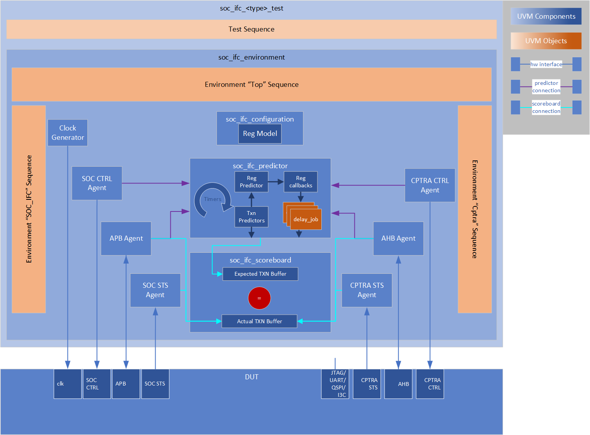

Caliptra Hardware Verification Architecture and Methodology

Version 0.8

# Scope

This document describes the Caliptra hardware verification methodology and testbench architecture. This includes explanation of how the testbenches are conceptually designed, what scenarios are covered, and how the testplan maps to actual code implementation.

This document is intended to enable users to reproduce and extend the Caliptra testplan, but does not provide comprehensive explanation for the Testplan itself, nor does it provided tool-specific instructions or scripting guidelines for integrating the code base into a user environment.

# Overview

Caliptra is validated using a collection of different testbenches, each with a different purpose and scope of operation. Individual blocks are validated using standalone unit testbenches, and caliptra_top is validated using a combination of standalone testbench with firmware smoke tests and randomized UVM regression testing. Each of these testbenches is meant to provide coverage over a different domain from the testplan, and work together in stages to provide early proof of Pull Request integrity, and extended coverage for test plan sign off and design confidence. Functional and code coverage are captured and aggregated for each testbench.

This document does not comprehensively discuss environment configuration or tool chains used. However, it is useful to note that some simple directed tests are able to be run in the open-source domain entirely using Verilator and other Open Source Software (OSS), while more complex scenarios (built in UVM) and code coverage require proprietary tools, licenses, and verification IP. Reproducing the testplan for these regression suites is left as an exercise for individual integrators.

# Unit testbenches
For cryptographic modules, unit tests may iterate through a suite of known answer tests, NIST test vectors, or other directed scenarios. The SOC_IFC unit testbench provides basic coverage for a mailbox operation, extended directed testing for the complete register set, and some randomized testing. Key Vault, Data Vault, and PCR Vault unit testbenches...<TODO>

# Standalone testbench
The Caliptra Top standalone testbench facilitates some basic bringup activities, and enables firmware to be run on the embedded RISC-V processor for directed testing. The testbench implements an assortment of reset activities, basic mailbox command operation, fuse programming, clock gating, cryptography operations, and other necessary stimulus in a basic and restricted fashion to enable "smoke tests" and other directed scenarios to run.

## Testbench design
The testbench design has four major components:
- clock and reset generation
- SRAM implementation, including ROM, ICCM, DCCM, and Mailbox SRAM models
- APB state machine for rudimentary traffic generation
- Modular testing "services"

## Modular testbench "services"

Although production designs of Caliptra must adhere to the predefined functionality for generic input and output wires (which are used to implement standardized late-binding features), the standalone testbench heavily relies upon these signals to enable validation firmware and the testbench to easily communicate testing intent to each other. In order to achieve this testing functionality, the testbench services implements a set of proprietary encodings and activation triggers around the generic input and output wires.

## Firmware operation

## Regression suite

# UVM testbench

The Universal Verification Methodology (UVM) is used to enable extended randomized regression testing for individual blocks of Caliptra and for the full Caliptra subsystem. Baseline UVM testbenches were originally created using the Mentor Graphics UVM-Framework generation tool, and extended to furnish the necessary stimulus and analysis logic.

## UVM-Framework

The UVM Framework is a tool that uses scripted generation to create a fully operable UVM testbench from a minimal description of desired agents, interface signals, and transaction members. The tool is also useful for incorporating functional block environments into larger systems as sub-environments, which enabled substantial design reuse in the Caliptra testbench.

## IP block level testbench approach

Many individual IP blocks in the Caliptra system are validated using dedicated block testbenches. This enables quick iteration over cryptographic test vectors, register modeling, and reset or clocking scenarios with many possible permutations, but relatively short stimulus and response times (and low bringup delay).

The following blocks have dedicated UVM testbenches:
- Cryptographic IP
    - HMAC
    - SHA256
    - SHA512 (with SHA384)
    - ECC
- Volatile secret management IP
    - KeyVault
    - PCRVault
- SOC_IFC

## SOC Interface testbench design

A UVM testbench is used to facilitate testing for the SoC Interface in a standalone mode, which allows extended coverage of the block that is decoupled from Caliptra Firmware.

### Overview

The standalone SoC Interface testbench implemented in UVM provides stimulus and checking for functionality of the various SoC facing features of Caliptra. This includes mailbox operation, register interaction, SHA512 acceleration, and reset functionality. Because this testbench is designed for standalone testing, it includes both the SoC-facing interfaces (APB, fatal/non-fatal interrupts, reset inputs, etc) and the Caliptra-facing interfaces (AHB, Caliptra reset outputs, internal error status signals, RISC-V interrupts, etc). Each of these interfaces is accompanied by a full dedicated agent, along with drivers/monitors, agent-level sequences, and prediction/scoreboarding for all signal activity.
The following diagram depicts the organization of the SoC Interface UVM testbench. SoC-facing interfaces and internal Caliptra interfaces are visually separated in the diagram to provide clarity around the implementation approach. In particular, integration of the SoC Interface testbench in the system level bench relies upon this interface separation to improve logic reuse.

### Interface design and breakdown

### QVIP usage

### Predictor and scoreboard design

### Register model

### Register field callbacks

### Delay jobs

### Continuous timer tasks

### Environment level sequences

### Test sequences
- Rand
- Command line

## Caliptra top testbench design

### Reuse of testbench "services"

### Validation firmware

### Top level test sequences
- Rand
- Command line
- ROM

## Future work
- Pivot QVIP AHB/APB to open-source agents
- Clock gating model
- JTAG/QSPI/I3C/UART
